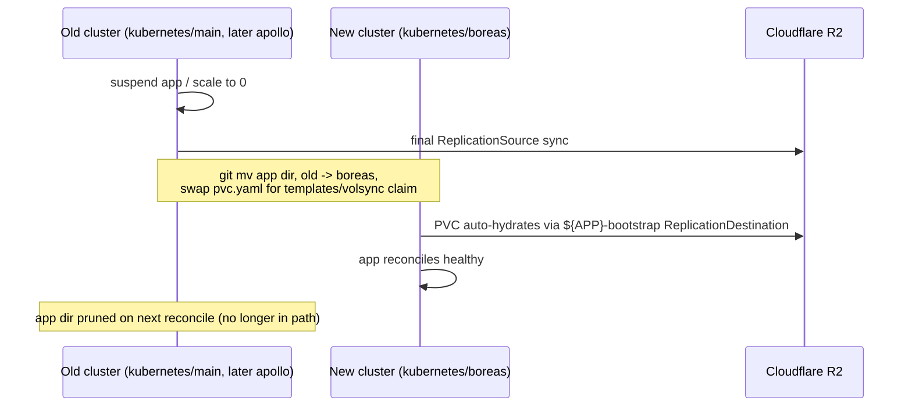

# Talos Migration

# Overview

The cluster moves from ansible-managed k3s to Talos across a consolidated, all-x86_64 fleet: four new NUC11 nodes plus hcc3 and hcc4 (existing NUCs, wiped and rejoined), retiring hcc, hcc2 (Odroid HC2, ARM — unsupported by Talos), and hcc-tablet1. The clusters are named alphabetically and sequentially — Greek mythology, this one is Apollo — rather than reused generic names like "main," so no cluster is ever renamed again once created. The new Talos cluster is bootstrapped directly as `kubernetes/boreas`, on its own VLAN/CIDR, while the current cluster's repo tree stays exactly as it is today (`kubernetes/main`) through the bulk of the migration — untouched, not even renamed — so the production Flux root is never touched until most apps have already proven out on the new cluster. Only once most services have moved over does the now largely-empty old tree get renamed to `kubernetes/apollo` (see "Safe rename of the live Flux root," below), deliberately deferred rather than done as prep work, to avoid a self-referential rename operation on the production cluster before any confidence in the new tooling exists. This is the last time this particular rename dance happens: from here on, a new cluster just gets the next name in sequence, never reusing or reclaiming an old one. Each application migrates independently — disabled, backed up, then its resource definitions moved to `kubernetes/boreas` — so the two clusters never contend over the same IPs or DNS records. The new cluster also isn't constrained to match the old cluster's Kubernetes version; since data moves through version-agnostic backup mechanisms, it can jump straight to a current stable Talos/Kubernetes release.

# Problem Statement

hcc and hcc2 are Odroid HC2 boards with no supported Talos image, and hcc-tablet1 is a tablet the operator no longer wants hosting workloads regardless of OS — all three need to leave the fleet. Separately, the ansible+SSH-managed k3s nodes carry ongoing config-drift risk (this repo has already had to fix issues stemming from manual intervention outside GitOps), and the upstream project this repo is based on, `cluster-template`, has moved to Talos-only. Talos's API-only, immutable model removes that entire class of drift. The migration must not lose data: Home Assistant history, Mealie recipes, Node-RED flows, Paperless documents, and the Postgres databases behind CloudNativePG all need to land on the new cluster intact.

# Functionality

Each hosted app (Home Assistant, Mealie, Node-RED, Paperless, and everything backed by the shared Postgres cluster) gets its own short maintenance window at its individual cutover point rather than one cluster-wide outage. This is a deliberate hard cutover, not a live/parallel one: each app goes fully offline for the few minutes its backup-and-restore takes, rather than staying reachable throughout via some kind of dual-serving or pre-verified staging copy. The trade is accepted deliberately — a bit of per-app downtime in exchange for never running backup/restore against a source that's still being written to, which is the actual data-loss risk being avoided, not just a nice-to-have. Ingress hostnames and Tailscale names are unchanged after migration — only the nodes and, briefly during transition, the backing cluster change. The GitOps workflow is identical post-migration: changes still land via Flux reconciliation, and the operator never SSHes into a node or hand-applies manifests to make routine changes.

After Wave 1, the operator has one working Talos cluster (`kubernetes/boreas`) and three devices (hcc, hcc2, hcc-tablet1) freed up for disposal or repurposing. After Wave 2, the fleet is fully consolidated to six Talos NUC11-class nodes on a single cluster and repo tree, `kubernetes/apollo` is deleted, and the ansible/k3s tooling in the repo becomes dead code ready for removal.

# Design

## Node topology

| Node | Today | After migration | Wave |
|---|---|---|---|
| hcc | k3s controller, Longhorn storage node (tainted `dedicated=storage`) | retired | 1 |
| hcc2 | same | retired | 1 |
| hcc-tablet1 | k3s controller | retired | 1 |
| hcc5, hcc6, hcc7 (new NUC11s) | not provisioned | Talos control-plane | 1 |
| hcc8 (new NUC11) | not provisioned | Talos worker | 1 |
| hcc3 | k3s controller, multus `enp1s0` host | wiped, joins as Talos worker | 2 |
| hcc4 | k3s controller, multus `enp1s0` host | wiped, joins as Talos worker | 2 |

End state: 6 nodes, 3 control-plane + 3 workers, satisfying Talos's odd-controller-count requirement without ever running an even split.

## Cluster & repo structure

The new cluster is bootstrapped directly as `kubernetes/boreas/` — `flux/`, `bootstrap/`, `apps/`, `templates/` — with its own `GitRepository`/`Kustomization` pair pointed at `./kubernetes/boreas`, and its own `cluster-settings` ConfigMap with a genuinely independent `NODE_CIDR`/`CLUSTER_CIDR`/control-plane VIP, living on a dedicated **HCC VLAN** carved out on the Ubiquiti gear (UCG Fiber) acquired since the original cluster was built. The existing live tree stays `kubernetes/main` — not renamed — until most apps have moved over (see "Safe rename of the live Flux root," below, for why this is deferred and how it's done safely once it happens). Because the two clusters sit on separate broadcast domains, Cilium's L2 announcements and BGP peering never collide on an IP regardless of numeric overlap. Unlike the old cluster's flat networking, the HCC VLAN is a permanent security boundary, not just a migration-scoped convenience — see Networking changes, below, for the isolation posture it enables.

This still means real duplication for the migration's duration: every app's manifests, plus `cluster-secrets.sops.yaml` (re-encrypted with the same age key — no new key material), exist in both the old cluster's tree (`kubernetes/main`, later renamed `kubernetes/apollo`) and (once migrated) `kubernetes/boreas` until that app's move lands. Renovate and manual changes touch whichever tree currently owns a given app. The old tree is deleted entirely once Wave 2 completes.

## Safe rename of the live Flux root

Deliberately deferred until most apps have already moved over, not done as Wave 1 prep work — this is a self-referential operation on the still-live production cluster's Flux root, and there's no reason to take it on before the new cluster and tooling have already proven themselves on the bulk of the migration. By the time it happens, the old tree mostly just contains whatever apps haven't moved yet plus foundational infra, so there's less left depending on it too.

Flux's root `Kustomization` objects on the still-running k3s cluster are self-referential: `kubernetes/main/flux/config/cluster.yaml` currently has `spec.path: ./kubernetes/main/flux` (and `apps.yaml` similarly `./kubernetes/main/apps`), and that `spec.path` is whatever was last *applied* into etcd — it isn't re-derived from wherever the file happens to sit in a given commit. Renaming the directory and repointing those paths in a single commit breaks the very next reconcile: Flux builds against its *current* live path, which no longer exists in that commit, the build fails, and the Kustomization sticks at `Ready=False`. It fails safe — a failed build doesn't trigger `prune`, so nothing already running gets torn down — but it won't self-heal.

The rename is done in two commits instead, with no manual `kubectl` needed:

1. With directories still named `main`, edit only the `path:` fields inside `kubernetes/main/flux/config/cluster.yaml` and `apps.yaml` to already say `./kubernetes/apollo/...`. Flux builds this against the still-valid current path and applies it — which updates the live Kustomization objects' `spec.path` for the next reconcile cycle.
2. Confirm that commit reconciled successfully (`flux get kustomization`).
3. `git mv kubernetes/main kubernetes/apollo`. The next reconcile now looks for `./kubernetes/apollo/flux`, which exists, and succeeds cleanly.

The root `Taskfile.yaml`'s `KUBERNETES_DIR: "{{.ROOT_DIR}}/kubernetes/main"` also needs repointing at this stage — worth a per-cluster task var while both trees coexist, rather than one hardcoded path.

## Kubernetes version

The new cluster isn't required to match the old cluster's Kubernetes version. The current k3s cluster is pinned to `KUBE_VERSION: v1.29.1+k3s2` (`kubernetes/main/apps/system-upgrade/k3s/ks.yaml` today) — old enough that an in-place upgrade would normally have to step through several minor versions one at a time. Because data moves through version-agnostic mechanisms (VolSync/restic is file-level; CNPG/Barman recovery is keyed to the Postgres major version, not the k8s version), the new cluster can jump straight to whatever current stable Talos/Kubernetes release is available, in one step, rather than a staged upgrade path. The one thing worth checking as each app moves — a natural side effect of the per-app disable/backup/move flow, which forces a fresh Flux apply on the new cluster before cutover — is that no chart or manifest assumes an API surface removed between the two versions.

The `.private/bootstrap-121456` scaffold is not the target: it's pinned to `talosVersion: v1.6.5` / `kubernetesVersion: v1.29.2`, and checking upstream `cluster-template` directly shows it's now several major Talos releases ahead (`v1.13.7` / Kubernetes `v1.36.4` as of this writing). Those two numbers are Renovate-tracked upstream and move on their own — Kubernetes already went `v1.36.3` → `v1.36.4` between two readings of this doc. They're recorded here only to establish *how far* the stale scaffold has drifted, not as values to pin: read the current ones off upstream's `topf.yaml.j2` at the moment configs are actually generated. Upstream has also swapped machine-config generators since that scaffold used `talhelper`/`talconfig.yaml`: it now uses [`topf`](https://github.com/postfinance/topf) (a `postfinance` tool, created December 2025 — young, ~95 GitHub stars at the time of writing, versus talhelper's long-established adoption), driven by a `topf.yaml` plus a directory of strategic-merge patches split by scope (`all/`, `control-plane/`, `worker/`, `node/<host>/`), matching Talos's own documented patching model. This is a genuine, deliberate change for the new cluster: since this is a fresh bootstrap of new infrastructure rather than ongoing maintenance of an already-detemplated tree, adopting the current tool is the right call here, not the same "don't maintain the template machinery" concern that applies to the rest of this repo (`plans/README.md`) — that policy is about not re-running makejinja against upstream repeatedly, not about which one-time tool generates the initial bootstrap. Usefully, `topf` doesn't force adopting upstream's other toolchain changes: it's a standalone binary that just reads a plain YAML `topf.yaml` and patch files, so it slots into this repo's existing Task-based `.taskfiles/Talos/Taskfile.yaml` in place of talhelper, hand-authored the same way `talconfig.yaml` is today, with no need to adopt Just or TOML. The trade-off worth going in with eyes open: `topf` is new enough that its rough edges (6 open issues, small community) are still being found, on tooling that manages the actual Talos machine configuration of every node.

While hand-authoring `topf.yaml` and its patches, it's worth cross-checking upstream's current content for anything worth carrying over beyond the tool switch itself — notably its sysctls tuning (`net.core.rmem_max`/`wmem_max` for QUIC, relevant given this cluster runs cloudflared; ARP cache GC thresholds, relevant given how much this cluster leans on Cilium L2Announcements) and its current bootstrap-apps sequencing, which is `cilium → coredns → [spegel] → cert-manager → flux-operator → flux-instance`. Two things fall out of that ordering:

- **Spegel already has a defined slot** — upstream places it between CoreDNS and cert-manager, with cert-manager's `needs:` pointing at whichever of the two precedes it. Since Spegel is adopted here (Platform component inventory), copy that slot rather than deriving one.
- **CoreDNS is a deliberate divergence.** Upstream bootstraps CoreDNS via Helm as its own release; this cluster keeps it Talos-managed (Platform component inventory), so that release is dropped and cert-manager's `needs:` points at Cilium or Spegel instead. Author it that way on purpose — otherwise it reads as an omission on the next comparison against upstream. Revisit only if `plans/05b-coredns-helm.md`'s original condition (needing custom CoreDNS config) ever actually arrives.

One open item from that comparison: upstream's current bootstrap-apps list doesn't include kubelet-csr-approver at all, unlike the stale scaffold — unconfirmed whether that's no longer needed on modern Talos or just installed differently now, so treat it as something to verify rather than assume required.

Two claims above have since been re-verified against upstream directly. `topf`'s patch-scoping model (`all/` → `<role>/` → `node/<host>/`, merged in that order, lexicographic within each folder, strategic-merge only — RFC 6902 JSON patches are unsupported, with `$patch: delete` covering removals — and `.yaml.tpl` for Go-templated patches) is confirmed by `topf`'s own documentation. Note that upstream only *ships* `all/` and `control-plane/`; `worker/` and `node/<host>/` are supported but have nothing to copy, so those get hand-authored. Separately, upstream's Talos config layer has had no structural change since the `topf` switch itself — recent commit history there is Renovate version bumps — so there is no newer Talos logic beyond what's described here to pull in.

## Foundational bootstrap (before any app moves)

Longhorn, the CloudNativePG *operator* (not a shared Cluster — see below), cert-manager, VolSync, Cilium, an ingress layer, and Authentik's dependencies need to exist on the new cluster before the first individual app migrates

> **Decided: Envoy Gateway, not ingress-nginx.** Avoids authoring every app's routing twice (`Ingress` now, `HTTPRoute` later) — write `HTTPRoute` once, during each app's move, instead of `Ingress` now and `HTTPRoute` again soon after. `plans/04-envoy-gateway.md` exists but still needs fleshing out for this cluster's actual topology (real IPs/VLAN, cloudflared integration, the raw-`LoadBalancer` apps like paperless-sftp and `postgres-lb` that stay unaffected either way) before Wave 1 — that prep work is unchanged by this decision, just no longer conditional on it. One new concrete thing that prep work needs to cover: `external-dns` currently sources from `["crd", "ingress"]` with `--ingress-class=external`, both Ingress-API concepts with no direct Gateway API equivalent — it needs a Gateway API source (e.g. `gateway-httproute`) and a different way to scope "external only" (Gateway API has no `ingressClassName`; that's normally done via which `Gateway` an `HTTPRoute`'s `parentRefs` points to). The external-dns hostname and `policy: upsert-only` fixes below still apply, just against whichever Gateway resource ends up carrying the external hostname instead of `ingress-nginx-external`'s Service.

Later `ks.yaml` files reference the foundational apps via `dependsOn` (e.g. Mealie depends on `cloudnative-pg`, `longhorn`, `authentik`) and via the shared `storageClassName: longhorn` convention. This step also includes copying `templates/volsync` into the new tree (`kubernetes/boreas/templates/volsync`), since it's currently unused by any real app but the per-app move step below depends on it being present at the same relative path apps already reference (`../../../../templates/volsync`).

CloudNativePG does *not* migrate as a shared unit: per `plans/11-cnpg-database-split.md`, the single `cnpg-cluster` (currently backing teslamate, paperless, and authentik) splits into per-app clusters (`teslamate-pg`, `paperless-pg`, `authentik-pg`) *during* this migration rather than before or after it — see "CNPG-backed apps," below. Only the operator itself is foundational; no shared Cluster CR is created on the new side at all.

## Platform component inventory

A fresh cluster bootstrap is the point to reconsider each platform-layer choice rather than carry it forward by default — deferring means either living with it or re-touching every node again later. Already-decided items are listed for completeness; the rest are open.

| Component | Status |
|---|---|
| Ingress (ingress-nginx vs. Envoy Gateway) | **Decided — Envoy Gateway.** See TODO above for what's still prep work vs. already settled |
| CNPG (shared vs. per-app clusters) | Already decided — splitting during migration |
| kube-vip | Already decided — replaced by Talos-native VIP |
| Ansible/SSH node management | Already decided — fully retired in Wave 2 |
| CoreDNS | **Decided — keep Talos-managed, for now.** No serious alternative DNS provider exists in practice; CoreDNS is the Kubernetes project's own graduated-CNCF default across every distribution, so the earlier framing overstated the decision as bigger than it is. Correction to an earlier claim here: Talos *does* auto-deploy a default CoreDNS during bootstrap (same as it auto-deploys Flannel and kube-proxy) unless explicitly disabled via `cluster.coreDNS.disabled: true` — it isn't missing DNS entirely. Unlike Cilium (which replaces Flannel because a real CNI is needed), there's no equivalent forcing reason to take over CoreDNS from Talos right now — leave `cluster.coreDNS.disabled` unset and let Talos manage it. Revisit later if custom CoreDNS config is ever actually needed (`plans/05b-coredns-helm.md`'s original condition still applies) |
| **Spegel** (P2P image distribution) | **Decided — adopt.** Not yet in the repo (`plans/05a-spegel.md`), but Wave 1 means 4-6 nodes pulling every image fresh during platform/app bring-up — exactly the load Spegel is for |
| Longhorn backup target | Already flagged — no cluster-level S3 target configured (Pre-migration backup verification); worth deciding whether to add one as defense-in-depth while touching Longhorn's config anyway |
| Longhorn `dedicated=storage` taint pattern | Already an Open Question — doesn't map cleanly to six similar NUC11s |
| OpenEBS | **Resolved — cruft, not a real prior decision.** The `.private/bootstrap-121456/templates/kubernetes/apps/openebs-system` scaffold reference is leftover template noise, not something ever deliberately adopted here; no action needed beyond not carrying it forward |
| **system-upgrade-controller** | **Decided — remove entirely in Wave 2, not just its k3s `Plan`.** It has exactly one `Plan` in this repo (`system-upgrade/k3s`). Talos OS upgrades go through `talosctl upgrade` (wrapped by `topf upgrade`) — an atomic A/B partition swap with automatic rollback on boot failure — and Kubernetes version upgrades go through `talosctl upgrade-k8s` directly (`topf` deliberately doesn't wrap this: *"topf intentionally does not manage Kubernetes upgrades"*). This isn't just a different mechanism for the same job — `system-upgrade-controller`'s design (a privileged pod that chroots into the node's host filesystem and runs an upgrade script) is structurally incompatible with Talos's immutable, API-only model regardless; there's no writable host filesystem or shell to chroot into |
| Dragonfly | **Resolved — keep.** Needed by an app today and expected to be needed going forward |
| **Secrets management (External Secrets Operator + 1Password)** | **Decided — adopt, for new use cases going forward, not a rip-and-replace of existing SOPS secrets.** Resolves `plans/11-cnpg-database-split.md`'s own open TODO ("Maybe it's finally time for 1Password?") — cross-namespace secret access (e.g. Grafana reading `teslamate-pg`'s credentials from another namespace) becomes an `ExternalSecret` in each namespace pointing at the same 1Password item, instead of a copy/replication workaround. Doesn't remove the `age.key` backup requirement from Pre-migration backup verification — Talos/cluster-bootstrap secrets (`topf.yaml`'s `secretsPath`, `cluster-secrets.sops.yaml`) still need SOPS+age at minimum, including to seed ESO's own 1Password Connect credential; ESO reduces `age.key`'s blast radius for future app secrets, it doesn't eliminate the need for it |
| **Observability (metrics + alerting)** | **Decided — adopt.** Several components already emit `ServiceMonitor`/`PrometheusRule` resources assuming a compatible backend (Cilium, cert-manager, Authentik, echo-server, and VolSync's own `prometheusrule.yaml`) but none is deployed — that wiring is currently dead, and Grafana's Prometheus datasource sits commented out. Stack choice (kube-prometheus-stack vs. the lighter VictoriaMetrics k8s stack) still open |
| VolSync/restic/R2, cloudflared/external-dns/cert-manager, Authentik, Multus, Cilium | No signal to reconsider — carrying forward as-is |

## Per-app migration: disable → back up → move

**VolSync-backed apps** (Home Assistant, Mealie, Node-RED, and Paperless's document library) follow the same three-step cutover, executed as a single change. The old cluster's tree is `kubernetes/main` for the bulk of these moves and `kubernetes/apollo` for any that happen after the deferred rename (see "Safe rename of the live Flux root," above) — same steps either way, just the source path:

1. **Disable** — suspend the app (scale to zero / suspend its Flux `Kustomization`) on the old cluster so it stops writing.
2. **Back up** — trigger one final `ReplicationSource` sync so R2 holds the exact post-disable state.
3. **Move** — `git mv` the app's directory from the old cluster's `apps/...` to `kubernetes/boreas/apps/...` in the same commit. While moving, swap the app's bespoke `pvc.yaml` for the shared `templates/volsync` component (`claim.yaml` + `r2.yaml`): its `claim.yaml` creates the PVC with `dataSourceRef: kind: ReplicationDestination, name: ${APP}-bootstrap`, so VolSync's CSI populator auto-hydrates the new PVC from the restic repository the moment it's created — no separate manual restore step. Add the one-time `${APP}-bootstrap` `ReplicationDestination`, reusing the app's existing (already-encrypted) R2 credentials. Post-move, the app is left on the shared template's `r2.yaml` for ongoing backups instead of its old one-off copy.

**CNPG-backed apps** (teslamate, authentik) follow the same disable-first shape, but "back up" and "move" happen together via CNPG's own database-import feature instead of VolSync. CNPG's `bootstrap.initdb.import` can technically run against a *live* source database — the app doesn't strictly have to be disabled first for the import itself to succeed — but disabling first is done anyway, deliberately, so the import captures a database no longer being written to rather than one mid-transaction. This isn't a step to relax later to shave time off the migration window; it's the same accepted-downtime-over-data-risk trade the whole migration is built on (see Functionality, above).

1. **Disable** — suspend the app on the old cluster.
2. **Back up + move, combined** — create the app's dedicated cluster (`teslamate-pg`, `authentik-pg`) directly on `kubernetes/boreas`, using CNPG's `bootstrap.initdb.import` (microservice `pg_dump`/restore) with `externalCluster.connectionParameters.host` pointed at the old cluster's `postgres-lb` Service (`postgres.${SECRET_DOMAIN}`) rather than an in-cluster DNS name — reachable because the old cluster stays live and routable across the dedicated VLAN for the whole migration window, regardless of what its tree is currently named. This produces a split, already-on-Talos cluster in one step, rather than splitting the old cluster first and migrating the result afterward. Then `git mv` the app's manifests, repointing its database host from `cnpg-cluster-rw...` to `${app}-pg-rw.database.svc.cluster.local`.
3. Grafana's TeslaMate datasource (`kubernetes/boreas/apps/monitoring/grafana/app/helmrelease.yaml`) needs its `url` updated from `cnpg-cluster-r...` to `teslamate-pg-r...` at the same time — it's a consumer of teslamate's database, not a database of its own.

Logical import is the mechanism here rather than Barman/WAL recovery from R2, and the reason is structural, not a preference: Barman recovery is *physical* and restores a whole instance, so it cannot select one database out of the shared `cnpg-cluster` — it would land all three databases in each new cluster, to be dropped twice over. The split is a logical reorganization, so it needs a logical mechanism. A useful side effect is that `pg_dump`/restore crosses PostgreSQL major versions, making this the moment to get off the current `16.2` image (a February 2024 patch release) — though unlike the Kubernetes jump, this one isn't automatically free: each app supports its own range of PostgreSQL versions and may need bumping first, which is a per-app pre-flight check run before that app's cutover rather than a decision made once upfront. Because each app now gets its own cluster, they don't all have to land on the same major, and staying on 16.x for a lagging app is always a valid answer. The cost is the cross-VLAN dependency on the old cluster noted under HCC VLAN isolation. See `plans/11-cnpg-database-split.md` for the full comparison.

**Paperless is a hybrid**: it needs both flows — the VolSync steps above for its document library PVC, and the CNPG steps for `paperless-pg` — ideally executed together so the app moves once, fully working, rather than twice.

`plans/11-cnpg-database-split.md`'s two open TODOs (Cluster namespace placement, and cross-namespace secret sharing — e.g. Grafana reading the teslamate database's credentials from another namespace) need resolving before this step, regardless of the source-host change above.

Because an app's manifests only ever exist in one cluster's tree at a time, its Ingress never exists on both clusters simultaneously — for an app that *has already moved*, external-dns naturally converges its DNS record to whichever cluster currently owns it (verified: `external-dns` sources from `crd`+`ingress` with `--ingress-class=external`, so each app gets its own record from its own Ingress rather than a shared wildcard). That covers the steady state, but not the transition: see Networking changes, below, for a real risk this alone misses — the new cluster's external-dns can start deleting *not-yet-moved* apps' records the moment it's bootstrapped, long before any app has actually moved. Internally-routed apps resolved via pihole/k8s-gateway follow the same per-app logic, but pihole/k8s-gateway are themselves standing infrastructure present on both clusters for the whole migration.

A `.new.${SECRET_DOMAIN}` staging hostname — restore and verify an app on the new cluster via its own temporary URL before disabling the old copy — was considered and declined: its only benefit is minimizing downtime, which isn't a goal here (see Functionality, above), and its cost (a second wildcard `Certificate`, temporary Ingresses, per-app cleanup) isn't worth paying for a benefit not being pursued. Verification instead happens with the app already disabled and down, checked internally (port-forward, logs, health checks) before the `git mv` ever exposes it at its real hostname.

## Per-app config review (not a blind move)

`git mv` alone is not sufficient — a few apps bind directly to IPs or node identities that only make sense on the old cluster's topology. Confirmed by inspection, not every app needs this; most (Mealie, Node-RED, teslamate) are clean moves. Two need real editing:

| App | What's bound | Change needed |
|---|---|---|
| Home Assistant | Static multus IP `192.168.4.100/24` for the `iot` macvlan network (`k8s.v1.cni.cncf.io/networks` annotation) | Reassign to a free address in whatever IoT VLAN/subnet the new node ends up on |
| Home Assistant | `nodeSelector: kubernetes.io/hostname: hcc3` | Repoint at whichever of `hcc5`–`hcc8` (or `hcc3`/`hcc4` post-Wave-2) takes over this role; reserve a free USB port on that node — the pin's comment mentions USB device access, currently unused but earmarked for a future Thread border-router antenna, not an active dependency to physically relocate today |
| Home Assistant | `HASS_HTTP_TRUSTED_PROXY_1/2` hardcoded as raw CIDRs (`10.69.0.0/16`, `10.96.0.0/12`) instead of `cluster-settings` vars | Parameterize while touching the file, so they track the new cluster's actual pod/service CIDR instead of silently going stale |
| Paperless (sftp) | Dedicated `LoadBalancer` Service with hardcoded `io.cilium/lb-ipam-ips: 192.168.6.22` | Reassign to an address in the new cluster's LB pool |

(CloudNativePG's `postgres-lb` Service, `io.cilium/lb-ipam-ips: 192.168.6.21`, isn't decommissioned early — it's the cross-cluster import source the CNPG split reads from during migration, per "CNPG-backed apps" below. Once every app's import is done, decide whether per-app equivalents are worth keeping for external Postgres access or whether it's retired entirely along with `kubernetes/apollo`.)

## Wave 1 — stand up the new cluster, migrate apps, retire the Odroids and tablet

Three distinct phases, deliberately sequenced by how atomically each one can be done: cluster infrastructure comes up as a single unit (a Kubernetes API doesn't exist in a partial state), platform services are stood up and verified individually before the next one starts, and apps migrate one at a time exactly as already detailed above.

**Phase A — cluster infrastructure (all at once, by definition):**

1. Flip `bootstrap_distribution` to `talos` in `config.sample.yaml`, generate a Talos factory schematic with the system extensions Longhorn needs (`iscsi-tools`, `util-linux-tools`), and lay out the new `kubernetes/boreas/` tree (`bootstrap/`, `flux/`, `apps/`, `templates/`) on its own VLAN. Use the scaffold at `.private/bootstrap-121456/templates/kubernetes/bootstrap/talos/` as a structural reference only, not a direct promotion — hand-author `topf.yaml` plus its `all/`/`control-plane/`/`worker/`/`node/${hostname}/` patch directories against current Talos/Kubernetes versions (see Kubernetes version, above), cross-checking upstream `cluster-template`'s current machine-config patches for anything worth carrying over. The existing `kubernetes/main` tree is untouched at this point — see "Safe rename of the live Flux root," above, for why that's deliberate.
2. Boot the four new NUC11s — continuing the existing `hcc` naming rather than a generic scheme, so they become `hcc5`–`hcc8` — into Talos maintenance mode and apply machine configs (`hcc5`–`hcc7` as control-plane, `hcc8` as worker) using `.taskfiles/Talos/Taskfile.yaml` (adapted to shell out to `topf apply`/`topf upgrade` in place of talhelper), bootstrap etcd, fetch kubeconfig.
3. Install what a working Kubernetes API depends on and nothing more: Cilium as CNI (`cluster.network.cni.name: none` in `topf.yaml`, replacing Talos's built-in Flannel), kubelet-csr-approver if still needed (TODO — see Kubernetes version, above), and Flux itself (`flux-operator`/`flux-instance`). CoreDNS is left as Talos's own default rather than taken over (see "Platform component inventory," above) — nothing to do here. This is the boundary of "infra" — everything after this point is something Flux reconciles, not something bootstrapped by hand.

**Phase B — platform services (one by one, each verified before the next):**

4. Bring up each shared/foundational service as its own Flux `Kustomization` with `wait: true`, confirming healthy before moving to the next, rather than applying them all at once: Spegel (early — it speeds up every image pull after it), the metrics stack (early — so every subsequent service's `ServiceMonitor` gets picked up as it's deployed, rather than backfilled later), External Secrets Operator + 1Password Connect, Longhorn, the CloudNativePG operator, VolSync, cert-manager, Envoy Gateway, external-dns (configured for Gateway API sources, with `policy: upsert-only`, see Networking changes), Authentik's dependencies. See "Platform component inventory," above, for which of these are being reconsidered rather than carried forward as-is.

**Phase C — app migration (one by one, as already detailed above):**

5. Migrate each stateful app in turn via disable → back up → move — VolSync-backed apps via `ReplicationDestination` restore, CNPG-backed apps (teslamate, authentik, and paperless's database) via cross-cluster database import against the old cluster's `postgres-lb`, per "CNPG-backed apps" above — verifying and cutting over one at a time.
6. Once most apps have moved over, rename the old cluster's now largely-empty tree using the two-commit safe sequence above: `kubernetes/main` → `kubernetes/apollo`, then update `Taskfile.yaml`'s `KUBERNETES_DIR`. Any apps still mid-migration at this point simply move from `kubernetes/apollo/apps/...` instead of `kubernetes/main/apps/...` from here on — same steps, new source path.
7. Once every app is verified and Longhorn on the old cluster reports no remaining replicas on hcc/hcc2, cordon and drain hcc, hcc2, and hcc-tablet1, then power them off.

## Wave 2 — absorb hcc3 and hcc4

1. Cordon and drain hcc3/hcc4 from the now-empty `kubernetes/apollo` cluster.
2. Wipe and reinstall them with Talos, join as workers to the `kubernetes/boreas` cluster — keeping their existing names, so the final six nodes are `hcc3`, `hcc4`, `hcc5`, `hcc6`, `hcc7`, `hcc8` (control-plane: `hcc5`–`hcc7`; workers: `hcc3`, `hcc4`, `hcc8`).
3. Re-verify the `iot` multus `NetworkAttachmentDefinition` (currently macvlan on `enp1s0`, physically cabled to hcc3/hcc4) against the new OS — interface naming and driver availability can differ under Talos, and this is a physical-cabling dependency, not just config. It also needs an actual VLAN tag added now (see HCC VLAN isolation, above) — under the old flat networking the cluster and IoT devices shared a broadcast domain, so no tagging was needed; on the new cluster they don't.
4. Delete `kubernetes/apollo` entirely, and remove the now-dead ansible/k3s tooling: `ansible/inventory/hosts.yaml`, the `system-upgrade/k3s` Flux Kustomization, and any taskfiles that only existed to drive ansible+k3s.

## Data migration by class

| Data | Current store | Migration method |
|---|---|---|
| Home Assistant config, Mealie data, Node-RED flows, Paperless library | Longhorn PVC, already VolSync→R2 backed | Disable → final sync → move, hydrated via `templates/volsync`'s `${APP}-bootstrap` `ReplicationDestination` |
| Postgres: teslamate, authentik, paperless | Shared `cnpg-cluster`, Barman Cloud → R2 | Split during migration: each app's database imported directly from the old cluster's live `postgres-lb` into its own new `${app}-pg` cluster on `kubernetes/boreas`, via CNPG's database-import feature — see `plans/11-cnpg-database-split.md` and "CNPG-backed apps," above |
| Grafana | `persistence.enabled: false` (verified) — dashboards provisioned declaratively from ConfigMaps/URLs in `helmrelease.yaml` | Recreated fresh by Flux reconciliation; TeslaMate datasource URL updated alongside teslamate's move |
| Authentik | No PVC (verified) — all state in the `authentik` database, now `authentik-pg` | Recreated fresh; data already covered by the CNPG split above |
| Pihole, Dragonfly | No PVC, no VolSync/backup coverage of any kind | **Verify before migrating, don't assume**: confirm Pihole's adlists/custom DNS/whitelist are fully GitOps-declared (not UI-edited drift that only lives in the running pod) before treating it as stateless; confirm Dragonfly is intentionally cache-only and safe to lose |
| Teslamate's `teslamate-backup-pvc` | 1Gi PVC holding a one-time historical SQL import artifact, not live data | Not migrated — live data is already in CNPG/Barman; recreated empty |

## Networking changes

- The control-plane VIP moves into each control-plane node's Talos machine config as a native `vip` setting on the new cluster's own CIDR; the kube-vip DaemonSet's API-server-VIP role goes away entirely rather than being reassigned.
- **KubePrism** (no k3s equivalent) splits internal from external API-server traffic: kubelet and, on control-plane nodes, the static pods (`kube-scheduler`/`kube-controller-manager`) talk to a local per-node proxy (port 7445, confirmed against upstream's current values below) instead of riding on the same VIP `kubectl`/`talosctl` use from outside the cluster. On by default in current Talos — nothing to build, just don't let it get disabled while hand-authoring `topf.yaml`'s `all/` machine-config patches from the stale scaffold.
- **Cilium depends on KubePrism directly, not just incidentally.** Pulled upstream `cluster-template`'s actual current Cilium `HelmRelease` to confirm: `k8sServiceHost: 127.0.0.1` / `k8sServicePort: 7445`, alongside `kubeProxyReplacement: true`. With kube-proxy fully replaced by Cilium's own eBPF datapath, there's no iptables/ipvs fallback for resolving `kubernetes.default.svc` — Cilium can't route to a Service IP using a datapath that isn't up yet, so it needs a static, always-reachable API-server address that doesn't depend on its own readiness, the VIP, or DNS. This is a harder requirement for Cilium than for plain kubelet traffic, not just the same convenience. Two more settings confirmed from that same file, worth carrying into this cluster's Cilium config: `cni.exclusive: false` (upstream's own comment: *"Required for pairing with Multus CNI"* — directly relevant given this cluster's IoT macvlan setup), and `gatewayAPI.enabled: false` (upstream deliberately leaves Cilium's own built-in Gateway API implementation off — worth keeping off here too, so it doesn't compete with the standalone Envoy Gateway install over the same CRDs/`GatewayClass`).
- Cilium's containerd/CNI paths change from k3s's embedded layout to Talos's `/etc/cri/conf.d/hosts`, which also affects Spegel's path configuration (already tracked as a k3s-vs-Talos difference in `plans/05a-spegel.md`).
- Standing shared infrastructure — the ingress controllers, pihole, k8s-gateway — runs concurrently on both clusters for the entire migration window (not just per-app cutover moments), which is exactly what the dedicated VLAN/CIDR is for. Internal DNS resolution (pihole/k8s-gateway) still needs one explicit "flip the resolver" step once all internally-routed apps have moved, since that's about which pihole instance clients are actually configured to query, not something GitOps alone resolves.
- On the old cluster, `ingress-nginx-external`'s own Service carries `external-dns.alpha.kubernetes.io/hostname: "external.${SECRET_DOMAIN}"` — a hostname for the controller itself, not a per-app record. The new cluster's external Gateway (Envoy Gateway, decided above) needs the equivalent annotation on whichever resource carries it (the `Gateway` object, or a dedicated Service depending on how Envoy Gateway's LB IP is exposed — to work out during the plan 04 prep). Because this is foundational infrastructure present on both clusters for the whole migration (not something that gets `git mv`'d per-app), this one record would otherwise be contested by both clusters' external-dns instances for the entire migration, not just at a cutover moment. Fix: give the new cluster's external Gateway a distinct flat hostname during the migration — `external-new.${SECRET_DOMAIN}` — still one label deep, so it's covered by the existing `*.${SECRET_DOMAIN}` wildcard `Certificate` with no new cert infrastructure needed. Internal ingress has no equivalent annotation on the old cluster (internal routing resolves via pihole/k8s-gateway, not external-dns), so this is specific to the external side.
- A sharper version of the same problem, not fixed by the point above: `external-dns` runs `policy: sync` with `txtOwnerId: default` on both clusters. `sync` deletes any record an instance owns (per its TXT registry marker) that no longer has a matching source in *that instance's own cluster*. The new cluster's external-dns is foundational — it starts running in Wave 1 Phase B, long before any individual app has moved — so the moment it reconciles, every not-yet-moved app's hostname looks orphaned to it (owned by `default`, no local Ingress) and `sync` would delete it: a cascading DNS outage across every still-live app, immediately, well before any real cutover. Fix: set the new cluster's external-dns to `policy: upsert-only` for the duration of the migration — it can still create/update records for apps that have moved, but structurally cannot delete anything, so it can't touch a not-yet-moved app's record no matter what its TXT marker claims. Revert to `policy: sync` once `kubernetes/apollo` is deleted at the end of Wave 2, when normal pruning becomes safe again. `kubernetes/apollo`'s own external-dns doesn't need to change — it correctly deleting a just-moved app's now-locally-orphaned record, moments before the new cluster (re-)creates it, is the expected brief flap at that app's own cutover, not a new risk.
- The `dedicated=storage` node taint that currently pins Longhorn's system pods to hcc/hcc2 no longer maps cleanly to six otherwise-identical NUC11-class nodes; whether it's still needed, and where Longhorn's `defaultDataPath: /storage01` disk lives on each new node, is a topology decision to make before Wave 1 bootstraps Longhorn (see Open Questions).

## HCC VLAN isolation

Today the whole cluster shares a VLAN with Home Assistant's actual IoT devices — the multus `NetworkAttachmentDefinition`'s own comment says *"since the cluster is already on the IoT VLAN, no VLAN tagging is needed."* That's an accident of the old gear's flat networking, not a deliberate choice. On the new cluster:

- **Main (trusted) network → HCC VLAN: unrestricted.** No firewall changes needed for the operator's own devices to reach the cluster.
- **New HCC VLAN → old cluster's network, port 5432: explicitly required for the migration window.** This one is easy to miss because it's the only rule the *migration itself* depends on rather than the steady state. CNPG's `bootstrap.initdb.import` runs `pg_dump` over a live connection, so each new `${app}-pg` cluster must reach the old cluster's `postgres-lb` Service (`192.168.6.21`, `postgres.${SECRET_DOMAIN}`) while the old cluster is still on the pre-VLAN network. Without it every CNPG-backed app's cutover fails at bootstrap. It's temporary — drop it once teslamate, authentik, and paperless have all moved.
- **IoT VLAN ↔ HCC VLAN: isolated by default.** The goal is specifically to stop escalation between the two — a compromised IoT device shouldn't be able to reach cluster nodes or services, and the cluster shouldn't have blanket reach into IoT either.
- **Home Assistant's multus macvlan interface is the one deliberate exception.** That pod is intentionally dual-homed — one interface in the cluster's own pod network, one with a real IP directly on the IoT VLAN, because that's how it discovers/talks to IoT devices at all. The VLAN/firewall boundary protects everything else; this one interface is a narrow, intended bridge, not a gap in it.
- Because the node's primary interface no longer sits on the IoT VLAN by default, the macvlan interface needs actual 802.1q VLAN tagging to reach it now — `config.sample.yaml` already has a placeholder for this (`bootstrap_talos.vlan`, currently unset) and the multus NAD itself needs a `vlan` field added once an IoT VLAN ID is assigned on the UCG Fiber.
- A dedicated VLAN for Longhorn's inter-node replication traffic (keeping it off the same path as ingress/app traffic — a genuine Longhorn best practice) is deliberately **out of scope for this migration** — noted as a future optimization once the cluster is stable, not something to build now.
- BGP for LoadBalancer IP announcement (replacing Cilium's L2Announcements, and giving the currently-inert `CiliumBGPPeeringPolicy` a real config) is possible in principle on a UCG Fiber, but its Advanced Routing/BGP feature support is worth checking directly in the UniFi controller before committing to it — not assumed here, and not a priority at this scale regardless.

## Bootstrap tooling

`.taskfiles/Talos/Taskfile.yaml` — already present in the repo and previously flagged for removal back when the repo was k3s-only (`plans/09-simplified-taskfiles.md`) — becomes the live bootstrap path instead of dead code, but its recipes need adapting from talhelper's `gencommand`-based flow to shell out to `topf` instead (`topf apply`, `topf upgrade`, `topf render`, `topf reset`, in place of the current `bootstrap-apply`/`upgrade-talos`/`soft-nuke`/`hard-nuke` tasks). This deliberately does *not* pull in upstream `cluster-template`'s Just/TOML toolchain alongside `topf` (see Kubernetes version, above) — `topf` itself is a standalone binary with no dependency on either, so it fits directly into this repo's existing Task-based, YAML-first conventions. Secrets are generated and SOPS-encrypted the same way the rest of the repo's secrets already are (`topf.yaml` references a `secretsPath: secrets.sops.yaml`, mirroring talhelper's `talsecret.sops.yaml`), so no new key material or encryption mechanism is introduced.

# Security

- Talos removes SSH entirely: nodes are administered only through the mTLS-authenticated `talosctl` API, cutting the SSH-key/`authorized_keys` surface currently spread across five boxes.
- Each CNPG-backed app's backup writer is single-owner by construction: the old cluster's `cnpg-cluster` keeps writing scheduled backups for an app until that app's own disable/import step, at which point its new dedicated cluster takes over — never two primaries pushing WAL for the same database at once. Because the split happens per-app rather than all at once, this now applies three times (teslamate, authentik, paperless) instead of once.
- Old disks (hcc, hcc2, hcc-tablet1) hold the same application secrets now restored onto the new cluster. Wipe them, not just power them off, before disposal or repurposing.

## Pre-migration backup verification

Longhorn has no cluster-level backup target configured (`defaultSettings` has no `backupTarget`) — there is no storage-layer safety net underneath the per-app VolSync/CNPG jobs. If an app's backup isn't wired up, working, and current, it has *zero* recovery path, not a slower one. Before Wave 1 starts:

- **`age.key`**: gitignored, exists only locally — every SOPS-encrypted secret in the repo, and the ability to seed the new cluster's `sops-age` Secret at all, depends on this one file. Confirm it has a durable, external backup (password manager, offline copy) before touching anything; losing it blocks the migration itself, not just one app's data.
- **Every PVC-holding app** (chart-managed or explicit) has a currently-*succeeding* backup, verified live — not just declared in git. A wired-up `ReplicationSource` or `ScheduledBackup` that's been silently failing is as dangerous as no backup at all. Check restic snapshot lists / CNPG backup status for each of: Home Assistant, Mealie, Node-RED, Paperless (library + database), teslamate, authentik.
- **Pihole and Dragonfly** have no PVC and no backup of any kind. Confirm Pihole's adlists/custom DNS/whitelist are fully GitOps-declared rather than partially UI-edited drift that only exists in the running pod, and confirm Dragonfly's data is intentionally cache-only and safe to lose — don't infer either from the absence of a PVC alone.

# Pre-Migration Checklist

**Backups (gate — don't proceed until these are confirmed):**

- [ ] Confirm `age.key` has a durable external backup outside this machine
- [ ] Verify every VolSync `ReplicationSource` (Home Assistant, Mealie, Node-RED, Paperless) has a recent, successful snapshot in R2 — not just that the resource exists
- [ ] Verify CNPG's `ScheduledBackup` has a recent, successful backup in R2
- [ ] Confirm Pihole's configuration is fully GitOps-declared (no UI-only drift) or export/commit anything that isn't
- [ ] Confirm Dragonfly's data is intentionally cache-only and safe to lose

**Everything else:**

- [ ] Generate a Talos factory schematic ID with `iscsi-tools` and `util-linux-tools` extensions, targeting a current Talos/Kubernetes release (not the stale scaffold's v1.6.5/v1.29.2)
- [ ] Carve out the dedicated HCC VLAN/CIDR on the UCG Fiber, plus firewall rules: main network → HCC unrestricted, IoT ↔ HCC isolated
- [ ] Open HCC VLAN → old cluster `postgres-lb` (`192.168.6.21:5432`) for the migration window — every CNPG-backed app's cutover fails at bootstrap without it; remove once teslamate, authentik, and paperless have moved
- [ ] Per CNPG-backed app, immediately before *that app's* cutover (not upfront): check its supported PostgreSQL range against the target major, bump the app on the old cluster first if a newer version is needed, and confirm required extensions (`cube`/`earthdistance` for teslamate) ship in the CNPG image for that major — see `plans/11-cnpg-database-split.md`
- [ ] Assign an IoT VLAN ID and add it to the multus NAD's `vlan` field and `bootstrap_talos.vlan` in `config.sample.yaml`
- [ ] Hand-author `kubernetes/boreas/bootstrap/talos/topf.yaml` plus its scoped patch directories against current versions, using `.private/bootstrap-121456/` and upstream `cluster-template`'s current machine-config patches as reference, not a direct promotion
- [ ] Adapt `.taskfiles/Talos/Taskfile.yaml` from talhelper's `gencommand` flow to shell out to `topf`
- [ ] Verify whether kubelet-csr-approver is still needed on the target Talos/Kubernetes version (absent from upstream's current bootstrap-apps list, present in the stale scaffold)
- [ ] Copy `templates/volsync` into the new `kubernetes/boreas/templates/volsync` during foundational bootstrap
- [ ] Confirm current Longhorn replica placement (don't assume hcc/hcc2 hold all replica data just because they're taint-dedicated to storage)
- [ ] Decide the new nodes' Longhorn disk layout / whether the storage-node taint pattern is still needed
- [ ] Verify `teslamate_db_2024-03-18.sql` in `teslamate-backup-pvc` isn't needed for anything before letting it drop
- [ ] Decide which new node inherits Home Assistant's `nodeSelector` pin and reserve a free USB port on it for the future Thread antenna
- [ ] Parameterize Home Assistant's `HASS_HTTP_TRUSTED_PROXY_1/2` into `cluster-settings` vars
- [ ] Resolve `plans/11-cnpg-database-split.md`'s remaining open TODO (Cluster namespace placement) before the first CNPG-backed app migrates — its cross-namespace secret sharing TODO is now resolved via ESO/1Password, see Platform component inventory
- [ ] Stand up External Secrets Operator + 1Password Connect early in Phase B
- [ ] Stand up the metrics stack (kube-prometheus-stack or VictoriaMetrics — TBD) early in Phase B, before other platform services so their `ServiceMonitor`s get picked up as deployed
- [ ] Set the new cluster's external-dns to `policy: upsert-only` before it's bootstrapped in Wave 1 Phase B (before any app moves, not after)
- [ ] Flesh out `plans/04-envoy-gateway.md` for this cluster's real topology (IPs/VLAN, cloudflared integration, raw-`LoadBalancer` apps) before Wave 1 — see TODO in Foundational bootstrap
- [ ] Configure `external-dns` for Gateway API sources (e.g. `gateway-httproute`) instead of `["crd", "ingress"]`, and work out the Gateway API equivalent of `--ingress-class=external` scoping
- [ ] Set the new cluster's external Gateway's hostname annotation to `external-new.${SECRET_DOMAIN}` as part of foundational bootstrap
- [ ] Add Spegel as a Phase B platform service (`plans/05a-spegel.md`, adapted for Talos's containerd paths)
- [ ] Remove `system-upgrade-controller` entirely in Wave 2 (not just the `system-upgrade/k3s` Kustomization)

**Mid-Wave-1 (once most apps have moved, not upfront):**

- [ ] Rename `kubernetes/main` → `kubernetes/apollo` using the two-commit safe sequence (repoint Flux paths first, verify reconcile, then `git mv`)
- [ ] Update root `Taskfile.yaml`'s `KUBERNETES_DIR` var

# Rollback

Because the old cluster's copy of an app is only disabled, never deleted, until the moved copy is verified healthy on `kubernetes/boreas`, rollback per app is: re-enable the old Kustomization/scale back up, `git mv` the directory back to the old cluster's tree (`kubernetes/main` or `kubernetes/apollo`, whichever it currently is). For CNPG-backed apps, rollback is repointing the app's database host back to `cnpg-cluster-rw...` on the old cluster and deleting the partial `${app}-pg` cluster on `kubernetes/boreas` — the source cluster is never modified by an import, so this is safe at any point. Before the Wave 1 decommission step, cluster-wide rollback is simply not cordoning/draining/powering off hcc, hcc2, and hcc-tablet1.

# Open Questions

- Does the `iot` macvlan NIC stay on hcc3/hcc4 after Wave 2, or move to different nodes?
- Does the Longhorn `dedicated=storage` taint pattern still make sense once storage is spread across six similar NUC11 nodes instead of two dedicated Odroid boxes?
- **Future optimization, explicitly out of scope here**: a dedicated VLAN for Longhorn's inter-node replication traffic, once the cluster is stable post-migration.
