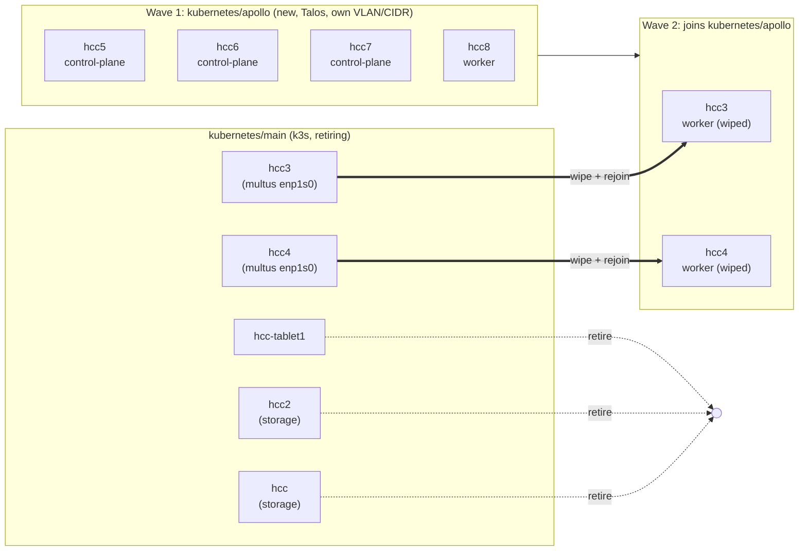
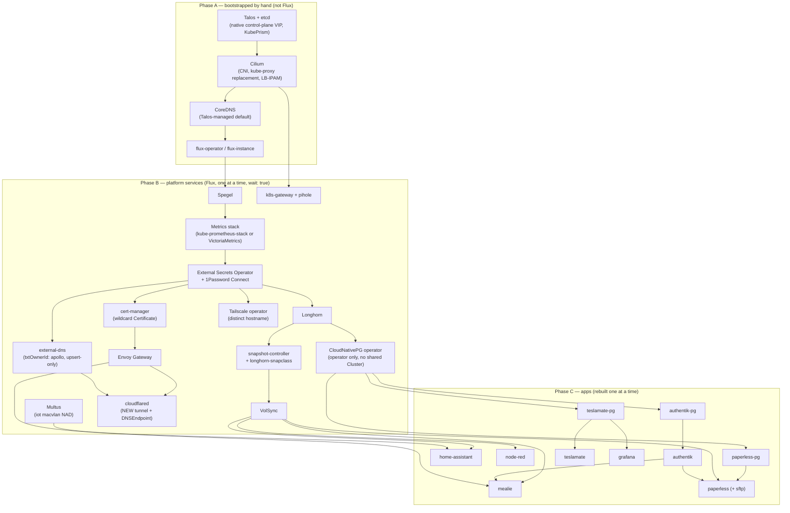

# Talos Migration

# Overview

The cluster moves from ansible-managed k3s to Talos across a consolidated, all-x86_64 fleet: four new NUC11 nodes plus hcc3 and hcc4 (existing NUCs, wiped and rejoined), retiring hcc, hcc2 (Odroid HC2, ARM — unsupported by Talos), and hcc-tablet1.

The new Talos cluster is bootstrapped as `kubernetes/apollo`, on its own VLAN/CIDR. Clusters are named alphabetically and sequentially from Greek mythology — this one is Apollo, the next will start with B — so no cluster is ever renamed once created and no name is ever reused. The existing k3s cluster keeps its generic `kubernetes/main` tree, untouched and un-renamed, for its entire remaining life; it is deleted outright at the end of Wave 2 rather than renamed into the new scheme. Retrofitting a mythology name onto a cluster that is being decommissioned would burn a name on something with weeks to live, and a rename of a live Flux root is a self-referential operation with real failure modes — neither cost buys anything, so `main` simply stays `main` until it's gone.

Each application is **rebuilt** on the new cluster rather than moved: its manifests are authored fresh under `kubernetes/apollo` (mostly copied from the old tree, but not blindly — see "Per-app config review"), while the old cluster's copy is disabled in place and its data left intact until the whole cluster is decommissioned. Nothing is deleted from `kubernetes/main` during the migration. That keeps a working, re-enableable copy of every app — and its data — behind each cutover, and it means the two clusters never contend over the same IPs, DNS records, or tailnet hostnames, because an app is only ever *serving* from one of them at a time.

The new cluster also isn't constrained to match the old cluster's Kubernetes version; since data moves through version-agnostic backup mechanisms, it can jump straight to a current stable Talos/Kubernetes release.

# Problem Statement

hcc and hcc2 are Odroid HC2 boards with no supported Talos image, and hcc-tablet1 is a tablet the operator no longer wants hosting workloads regardless of OS — all three need to leave the fleet. Separately, the ansible+SSH-managed k3s nodes carry ongoing config-drift risk (this repo has already had to fix issues stemming from manual intervention outside GitOps), and the upstream project this repo is based on, `cluster-template`, has moved to Talos-only. Talos's API-only, immutable model removes that entire class of drift. The migration must not lose data: Home Assistant history, Mealie recipes, Node-RED flows, Paperless documents, and the Postgres databases behind CloudNativePG all need to land on the new cluster intact.

# Functionality

Each hosted app (Home Assistant, Mealie, Node-RED, Paperless, and everything backed by the shared Postgres cluster) gets its own short maintenance window at its individual cutover point rather than one cluster-wide outage. This is a deliberate hard cutover, not a live/parallel one: each app goes fully offline for the few minutes its backup-and-restore takes, rather than staying reachable throughout via some kind of dual-serving or pre-verified staging copy. The trade is accepted deliberately — a bit of per-app downtime in exchange for never running backup/restore against a source that's still being written to, which is the actual data-loss risk being avoided, not just a nice-to-have.

Ingress hostnames and Tailscale names are unchanged after migration: an app is released from the old cluster and reclaims the *same* name on the new one at its cutover moment. The GitOps workflow is identical post-migration: changes still land via Flux reconciliation, and the operator never SSHes into a node or hand-applies manifests to make routine changes.

After Wave 1, the operator has one working Talos cluster (`kubernetes/apollo`) and three devices (hcc, hcc2, hcc-tablet1) freed up for disposal or repurposing. After Wave 2, the fleet is fully consolidated to six Talos NUC11-class nodes on a single cluster and repo tree, `kubernetes/main` is deleted, and the ansible/k3s tooling in the repo becomes dead code ready for removal.

# Design

## Node topology

| Node | Today | After migration | Wave |
|---|---|---|---|
| hcc | k3s controller, Longhorn storage node (tainted `dedicated=storage`) | retired | 1 |
| hcc2 | same | retired | 1 |
| hcc-tablet1 | k3s controller | retired | 1 |
| hcc5, hcc6, hcc7 (new NUC11s) | not provisioned | Talos control-plane | 1 |
| hcc8 (new NUC11) | not provisioned | Talos worker | 1 |
| hcc3 | k3s controller, multus `enp1s0` host | wiped, joins as Talos worker | 2 |
| hcc4 | k3s controller, multus `enp1s0` host | wiped, joins as Talos worker | 2 |

End state: 6 nodes, 3 control-plane + 3 workers, satisfying Talos's odd-controller-count requirement without ever running an even split.



## Cluster & repo structure

The new cluster is bootstrapped as `kubernetes/apollo/` — `flux/`, `bootstrap/`, `apps/`, `templates/` — with its own `GitRepository`/`Kustomization` pair pointed at `./kubernetes/apollo`, and its own `cluster-settings` ConfigMap with a genuinely independent `NODE_CIDR`/`CLUSTER_CIDR`/control-plane VIP, living on a dedicated **HCC VLAN** carved out on the Ubiquiti gear (UCG Fiber) acquired since the original cluster was built. The existing live tree stays `kubernetes/main`, never renamed, until it is deleted wholesale in Wave 2. Because the two clusters sit on separate broadcast domains, Cilium's L2 announcements and BGP peering never collide on an IP regardless of numeric overlap. Unlike the old cluster's flat networking, the HCC VLAN is a permanent security boundary, not just a migration-scoped convenience — see Networking changes, below, for the isolation posture it enables.

This means real duplication for the migration's duration: every app's manifests, plus `cluster-secrets.sops.yaml` (re-encrypted with the same age key — no new key material), exist in both trees until the old one is deleted. That duplication is deliberate — it's what makes each cutover reversible (see Rollback). Renovate and manual changes touch whichever tree currently *serves* a given app; the disabled copy in `kubernetes/main` is frozen, not maintained.

Two repo-level things need per-cluster handling while both trees coexist:

- The root `Taskfile.yaml`'s `KUBERNETES_DIR: "{{.ROOT_DIR}}/kubernetes/main"` is a single hardcoded path. It needs to become a per-cluster task var (defaulting to whichever cluster is being worked on) rather than being repointed once.
- `.github/workflows/flux-diff.yaml` and `kubeconform.yaml` both reference `kubernetes/main` explicitly. They need `kubernetes/apollo` added **from the moment the tree is created**, not at the end — otherwise every app authored on the new cluster lands with no CI validation at all, which is exactly when validation is most useful.

## Kubernetes version

The new cluster isn't required to match the old cluster's Kubernetes version. The current k3s cluster is pinned to `KUBE_VERSION: v1.29.1+k3s2` (`kubernetes/main/apps/system-upgrade/k3s/ks.yaml` today) — old enough that an in-place upgrade would normally have to step through several minor versions one at a time. Because data moves through version-agnostic mechanisms (VolSync/restic is file-level; CNPG/Barman recovery is keyed to the Postgres major version, not the k8s version), the new cluster can jump straight to whatever current stable Talos/Kubernetes release is available, in one step, rather than a staged upgrade path. The one thing worth checking as each app is rebuilt — a natural side effect of authoring it fresh on the new cluster before cutover — is that no chart or manifest assumes an API surface removed between the two versions.

The `.private/bootstrap-121456` scaffold is not the target: it's pinned to `talosVersion: v1.6.5` / `kubernetesVersion: v1.29.2`, and checking upstream `cluster-template` directly shows it's now several major Talos releases ahead (`v1.13.7` / Kubernetes `v1.36.4` as of this writing). Those two numbers are Renovate-tracked upstream and move on their own — Kubernetes already went `v1.36.3` → `v1.36.4` between two readings of this doc. They're recorded here only to establish *how far* the stale scaffold has drifted, not as values to pin: read the current ones off upstream's `topf.yaml.j2` at the moment configs are actually generated.

Upstream has also swapped machine-config generators since that scaffold used `talhelper`/`talconfig.yaml`: it now uses [`topf`](https://github.com/postfinance/topf) (a `postfinance` tool, created December 2025 — young, ~95 GitHub stars at the time of writing, versus talhelper's long-established adoption), driven by a `topf.yaml` plus a directory of strategic-merge patches split by scope (`all/`, `control-plane/`, `worker/`, `node/<host>/`), matching Talos's own documented patching model. This is a genuine, deliberate change for the new cluster: since this is a fresh bootstrap of new infrastructure rather than ongoing maintenance of an already-detemplated tree, adopting the current tool is the right call here, not the same "don't maintain the template machinery" concern that applies to the rest of this repo (`plans/README.md`) — that policy is about not re-running makejinja against upstream repeatedly, not about which one-time tool generates the initial bootstrap. Usefully, `topf` doesn't force adopting upstream's other toolchain changes: it's a standalone binary that just reads a plain YAML `topf.yaml` and patch files, so it slots into this repo's existing Task-based `.taskfiles/Talos/Taskfile.yaml` in place of talhelper, hand-authored the same way `talconfig.yaml` is today, with no need to adopt Just or TOML. The trade-off worth going in with eyes open: `topf` is new enough that its rough edges (6 open issues, small community) are still being found, on tooling that manages the actual Talos machine configuration of every node.

While hand-authoring `topf.yaml` and its patches, it's worth cross-checking upstream's current content for anything worth carrying over beyond the tool switch itself — notably its sysctls tuning (`net.core.rmem_max`/`wmem_max` for QUIC, relevant given this cluster runs cloudflared; ARP cache GC thresholds, relevant given how much this cluster leans on Cilium L2Announcements) and its current bootstrap-apps sequencing, which is `cilium → coredns → [spegel] → cert-manager → flux-operator → flux-instance`. Two things fall out of that ordering:

- **Spegel already has a defined slot** — upstream places it between CoreDNS and cert-manager, with cert-manager's `needs:` pointing at whichever of the two precedes it. Since Spegel is adopted here (Platform component inventory), copy that slot rather than deriving one.
- **CoreDNS is a deliberate divergence.** Upstream bootstraps CoreDNS via Helm as its own release; this cluster keeps it Talos-managed (Platform component inventory), so that release is dropped and cert-manager's `needs:` points at Cilium or Spegel instead. Author it that way on purpose — otherwise it reads as an omission on the next comparison against upstream. Revisit only if `plans/05b-coredns-helm.md`'s original condition (needing custom CoreDNS config) ever actually arrives.

One open item from that comparison: upstream's current bootstrap-apps list doesn't include kubelet-csr-approver at all, unlike the stale scaffold — unconfirmed whether that's no longer needed on modern Talos or just installed differently now, so treat it as something to verify rather than assume required.

Two claims above have since been re-verified against upstream directly. `topf`'s patch-scoping model (`all/` → `<role>/` → `node/<host>/`, merged in that order, lexicographic within each folder, strategic-merge only — RFC 6902 JSON patches are unsupported, with `$patch: delete` covering removals — and `.yaml.tpl` for Go-templated patches) is confirmed by `topf`'s own documentation. Note that upstream only *ships* `all/` and `control-plane/`; `worker/` and `node/<host>/` are supported but have nothing to copy, so those get hand-authored. Separately, upstream's Talos config layer has had no structural change since the `topf` switch itself — recent commit history there is Renovate version bumps — so there is no newer Talos logic beyond what's described here to pull in.

## Foundational bootstrap (before any app moves)

The platform layer needs to exist and be verified before the first individual app is rebuilt. The dependency graph below is the authoritative ordering; the notes after it cover the pieces that aren't a straight copy of the old cluster.



Notes on the pieces that are **not** a straight carry-forward:

> **Decided: Envoy Gateway, not ingress-nginx.** Avoids authoring every app's routing twice (`Ingress` now, `HTTPRoute` later) — write `HTTPRoute` once, while each app is being rebuilt, instead of `Ingress` now and `HTTPRoute` again soon after. `plans/04-envoy-gateway.md` exists but still needs fleshing out for this cluster's actual topology (real IPs/VLAN, cloudflared integration, the raw-`LoadBalancer` apps like paperless-sftp and `postgres-lb` that stay unaffected either way) before Wave 1 — that prep work is unchanged by this decision, just no longer conditional on it. One new concrete thing that prep work needs to cover: `external-dns` currently sources from `["crd", "ingress"]` with `--ingress-class=external`, both Ingress-API concepts with no direct Gateway API equivalent — it needs a Gateway API source (e.g. `gateway-httproute`) and a different way to scope "external only" (Gateway API has no `ingressClassName`; that's normally done via which `Gateway` an `HTTPRoute`'s `parentRefs` points to).

- **snapshot-controller is a hard prerequisite for VolSync, and is its own app** (`kubernetes/main/apps/storage/snapshot-controller`), not part of Longhorn's chart. Every `ReplicationSource`/`ReplicationDestination` in this repo uses `copyMethod: Snapshot` with `volumeSnapshotClassName: longhorn-snapclass`, so both the controller and that `VolumeSnapshotClass` must exist before the first VolSync-backed app is rebuilt — otherwise `${APP}-bootstrap` hydration hangs with no obvious cause.
- **The Tailscale operator needs a distinct identity per cluster.** The old cluster's operator registers as `hostname: tailscale-operator`; a second operator joining the same tailnet with the same hostname gets silently suffixed (`tailscale-operator-1`), and the same is true for every per-app `className: tailscale` Ingress device. The new cluster's operator needs its own hostname (e.g. `tailscale-operator-apollo`) and its own OAuth client credentials. Per-app tailnet names are reclaimed the same way DNS names are — released on the old cluster at disable, recreated on the new one at cutover (see Per-app migration).
- **cloudflared needs a genuinely new tunnel**, not the same credentials copied over. See Networking changes for why, and for the `external-apollo.${SECRET_DOMAIN}` alias that goes with it.
- **Multus** is foundational rather than app-level, because Home Assistant's `iot` macvlan attachment depends on it — but see "Per-app config review" for the hardware prerequisite that gates Home Assistant specifically.
- Copy `templates/volsync` into the new tree (`kubernetes/apollo/templates/volsync`), since the per-app rebuild step depends on it being present at the same relative path apps already reference (`../../../../templates/volsync`).

CloudNativePG does *not* migrate as a shared unit: per `plans/11-cnpg-database-split.md`, the single `cnpg-cluster` (currently backing teslamate, paperless, and authentik) splits into per-app clusters (`teslamate-pg`, `paperless-pg`, `authentik-pg`) *during* this migration rather than before or after it — see "CNPG-backed apps," below. Only the operator itself is foundational; no shared Cluster CR is created on the new side at all.

## Platform component inventory

A fresh cluster bootstrap is the point to reconsider each platform-layer choice rather than carry it forward by default — deferring means either living with it or re-touching every node again later. Already-decided items are listed for completeness; the rest are open.

| Component | Status |
|---|---|
| Ingress (ingress-nginx vs. Envoy Gateway) | **Decided — Envoy Gateway.** See callout above for what's still prep work vs. already settled |
| CNPG (shared vs. per-app clusters) | Already decided — splitting during migration |
| kube-vip | Already decided — replaced by Talos-native VIP |
| Ansible/SSH node management | Already decided — fully retired in Wave 2 |
| CoreDNS | **Decided — keep Talos-managed, for now.** No serious alternative DNS provider exists in practice; CoreDNS is the Kubernetes project's own graduated-CNCF default across every distribution. Talos *does* auto-deploy a default CoreDNS during bootstrap (same as it auto-deploys Flannel and kube-proxy) unless explicitly disabled via `cluster.coreDNS.disabled: true` — it isn't missing DNS entirely. Unlike Cilium (which replaces Flannel because a real CNI is needed), there's no equivalent forcing reason to take over CoreDNS from Talos right now — leave `cluster.coreDNS.disabled` unset. Revisit if custom CoreDNS config is ever actually needed (`plans/05b-coredns-helm.md`'s original condition still applies) |
| **Spegel** (P2P image distribution) | **Decided — adopt.** Not yet in the repo (`plans/05a-spegel.md`), but Wave 1 means 4-6 nodes pulling every image fresh during platform/app bring-up — exactly the load Spegel is for |
| **snapshot-controller** | Already in the repo, but **easy to miss as a VolSync prerequisite** — carry forward, and stand it up (with `longhorn-snapclass`) before the first VolSync-backed app |
| **Tailscale operator** | Carry forward, but **needs a distinct per-cluster hostname and its own OAuth credentials** — two operators in one tailnet otherwise collide on device names |
| **cloudflared** | Carry forward the component, but **the new cluster needs its own tunnel**, not the old tunnel's credentials — see Networking changes |
| Longhorn backup target | Already flagged — no cluster-level S3 target configured (Pre-migration backup verification); worth deciding whether to add one as defense-in-depth while touching Longhorn's config anyway |
| Longhorn `dedicated=storage` taint pattern | Already an Open Question — doesn't map cleanly to six similar NUC11s |
| OpenEBS | **Resolved — cruft, not a real prior decision.** The `.private/bootstrap-121456/templates/kubernetes/apps/openebs-system` scaffold reference is leftover template noise, not something ever deliberately adopted here; no action needed beyond not carrying it forward |
| **system-upgrade-controller** | **Decided — remove entirely in Wave 2, not just its k3s `Plan`.** It has exactly one `Plan` in this repo (`system-upgrade/k3s`). Talos OS upgrades go through `talosctl upgrade` (wrapped by `topf upgrade`) — an atomic A/B partition swap with automatic rollback on boot failure — and Kubernetes version upgrades go through `talosctl upgrade-k8s` directly (`topf` deliberately doesn't wrap this: *"topf intentionally does not manage Kubernetes upgrades"*). This isn't just a different mechanism for the same job — `system-upgrade-controller`'s design (a privileged pod that chroots into the node's host filesystem and runs an upgrade script) is structurally incompatible with Talos's immutable, API-only model regardless; there's no writable host filesystem or shell to chroot into |
| Dragonfly | **Resolved — keep.** Needed by an app today and expected to be needed going forward |
| **Secrets management (External Secrets Operator + 1Password)** | **Decided — adopt, for new use cases going forward, not a rip-and-replace of existing SOPS secrets.** Resolves `plans/11-cnpg-database-split.md`'s own open TODO ("Maybe it's finally time for 1Password?") — cross-namespace secret access (e.g. Grafana reading `teslamate-pg`'s credentials from another namespace) becomes an `ExternalSecret` in each namespace pointing at the same 1Password item, instead of a copy/replication workaround. Doesn't remove the `age.key` backup requirement from Pre-migration backup verification — Talos/cluster-bootstrap secrets (`topf.yaml`'s `secretsPath`, `cluster-secrets.sops.yaml`) still need SOPS+age at minimum, including to seed ESO's own 1Password Connect credential; ESO reduces `age.key`'s blast radius for future app secrets, it doesn't eliminate the need for it |
| **Observability (metrics + alerting)** | **Decided — adopt.** Several components already emit `ServiceMonitor`/`PrometheusRule` resources assuming a compatible backend (Cilium, cert-manager, Authentik, echo-server, external-dns, and VolSync's own `prometheusrule.yaml`) but none is deployed — that wiring is currently dead, and Grafana's Prometheus datasource sits commented out. Stack choice (kube-prometheus-stack vs. the lighter VictoriaMetrics k8s stack) still open |
| VolSync/restic/R2, external-dns/cert-manager, Authentik, Multus, Cilium, pihole/k8s-gateway, reloader, metrics-server | No signal to reconsider — carrying forward as-is |

## Per-app migration: disable → back up → rebuild

The unit of work is a **rebuild on the new cluster plus a disable on the old one**, not a `git mv`. The app's directory under `kubernetes/main` is never deleted during the migration — it is only disabled, so it can be re-enabled by reverting one commit, with its Longhorn volume still intact.

### What "disable" means, precisely

Disable is a **commit merged to the old cluster's tree** that does three things at once, plus a manual final backup afterward. Suspending a Flux `Kustomization` is *not* sufficient on its own: a suspended Kustomization stops reconciling, but every object it already applied — Ingresses included — stays in the cluster, which means the app keeps holding its DNS and tailnet names.

1. **Scale the workload to zero** (`replicas: 0` in the HelmRelease values, or suspend the HelmRelease and scale down) so nothing is writing to the PVC or the database.
2. **Remove the app's `className: external` Ingress**, if it has one. This is what makes the old cluster's external-dns (`policy: sync`) delete both the app's CNAME and its TXT ownership record — releasing the name so the new cluster can claim it. Without this step the record stays owned by the old cluster and the new cluster silently refuses to touch it.
3. **Remove the app's `className: tailscale` Ingress**, if it has one, so the tailnet device is deregistered and the hostname is free for the new cluster's operator to claim.

What deliberately stays: the app's `pvc.yaml` and its data, its `ReplicationSource`, its secrets, and its directory in `kubernetes/main`. The internal (`className: internal`) Ingress can stay too — internal resolution is handled separately, below.

Then, with the app confirmed stopped:

4. **Back up** — trigger one final `ReplicationSource` sync so R2 holds the exact post-disable state, and confirm the snapshot landed before going any further.

### Rebuild (VolSync-backed apps)

Home Assistant, Mealie, Node-RED, and Paperless's document library. Author the app fresh under `kubernetes/apollo/apps/...`, copying from the old tree and changing:

- Swap the app's bespoke `pvc.yaml` for the shared `templates/volsync` component (`claim.yaml` + `r2.yaml`). Its `claim.yaml` creates the PVC with `dataSourceRef: kind: ReplicationDestination, name: ${APP}-bootstrap`, so VolSync's CSI populator auto-hydrates the new PVC from the restic repository the moment it's created — no separate manual restore step. Add the one-time `${APP}-bootstrap` `ReplicationDestination`, reusing the app's existing (already-encrypted) R2 credentials. Post-cutover the app is left on the shared template's `r2.yaml` for ongoing backups instead of its old one-off copy.
- Replace `Ingress` with `HTTPRoute` against the appropriate Gateway.
- For externally-exposed apps, point the external-dns target at the new cluster's tunnel alias (`external-apollo.${SECRET_DOMAIN}`) rather than `external.${SECRET_DOMAIN}` — see Networking changes.
- Apply anything from "Per-app config review," below.

Verify with the app running but not yet named: port-forward, check logs, confirm the hydrated data is actually there. Only then attach the routing that publishes its real hostname. A `.new.${SECRET_DOMAIN}` staging hostname was considered and declined: its only benefit is minimizing downtime, which isn't a goal here, and its cost (a second wildcard `Certificate`, temporary routes, per-app cleanup) isn't worth paying for a benefit not being pursued.

### Rebuild (CNPG-backed apps)

teslamate, authentik, and paperless's database. Same disable-first shape, but "back up" and "rebuild" happen together via CNPG's own database-import feature instead of VolSync. CNPG's `bootstrap.initdb.import` can technically run against a *live* source database — the app doesn't strictly have to be disabled first for the import itself to succeed — but disabling first is done anyway, deliberately, so the import captures a database no longer being written to rather than one mid-transaction. This isn't a step to relax later to shave time off the migration window; it's the same accepted-downtime-over-data-risk trade the whole migration is built on.

Create the app's dedicated cluster (`teslamate-pg`, `authentik-pg`, `paperless-pg`) directly on `kubernetes/apollo`, using `bootstrap.initdb.import` (microservice `pg_dump`/restore) with `externalCluster.connectionParameters.host` pointed at the old cluster's `postgres-lb` Service. **Use the raw IP `192.168.6.21`, not `postgres.${SECRET_DOMAIN}`** — that hostname is published by the old cluster's k8s-gateway for *internal* resolution only (external-dns doesn't watch Services at all, see Networking changes), so it isn't reliably resolvable from the new cluster during exactly the window when internal DNS is in flux. This produces a split, already-on-Talos cluster in one step, rather than splitting the old cluster first and migrating the result afterward. Then point the rebuilt app's database host at `${app}-pg-rw.database.svc.cluster.local`.

Grafana's TeslaMate datasource (`kubernetes/apollo/apps/monitoring/grafana/app/helmrelease.yaml`) needs its `url` updated from `cnpg-cluster-r...` to `teslamate-pg-r...` at the same time — it's a consumer of teslamate's database, not a database of its own.

Logical import is the mechanism here rather than Barman/WAL recovery from R2, and the reason is structural, not a preference: Barman recovery is *physical* and restores a whole instance, so it cannot select one database out of the shared `cnpg-cluster` — it would land all three databases in each new cluster, to be dropped twice over. The split is a logical reorganization, so it needs a logical mechanism. A useful side effect is that `pg_dump`/restore crosses PostgreSQL major versions, making this the moment to get off the current `16.2` image (a February 2024 patch release) — though unlike the Kubernetes jump, this one isn't automatically free: each app supports its own range of PostgreSQL versions and may need bumping first, which is a per-app pre-flight check run before that app's cutover rather than a decision made once upfront. Because each app now gets its own cluster, they don't all have to land on the same major, and staying on 16.x for a lagging app is always a valid answer. See `plans/11-cnpg-database-split.md` for the full comparison.

**Paperless is a hybrid**: it needs both flows — the VolSync steps for its document library PVC, and the CNPG steps for `paperless-pg` — executed together so the app is rebuilt once, fully working, rather than twice.

`plans/11-cnpg-database-split.md`'s remaining open TODO (Cluster namespace placement) needs resolving before the first CNPG-backed app is rebuilt.

### App ordering

Not arbitrary — `dependsOn` edges in the existing `ks.yaml` files force part of it:

1. **authentik first** (with `authentik-pg`). Mealie and Paperless both declare `dependsOn: authentik`, and it's the SSO front door for everything else. Migrating it first means every later app is authored against its final identity provider rather than being re-pointed afterward.
2. **Mealie or Node-RED second** — small, VolSync-only, externally-exposed (Mealie) and internal-only (Node-RED) respectively. Between them they exercise every mechanism in this doc (VolSync hydration, DNS release/reclaim, tailnet reclaim, internal resolution override) on an app where a mistake is cheap.
3. **Paperless** — the hybrid, once both mechanisms are proven separately.
4. **teslamate + Grafana** together, since Grafana's datasource follows teslamate's database.
5. **Home Assistant last**, or after Wave 2 — it's gated on IoT VLAN hardware that doesn't exist yet (see Per-app config review).


### Internal DNS during migration

This is the piece that per-app DNS release doesn't cover, and it affects most apps: **the majority of apps here are internal-only** (`className: internal` — Paperless, Node-RED, Home Assistant, TeslaMate, kube-ops-view, Capacitor). Only Mealie, echo-server, and Authentik's webfinger use `className: external`.

Internal names don't resolve through external-dns at all. Pihole forwards the whole zone to a single k8s-gateway instance (`server=/${SECRET_DOMAIN}/${LB_K8S_GATEWAY}`), and that instance only knows about its own cluster's Ingresses and LoadBalancer Services. So the moment an internal app is rebuilt on the new cluster, clients still resolve its name to the old cluster's internal ingress IP, where the app no longer runs — and repointing the whole zone at the new k8s-gateway would break every app that hasn't moved yet.

The fix is a per-app override on the old cluster's pihole, added in the same change as that app's cutover. dnsmasq resolves the most specific match first, so a per-host entry wins over the zone-wide forward:

```
server=/paperless.${SECRET_DOMAIN}/${LB_K8S_GATEWAY_APOLLO}
```

The override list grows by one per internal app cutover and is deleted wholesale at the end, when clients are repointed at the new cluster's pihole and the old zone-wide forward goes away with the old cluster. Two consequences worth stating: the old cluster's pihole must be able to reach the new cluster's k8s-gateway LB IP (a firewall rule on the HCC VLAN, port 53 — see HCC VLAN isolation), and pihole's config must be GitOps-declared for these overrides to be reviewable rather than UI drift, which is already a pre-migration checklist item.

## Per-app config review (not a blind move)

Copying manifests forward is not sufficient — a few apps bind directly to IPs or node identities that only make sense on the old cluster's topology. Confirmed by inspection, not every app needs this; most (Mealie, Node-RED, teslamate) are clean copies. What needs real editing:

| App | What's bound | Change needed |
|---|---|---|
| Home Assistant | Static multus IP `192.168.4.100/24` for the `iot` macvlan network (`k8s.v1.cni.cncf.io/networks` annotation) | Reassign to a free address in whatever IoT VLAN/subnet the new node ends up on |
| Home Assistant | `nodeSelector: kubernetes.io/hostname: hcc3` | Repoint at whichever node ends up carrying the IoT NIC; reserve a free USB port on it — the pin's comment mentions USB device access, currently unused but earmarked for a future Thread border-router antenna, not an active dependency to physically relocate today |
| Home Assistant | `HASS_HTTP_TRUSTED_PROXY_1/2` hardcoded as raw CIDRs (`10.69.0.0/16`, `10.96.0.0/12`) instead of `cluster-settings` vars | Parameterize while touching the file, so they track the new cluster's actual pod/service CIDR instead of silently going stale |
| Paperless (sftp) | Dedicated `LoadBalancer` Service with hardcoded `io.cilium/lb-ipam-ips: 192.168.6.22` | Reassign to an address in the new cluster's LB pool |
| Mealie, echo-server, Authentik (webfinger) | `external-dns.alpha.kubernetes.io/target: external.${SECRET_DOMAIN}` — the old cluster's tunnel alias | Repoint at `external-apollo.${SECRET_DOMAIN}` (see Networking changes) |
| All apps | `className: internal` / `external` / `tailscale` Ingresses | Rewrite as `HTTPRoute` against the appropriate Gateway (Tailscale ingress handling to confirm during plan 04 prep — the Tailscale operator is Ingress-based today) |

**Home Assistant is blocked on hardware that doesn't exist yet.** The `iot` macvlan's parent interface (`enp1s0`) is physically cabled on hcc3/hcc4, which don't join the new cluster until Wave 2, and no Wave-1 node has IoT VLAN reachability today. There is no config-only workaround: this is a cabling and switch-port question (a trunked port carrying the IoT VLAN to whichever node takes the pin), not a manifest edit. Either provision that as explicit Wave-1 prep, or sequence Home Assistant's rebuild after Wave 2. Decide which before Wave 1 starts rather than discovering it at Home Assistant's cutover.

(CloudNativePG's `postgres-lb` Service, `io.cilium/lb-ipam-ips: 192.168.6.21`, isn't decommissioned early — it's the cross-cluster import source the CNPG split reads from during migration. Once every app's import is done, decide whether per-app equivalents are worth keeping for external Postgres access or whether it's retired entirely along with the old cluster.)

## Wave 1 — stand up the new cluster, migrate apps, retire the Odroids and tablet

Three distinct phases, deliberately sequenced by how atomically each one can be done: cluster infrastructure comes up as a single unit (a Kubernetes API doesn't exist in a partial state), platform services are stood up and verified individually before the next one starts, and apps are rebuilt one at a time exactly as already detailed above.

**Phase A — cluster infrastructure (all at once, by definition):**

1. Flip `bootstrap_distribution` to `talos` in `config.sample.yaml`, generate a Talos factory schematic with the system extensions Longhorn needs (`iscsi-tools`, `util-linux-tools`), and lay out the new `kubernetes/apollo/` tree (`bootstrap/`, `flux/`, `apps/`, `templates/`) on its own VLAN. Use the scaffold at `.private/bootstrap-121456/templates/kubernetes/bootstrap/talos/` as a structural reference only, not a direct promotion — hand-author `topf.yaml` plus its `all/`/`control-plane/`/`worker/`/`node/${hostname}/` patch directories against current Talos/Kubernetes versions (see Kubernetes version, above). Add `kubernetes/apollo` to the CI workflows at this point, not later.
2. Boot the four new NUC11s — continuing the existing `hcc` naming rather than a generic scheme, so they become `hcc5`–`hcc8` — into Talos maintenance mode and apply machine configs (`hcc5`–`hcc7` as control-plane, `hcc8` as worker) using `.taskfiles/Talos/Taskfile.yaml` (adapted to shell out to `topf apply`/`topf upgrade` in place of talhelper), bootstrap etcd, fetch kubeconfig.
3. Install what a working Kubernetes API depends on and nothing more: Cilium as CNI (`cluster.network.cni.name: none` in `topf.yaml`, replacing Talos's built-in Flannel), kubelet-csr-approver if still needed (TODO — see Kubernetes version, above), and Flux itself (`flux-operator`/`flux-instance`). CoreDNS is left as Talos's own default rather than taken over — nothing to do here. This is the boundary of "infra" — everything after this point is something Flux reconciles, not something bootstrapped by hand.

**Phase B — platform services (one by one, each verified before the next):**

4. Bring up each shared/foundational service as its own Flux `Kustomization` with `wait: true`, confirming healthy before moving to the next, in the order given by the dependency graph in "Foundational bootstrap": Spegel (early — it speeds up every image pull after it), the metrics stack (early — so every subsequent service's `ServiceMonitor` gets picked up as it's deployed, rather than backfilled later), External Secrets Operator + 1Password Connect, cert-manager, Longhorn, snapshot-controller, VolSync, the CloudNativePG operator, Multus, Envoy Gateway, external-dns (Gateway API sources, `txtOwnerId: apollo`, `policy: upsert-only`), cloudflared (new tunnel), pihole/k8s-gateway, the Tailscale operator (distinct hostname).

**Phase C — app migration (one by one, as already detailed above):**

5. Rebuild each stateful app in turn via disable → back up → rebuild, in the order given under "App ordering" — VolSync-backed apps hydrating via `${APP}-bootstrap` `ReplicationDestination`, CNPG-backed apps via cross-cluster database import against the old cluster's `postgres-lb` at `192.168.6.21` — verifying and cutting over one at a time, adding each internal app's pihole override as it goes.
6. Once every app is verified and Longhorn on the old cluster reports no remaining replicas on hcc/hcc2, cordon and drain hcc, hcc2, and hcc-tablet1, then power them off. The old cluster keeps running on hcc3/hcc4 with every app disabled-but-intact until Wave 2.

## Wave 2 — absorb hcc3 and hcc4

1. Confirm every app is healthy on the new cluster and no rollback is pending — this is the point of no return for the old cluster's data.
2. Cordon and drain hcc3/hcc4 from the now-idle old cluster.
3. Wipe and reinstall them with Talos, join as workers to the `kubernetes/apollo` cluster — keeping their existing names, so the final six nodes are `hcc3`, `hcc4`, `hcc5`, `hcc6`, `hcc7`, `hcc8` (control-plane: `hcc5`–`hcc7`; workers: `hcc3`, `hcc4`, `hcc8`).
4. Re-verify the `iot` multus `NetworkAttachmentDefinition` (currently macvlan on `enp1s0`, physically cabled to hcc3/hcc4) against the new OS — interface naming and driver availability can differ under Talos, and this is a physical-cabling dependency, not just config. It also needs an actual VLAN tag added now (see HCC VLAN isolation) — under the old flat networking the cluster and IoT devices shared a broadcast domain, so no tagging was needed; on the new cluster they don't. If Home Assistant was deferred, this is where it gets rebuilt.
5. Repoint clients at the new cluster's pihole, and delete the accumulated per-app dnsmasq overrides along with the old cluster.
6. Revert the new cluster's external-dns to `policy: sync` — normal pruning is safe again once no other cluster owns records in the zone.
7. Delete `kubernetes/main` entirely, and remove the now-dead ansible/k3s tooling: `ansible/inventory/hosts.yaml`, the `system-upgrade/k3s` Flux Kustomization, `system-upgrade-controller` itself, and any taskfiles that only existed to drive ansible+k3s.
8. Wipe the old disks (see Security).

## Data migration by class

| Data | Current store | Migration method |
|---|---|---|
| Home Assistant config, Mealie data, Node-RED flows, Paperless library | Longhorn PVC, already VolSync→R2 backed | Disable → final sync → rebuild on new cluster, hydrated via `templates/volsync`'s `${APP}-bootstrap` `ReplicationDestination`. Source PVC retained on the old cluster until Wave 2 |
| Postgres: teslamate, authentik, paperless | Shared `cnpg-cluster`, Barman Cloud → R2 | Split during migration: each app's database imported directly from the old cluster's live `postgres-lb` (`192.168.6.21`) into its own new `${app}-pg` cluster — see `plans/11-cnpg-database-split.md`. Source cluster never modified by an import |
| Grafana | `persistence.enabled: false` (verified) — dashboards provisioned declaratively from ConfigMaps/URLs in `helmrelease.yaml` | Recreated fresh by Flux reconciliation; TeslaMate datasource URL updated alongside teslamate's rebuild |
| Authentik | No PVC (verified) — all state in the `authentik` database, now `authentik-pg` | Recreated fresh; data already covered by the CNPG split above |
| Pihole, Dragonfly | No PVC, no VolSync/backup coverage of any kind | **Verify before migrating, don't assume**: confirm Pihole's adlists/custom DNS/whitelist are fully GitOps-declared (not UI-edited drift that only lives in the running pod) before treating it as stateless; confirm Dragonfly is intentionally cache-only and safe to lose |
| Teslamate's `teslamate-backup-pvc` | 1Gi PVC holding a one-time historical SQL import artifact, not live data | Not migrated — live data is already in CNPG/Barman; recreated empty |

## Networking changes

- The control-plane VIP moves into each control-plane node's Talos machine config as a native `vip` setting on the new cluster's own CIDR; the kube-vip DaemonSet's API-server-VIP role goes away entirely rather than being reassigned.
- **KubePrism** (no k3s equivalent) splits internal from external API-server traffic: kubelet and, on control-plane nodes, the static pods (`kube-scheduler`/`kube-controller-manager`) talk to a local per-node proxy (port 7445, confirmed against upstream's current values below) instead of riding on the same VIP `kubectl`/`talosctl` use from outside the cluster. On by default in current Talos — nothing to build, just don't let it get disabled while hand-authoring `topf.yaml`'s `all/` machine-config patches from the stale scaffold.
- **Cilium depends on KubePrism directly, not just incidentally.** Pulled upstream `cluster-template`'s actual current Cilium `HelmRelease` to confirm: `k8sServiceHost: 127.0.0.1` / `k8sServicePort: 7445`, alongside `kubeProxyReplacement: true`. With kube-proxy fully replaced by Cilium's own eBPF datapath, there's no iptables/ipvs fallback for resolving `kubernetes.default.svc` — Cilium can't route to a Service IP using a datapath that isn't up yet, so it needs a static, always-reachable API-server address that doesn't depend on its own readiness, the VIP, or DNS. This is a harder requirement for Cilium than for plain kubelet traffic, not just the same convenience. Two more settings confirmed from that same file, worth carrying into this cluster's Cilium config: `cni.exclusive: false` (upstream's own comment: *"Required for pairing with Multus CNI"* — directly relevant given this cluster's IoT macvlan setup), and `gatewayAPI.enabled: false` (upstream deliberately leaves Cilium's own built-in Gateway API implementation off — worth keeping off here too, so it doesn't compete with the standalone Envoy Gateway install over the same CRDs/`GatewayClass`).
- Cilium's containerd/CNI paths change from k3s's embedded layout to Talos's `/etc/cri/conf.d/hosts`, which also affects Spegel's path configuration (already tracked as a k3s-vs-Talos difference in `plans/05a-spegel.md`).
- Standing shared infrastructure — the ingress layer, pihole, k8s-gateway, cloudflared, the Tailscale operator — runs concurrently on both clusters for the entire migration window (not just per-app cutover moments), which is exactly what the dedicated VLAN/CIDR is for.
- The `dedicated=storage` node taint that currently pins Longhorn's system pods to hcc/hcc2 no longer maps cleanly to six otherwise-identical NUC11-class nodes; whether it's still needed, and where Longhorn's `defaultDataPath: /storage01` disk lives on each new node, is a topology decision to make before Wave 1 bootstraps Longhorn (see Open Questions).

### How external traffic actually reaches an app

Worth stating explicitly, because the obvious-looking mechanism is not the real one and the migration plan depends on the difference:

`external-dns` sources are `["crd", "ingress"]` — **Services are not watched at all**. So `ingress-nginx-external`'s Service annotation (`external-dns.alpha.kubernetes.io/hostname: external.${SECRET_DOMAIN}`) and `postgres-lb`'s (`postgres.${SECRET_DOMAIN}`) produce **no public DNS records**; they're effectively inert as far as external-dns is concerned, and resolve internally only because k8s-gateway serves the zone from LoadBalancer Services. The record that actually matters externally is created from the **`DNSEndpoint` CRD in cloudflared's app directory**: `external.${SECRET_DOMAIN}` → `${SECRET_CLOUDFLARE_TUNNEL_ID}.cfargotunnel.com`. Each app's own Ingress then contributes a proxied CNAME → `external.${SECRET_DOMAIN}`, and cloudflared routes `*.${SECRET_DOMAIN}` to the ingress controller with `originServerName: external.${SECRET_DOMAIN}` for origin TLS verification.

Three things follow for the new cluster:

- **It needs its own Cloudflare tunnel**, with its own tunnel ID and credentials. If `SECRET_CLOUDFLARE_TUNNEL_ID` is copied unchanged and both clusters run connectors for the same tunnel, Cloudflare load-balances requests across both — every app breaks intermittently, in a way that looks like a routing bug rather than a config one.
- **It needs its own alias**, `external-apollo.${SECRET_DOMAIN}`, published by its own `DNSEndpoint` and used as its cloudflared `originServerName`. One label deep, so the existing `*.${SECRET_DOMAIN}` wildcard `Certificate` already covers it as an origin server name — no new cert infrastructure. Each app's route carries `external-dns.alpha.kubernetes.io/target: external-apollo.${SECRET_DOMAIN}` when it's rebuilt. Recommendation: **keep this name permanently** rather than reclaiming plain `external` after decommission. It's self-documenting, it matches the per-cluster naming convention (the next cluster gets `external-boreas`), and reclaiming `external` would mean re-touching every app's route for cosmetics. (See Open Questions if that trade is worth revisiting.)
- **The Gateway needs no hostname annotation of its own.** The old cluster's Service annotation was never doing that job; the `DNSEndpoint` is.

### Preventing the two clusters' external-dns instances from fighting

Both clusters run external-dns against the same Cloudflare zone. Today's config is `policy: sync` with `txtOwnerId: default`. `sync` deletes any record an instance *owns* (per its TXT registry marker) that no longer has a matching source in that instance's own cluster.

If the new cluster is bootstrapped with the same `txtOwnerId: default`, then the moment it reconciles — in Wave 1 Phase B, long before any app has moved — every record owned by `default` with no local source looks orphaned to it. The severe case isn't the per-app records (only three Ingresses use `className: external`, so the blast radius there is Mealie, echo-server, and Authentik's webfinger); it's the **`external.${SECRET_DOMAIN}` DNSEndpoint record**, because the CRD source isn't filtered by ingress class at all. Deleting that one record takes down *every* externally-reachable app at once, on both clusters.

Two fixes, applied together:

1. **Give the new cluster a distinct `txtOwnerId` (`apollo`).** This is the primary fix. Each instance then only ever considers its own records deletable, so neither can touch the other's — during the migration or at a cutover moment. It also makes the per-app handoff clean rather than a permanent flap: with a shared owner ID, the old cluster would re-delete each just-recreated record on every reconcile, forever, because it still owns it and still has no local source.
2. **Set the new cluster's external-dns to `policy: upsert-only` for the duration.** Defense in depth: it structurally cannot delete anything regardless of what any TXT marker claims. Revert to `sync` in Wave 2 once the old cluster is gone.

The old cluster's external-dns is left exactly as it is. Its deletion of an app's record at that app's disable step is not a hazard — it's the mechanism that releases the name so the new cluster can claim it.

### Certificate issuance across two clusters

Both clusters run cert-manager issuing the same `*.${SECRET_DOMAIN}` wildcard via DNS-01. Two notes, neither blocking: Let's Encrypt's duplicate-certificate limit (5 per week for an identical name set) is not a problem at two clusters' normal renewal cadence, but is worth remembering if the new cluster is torn down and rebuilt repeatedly during bring-up — use the staging issuer while iterating. More subtly, concurrent DNS-01 challenges for the same identifier both write `_acme-challenge.${SECRET_DOMAIN}` TXT records and can clean up each other's, so avoid forcing simultaneous renewals on both clusters.

## HCC VLAN isolation

Today the whole cluster shares a VLAN with Home Assistant's actual IoT devices — the multus `NetworkAttachmentDefinition`'s own comment says *"since the cluster is already on the IoT VLAN, no VLAN tagging is needed."* That's an accident of the old gear's flat networking, not a deliberate choice. On the new cluster:

- **Main (trusted) network → HCC VLAN: unrestricted.** No firewall changes needed for the operator's own devices to reach the cluster.
- **New HCC VLAN → old cluster's network, port 5432: explicitly required for the migration window.** This one is easy to miss because it's the only rule the *migration itself* depends on rather than the steady state. CNPG's `bootstrap.initdb.import` runs `pg_dump` over a live connection, so each new `${app}-pg` cluster must reach the old cluster's `postgres-lb` Service (`192.168.6.21`) while the old cluster is still on the pre-VLAN network. Without it every CNPG-backed app's cutover fails at bootstrap. Temporary — drop it once teslamate, authentik, and paperless have all moved.
- **Old cluster's network → HCC VLAN, port 53: also required for the migration window.** The old cluster's pihole needs to reach the new cluster's k8s-gateway to serve the per-app internal DNS overrides described under "Internal DNS during migration." Equally easy to miss, and it fails as "the app is up but nothing can resolve it."
- **IoT VLAN ↔ HCC VLAN: isolated by default.** The goal is specifically to stop escalation between the two — a compromised IoT device shouldn't be able to reach cluster nodes or services, and the cluster shouldn't have blanket reach into IoT either.
- **Home Assistant's multus macvlan interface is the one deliberate exception.** That pod is intentionally dual-homed — one interface in the cluster's own pod network, one with a real IP directly on the IoT VLAN, because that's how it discovers/talks to IoT devices at all. The VLAN/firewall boundary protects everything else; this one interface is a narrow, intended bridge, not a gap in it.
- Because the node's primary interface no longer sits on the IoT VLAN by default, the macvlan interface needs actual 802.1q VLAN tagging to reach it now — `config.sample.yaml` already has a placeholder for this (`bootstrap_talos.vlan`, currently unset) and the multus NAD itself needs a `vlan` field added once an IoT VLAN ID is assigned on the UCG Fiber. This depends on a trunked switch port reaching whichever node carries the IoT NIC — hardware that isn't in place yet (see Per-app config review).
- A dedicated VLAN for Longhorn's inter-node replication traffic (keeping it off the same path as ingress/app traffic — a genuine Longhorn best practice) is deliberately **out of scope for this migration** — noted as a future optimization once the cluster is stable, not something to build now.
- BGP for LoadBalancer IP announcement (replacing Cilium's L2Announcements, and giving the currently-inert `CiliumBGPPeeringPolicy` a real config) is possible in principle on a UCG Fiber, but its Advanced Routing/BGP feature support is worth checking directly in the UniFi controller before committing to it — not assumed here, and not a priority at this scale regardless.

## Bootstrap tooling

`.taskfiles/Talos/Taskfile.yaml` — already present in the repo and previously flagged for removal back when the repo was k3s-only (`plans/09-simplified-taskfiles.md`) — becomes the live bootstrap path instead of dead code, but its recipes need adapting from talhelper's `gencommand`-based flow to shell out to `topf` instead (`topf apply`, `topf upgrade`, `topf render`, `topf reset`, in place of the current `bootstrap-apply`/`upgrade-talos`/`soft-nuke`/`hard-nuke` tasks). This deliberately does *not* pull in upstream `cluster-template`'s Just/TOML toolchain alongside `topf` (see Kubernetes version, above) — `topf` itself is a standalone binary with no dependency on either, so it fits directly into this repo's existing Task-based, YAML-first conventions. Secrets are generated and SOPS-encrypted the same way the rest of the repo's secrets already are (`topf.yaml` references a `secretsPath: secrets.sops.yaml`, mirroring talhelper's `talsecret.sops.yaml`), so no new key material or encryption mechanism is introduced.

# Security

- Talos removes SSH entirely: nodes are administered only through the mTLS-authenticated `talosctl` API, cutting the SSH-key/`authorized_keys` surface currently spread across five boxes.
- Each CNPG-backed app's backup writer is single-owner by construction: the old cluster's `cnpg-cluster` keeps writing scheduled backups for an app until that app's own disable/import step, at which point its new dedicated cluster takes over — never two primaries pushing WAL for the same database at once. Because the split happens per-app rather than all at once, this now applies three times (teslamate, authentik, paperless) instead of once.
- Because app data is deliberately **retained** on the old cluster until Wave 2, the old disks hold live copies of application data and secrets for the whole migration, not just stale ones. That's the intended safety net, but it means the old cluster stays in scope for access control until it's decommissioned — it isn't "already retired" once its apps are disabled.
- Old disks (hcc, hcc2, hcc-tablet1, and later hcc3/hcc4) hold the same application secrets now restored onto the new cluster. Wipe them, not just power them off, before disposal or repurposing.
- Retire the old Cloudflare tunnel's credentials and the old Tailscale operator's OAuth client once the old cluster is deleted; they remain valid until explicitly revoked.

## Pre-migration backup verification

Longhorn has no cluster-level backup target configured (`defaultSettings` has no `backupTarget`) — there is no storage-layer safety net underneath the per-app VolSync/CNPG jobs. If an app's backup isn't wired up, working, and current, it has *zero* recovery path, not a slower one. Before Wave 1 starts:

- **`age.key`**: gitignored, exists only locally — every SOPS-encrypted secret in the repo, and the ability to seed the new cluster's `sops-age` Secret at all, depends on this one file. Confirm it has a durable, external backup (password manager, offline copy) before touching anything; losing it blocks the migration itself, not just one app's data.
- **Every PVC-holding app** (chart-managed or explicit) has a currently-*succeeding* backup, verified live — not just declared in git. A wired-up `ReplicationSource` or `ScheduledBackup` that's been silently failing is as dangerous as no backup at all. Check restic snapshot lists / CNPG backup status for each of: Home Assistant, Mealie, Node-RED, Paperless (library + database), teslamate, authentik.
- **Pihole and Dragonfly** have no PVC and no backup of any kind. Confirm Pihole's adlists/custom DNS/whitelist are fully GitOps-declared rather than partially UI-edited drift that only exists in the running pod, and confirm Dragonfly's data is intentionally cache-only and safe to lose — don't infer either from the absence of a PVC alone.

# Pre-Migration Checklist

**Backups (gate — don't proceed until these are confirmed):**

- [ ] Confirm `age.key` has a durable external backup outside this machine
- [ ] Verify every VolSync `ReplicationSource` (Home Assistant, Mealie, Node-RED, Paperless) has a recent, successful snapshot in R2 — not just that the resource exists
- [ ] Verify CNPG's `ScheduledBackup` has a recent, successful backup in R2
- [ ] Confirm Pihole's configuration is fully GitOps-declared (no UI-only drift) or export/commit anything that isn't
- [ ] Confirm Dragonfly's data is intentionally cache-only and safe to lose

**Network and hardware:**

- [ ] Carve out the dedicated HCC VLAN/CIDR on the UCG Fiber, plus firewall rules: main network → HCC unrestricted, IoT ↔ HCC isolated
- [ ] Open HCC VLAN → old cluster `postgres-lb` (`192.168.6.21:5432`) for the migration window — every CNPG-backed app's cutover fails at bootstrap without it; remove once teslamate, authentik, and paperless have moved
- [ ] Open old cluster's network → new cluster's k8s-gateway LB IP (`:53`) for the migration window, so the old pihole can serve per-app internal DNS overrides
- [ ] **Decide Home Assistant's IoT path**: provision a trunked port carrying the IoT VLAN to a Wave-1 node, or explicitly defer Home Assistant's rebuild until after Wave 2. This is cabling, not config — settle it before Wave 1
- [ ] Assign an IoT VLAN ID and add it to the multus NAD's `vlan` field and `bootstrap_talos.vlan` in `config.sample.yaml`

**Cluster bootstrap:**

- [ ] Generate a Talos factory schematic ID with `iscsi-tools` and `util-linux-tools` extensions, targeting a current Talos/Kubernetes release (not the stale scaffold's v1.6.5/v1.29.2)
- [ ] Hand-author `kubernetes/apollo/bootstrap/talos/topf.yaml` plus its scoped patch directories against current versions, using `.private/bootstrap-121456/` and upstream `cluster-template`'s current machine-config patches as reference, not a direct promotion
- [ ] Adapt `.taskfiles/Talos/Taskfile.yaml` from talhelper's `gencommand` flow to shell out to `topf`
- [ ] Make root `Taskfile.yaml`'s `KUBERNETES_DIR` a per-cluster var rather than a single hardcoded path
- [ ] Add `kubernetes/apollo` to `.github/workflows/flux-diff.yaml` and `kubeconform.yaml` when the tree is created, not at the end
- [ ] Verify whether kubelet-csr-approver is still needed on the target Talos/Kubernetes version (absent from upstream's current bootstrap-apps list, present in the stale scaffold)

**Platform (Phase B):**

- [ ] Create a **new** Cloudflare tunnel for the new cluster (new ID + credentials — do not reuse the old tunnel), with its own `DNSEndpoint` publishing `external-apollo.${SECRET_DOMAIN}` and matching `originServerName`
- [ ] Set the new cluster's external-dns to `txtOwnerId: apollo` **and** `policy: upsert-only` before it first reconciles
- [ ] Configure `external-dns` for Gateway API sources (e.g. `gateway-httproute`) instead of `["crd", "ingress"]`, and work out the Gateway API equivalent of `--ingress-class=external` scoping
- [ ] Flesh out `plans/04-envoy-gateway.md` for this cluster's real topology (IPs/VLAN, cloudflared integration, raw-`LoadBalancer` apps, Tailscale-operator Ingress handling) before Wave 1
- [ ] Give the new Tailscale operator a distinct hostname and its own OAuth client credentials
- [ ] Stand up snapshot-controller **and** the `longhorn-snapclass` `VolumeSnapshotClass` before the first VolSync-backed app
- [ ] Copy `templates/volsync` into `kubernetes/apollo/templates/volsync` during foundational bootstrap
- [ ] Stand up External Secrets Operator + 1Password Connect early in Phase B
- [ ] Stand up the metrics stack (kube-prometheus-stack or VictoriaMetrics — TBD) early in Phase B, before other platform services so their `ServiceMonitor`s get picked up as deployed
- [ ] Add Spegel as a Phase B platform service (`plans/05a-spegel.md`, adapted for Talos's containerd paths)
- [ ] Use cert-manager's staging issuer while iterating on bring-up, to avoid Let's Encrypt duplicate-certificate limits
- [ ] Confirm current Longhorn replica placement (don't assume hcc/hcc2 hold all replica data just because they're taint-dedicated to storage)
- [ ] Decide the new nodes' Longhorn disk layout / whether the storage-node taint pattern is still needed

**Per-app (Phase C):**

- [ ] Resolve `plans/11-cnpg-database-split.md`'s remaining open TODO (Cluster namespace placement) before the first CNPG-backed app is rebuilt
- [ ] Per CNPG-backed app, immediately before *that app's* cutover (not upfront): check its supported PostgreSQL range against the target major, bump the app on the old cluster first if a newer version is needed, and confirm required extensions (`cube`/`earthdistance` for teslamate) ship in the CNPG image for that major
- [ ] Parameterize Home Assistant's `HASS_HTTP_TRUSTED_PROXY_1/2` into `cluster-settings` vars
- [ ] Decide which new node inherits Home Assistant's `nodeSelector` pin and reserve a free USB port on it for the future Thread antenna
- [ ] Verify `teslamate_db_2024-03-18.sql` in `teslamate-backup-pvc` isn't needed for anything before letting it drop

**Wave 2 teardown:**

- [ ] Revert the new cluster's external-dns to `policy: sync`
- [ ] Repoint clients at the new pihole and delete the per-app dnsmasq overrides
- [ ] Remove `system-upgrade-controller` entirely (not just the `system-upgrade/k3s` Kustomization)
- [ ] Delete `kubernetes/main`, `ansible/`, and the taskfiles that only drove ansible+k3s
- [ ] Revoke the old tunnel credentials and old Tailscale OAuth client; wipe the old disks

# Rollback

Rollback is cheap by construction, because nothing is deleted from the old cluster until Wave 2. The old copy of every app — manifests, PVC, and data — stays in `kubernetes/main`, disabled but intact.

- **Per app**: revert the disable commit. That restores `replicas`, the external Ingress (whose record external-dns re-creates), and the tailscale Ingress. On the new cluster, remove the app's route so its name is released first, or the two will contend at the DNS layer. Data written on the new cluster since cutover is lost — that's the real cost of rolling back, and it grows the longer an app runs on the new side, so verify promptly rather than leaving cutovers half-trusted for weeks.
- **CNPG-backed apps**: additionally repoint the app's database host back to `cnpg-cluster-rw...` and delete the partial `${app}-pg` cluster. The source cluster is never modified by an import, so this is safe at any point.
- **Cluster-wide, before the Wave 1 decommission step**: simply don't cordon/drain/power off hcc, hcc2, and hcc-tablet1.
- **After Wave 2 begins, there is no rollback** — wiping hcc3/hcc4 destroys the retained copies. Step 1 of Wave 2 exists to make that boundary explicit.

# Open Questions

- Does the `iot` macvlan NIC stay on hcc3/hcc4 after Wave 2, or move to different nodes? (Related but separate: which node gets the trunked IoT port in Wave 1, if Home Assistant isn't deferred.)
- Does the Longhorn `dedicated=storage` taint pattern still make sense once storage is spread across six similar NUC11 nodes instead of two dedicated Odroid boxes?
- Is `external-apollo.${SECRET_DOMAIN}` kept permanently as the per-cluster tunnel alias (recommended), or reclaimed to plain `external.${SECRET_DOMAIN}` after the old cluster is deleted — at the cost of re-touching every app's route annotation for cosmetics?
- **Future optimization, explicitly out of scope here**: a dedicated VLAN for Longhorn's inter-node replication traffic, once the cluster is stable post-migration.
