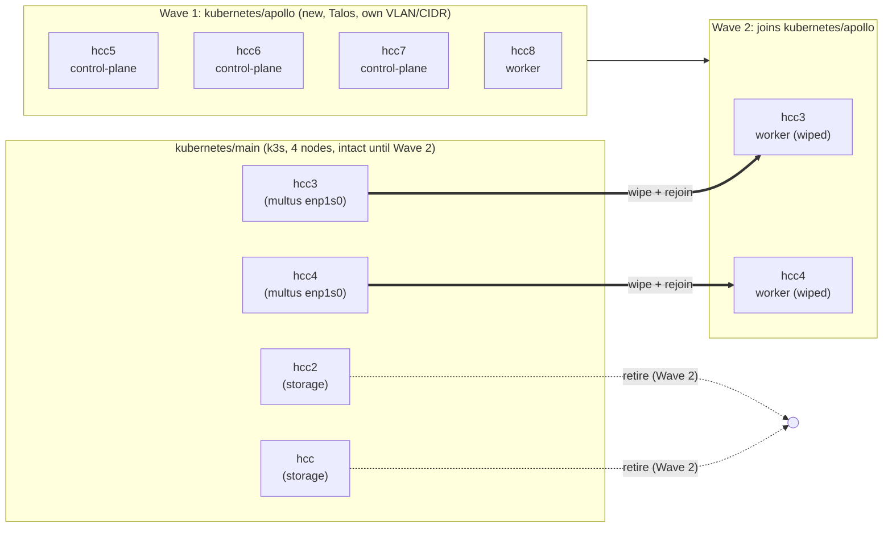
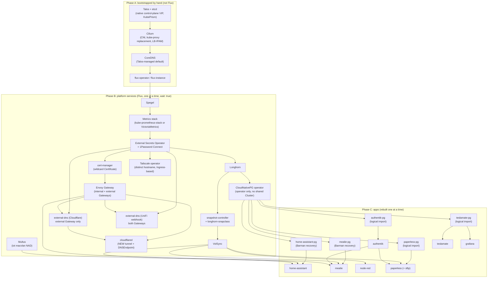
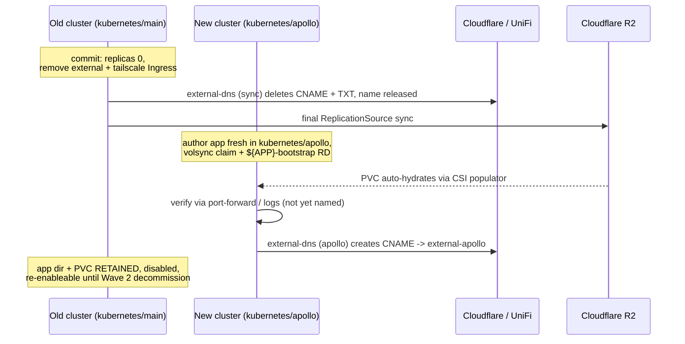

# Talos Migration

# Overview

The cluster moves from ansible-managed k3s to Talos on a consolidated, all-x86_64 fleet: four new NUC11 nodes, plus hcc3 and hcc4, which are existing NUCs that get wiped and rejoined. Two machines leave the fleet, both Odroid HC2 boards that Talos has no image for: hcc and hcc2. A third, hcc-tablet1, is in the ansible inventory but has already left the live cluster.

The new Talos cluster is bootstrapped as `kubernetes/apollo`, on its own VLAN and CIDR. Clusters take names from Greek mythology in alphabetical order (this one is Apollo, the next starts with B), so a cluster is never renamed after it is created and a name is never reused.

The existing k3s cluster keeps its generic `kubernetes/main` tree for the rest of its life, and is deleted outright at the end of Wave 2. Renaming it into the new scheme would spend a good name on a machine with weeks left to live, and renaming a live Flux root is a self-referential operation with real failure modes. Neither cost buys anything, so `main` stays `main` until it is gone.

Each application is rebuilt on the new cluster rather than moved. Its manifests are authored fresh under `kubernetes/apollo`, mostly copied from the old tree but reviewed on the way (see Per-app config review), while the old cluster's copy is disabled in place with its data left intact until the whole cluster is decommissioned. Nothing is deleted from `kubernetes/main` during the migration. Every app therefore keeps a working, re-enableable copy behind its cutover, along with its data. It also means the two clusters never contend over the same IPs, DNS records, or tailnet hostnames, because an app only ever serves from one of them at a time.

The new cluster does not have to match the old cluster's Kubernetes version. Data moves through version-agnostic backup mechanisms, so it can jump straight to a current stable Talos and Kubernetes release.

# Problem statement

hcc and hcc2 are Odroid HC2 boards with no supported Talos image, so both need to leave the fleet. hcc-tablet1, a tablet the operator no longer wanted hosting workloads on any OS, has already left: the ansible inventory still lists it as a controller, but the live cluster reports only four nodes.

Separately, the ansible and SSH-managed k3s nodes carry ongoing config-drift risk. This repo has already had to fix problems caused by manual intervention outside GitOps. The upstream project this repo is based on, `cluster-template`, has also moved to Talos only. Talos's API-only, immutable model removes that whole class of drift.

The migration must not lose data. Home Assistant history, Mealie recipes, Node-RED flows, Paperless documents, and the Postgres databases behind CloudNativePG all need to land on the new cluster intact. Note that most of that data is now in Postgres rather than on a PVC: Home Assistant's recorder history and Mealie's recipes both live in per-app CNPG clusters, so treating either app as VolSync-only would preserve its config and lose its contents.

# Functionality

Each hosted app gets its own short maintenance window at its individual cutover point, instead of one cluster-wide outage. That covers Home Assistant, Mealie, Node-RED, Paperless, and everything backed by the shared Postgres cluster.

This is a hard cutover rather than a live or parallel one. Each app goes fully offline for the few minutes its backup and restore takes, instead of staying reachable through dual-serving or a pre-verified staging copy. The trade is deliberate: a few minutes of downtime per app buys certainty that no backup or restore ever runs against a source that is still being written to. That is the actual data-loss risk being avoided.

Ingress hostnames and Tailscale names survive the migration unchanged. An app is released from the old cluster and reclaims the same name on the new one at its cutover moment. The GitOps workflow is identical afterward: changes still land through Flux reconciliation, and the operator never SSHes into a node or hand-applies manifests for routine work.

After Wave 1, every app runs on the new Talos cluster (`kubernetes/apollo`) while the old cluster still stands, whole and untouched, as the rollback environment. No hardware is freed yet, which is deliberate; see No node leaves the old cluster during Wave 1. After Wave 2, the fleet is consolidated onto six Talos NUC11-class nodes with a single cluster and repo tree, hcc and hcc2 are free for disposal, `kubernetes/main` is deleted, and the ansible and k3s tooling in the repo becomes dead code ready for removal.

# Design

## Node topology

| Node | Today | After migration | Wave |
|---|---|---|---|
| hcc | k3s controller + etcd, Longhorn storage node (tainted `dedicated=storage`) | retired | 2 |
| hcc2 | same | retired | 2 |
| hcc-tablet1 | listed as a controller in the ansible inventory, but not a member of the live cluster | already gone; confirm the machine is decommissioned and drop the stale inventory entry | n/a |
| hcc5, hcc6, hcc7 (new NUC11s) | not provisioned | Talos control-plane | 1 |
| hcc8 (new NUC11) | not provisioned | Talos worker | 1 |
| hcc3 | k3s controller, multus `enp1s0` host | wiped, joins as Talos worker | 2 |
| hcc4 | k3s controller, multus `enp1s0` host | wiped, joins as Talos worker | 2 |

End state: 6 nodes, 3 control-plane and 3 workers. That satisfies Talos's odd-controller-count requirement without ever running an even split.



## Disk layout and Longhorn

| Node | Disks | In Longhorn |
|---|---|---|
| hcc5 | 256GB NVMe, 1TB HDD (WD10SPSX) | NVMe only |
| hcc6 | 256GB NVMe, 1TB HDD (WD10SPSX) | NVMe only |
| hcc7 | 256GB NVMe, 256GB SATA SSD | both |
| hcc8 | 256GB NVMe, no expansion bay | NVMe only |
| hcc3, hcc4 | existing drives, about 360Gi schedulable each today | both, on rejoin in Wave 2 |

One untagged Longhorn pool holds every flash disk. The two HDDs stay out of it entirely.

### One tier, and why the HDDs stay out

Longhorn tiers split usefully on flash versus platter, not on NVMe versus SATA. A SATA SSD and an NVMe SSD differ in sequential bandwidth, roughly 550 MB/s against 3000 or more, but both land around 50 to 100 µs on random access, and inside a Longhorn volume that gap disappears under the iSCSI engine hop and the synchronous write to peer replicas. The existing cluster is the evidence: hcc and hcc2 are SATA SSDs, hcc3 and hcc4 are NVMe, all four sit in one untagged pool, and nothing has ever needed separating.

The WD10SPSX is a different class of device. It is a 7200 RPM 2.5 inch drive, so its SATA 6Gb/s interface is nowhere near the limiting factor. The platter is, at roughly 8 ms average random access and on the order of 150 random IOPS against tens of thousands for either SSD, a gap of two orders of magnitude. Longhorn's scheduler has no concept of disk speed and places replicas by free space and node anti-affinity, so an untagged HDD in the pool would eventually take a CNPG replica or the Home Assistant recorder volume, and the symptom would be latency rather than an error.

So the HDDs either get a tag, with a `diskSelector` fencing the default StorageClass off them, or they stay out of Longhorn. They stay out. Every Longhorn volume in the cluster holds about 12 GB of data between them, the app list (Home Assistant, Mealie, Node-RED, Paperless, Teslamate) has nothing that wants bulk capacity, and the HDDs are due for replacement by the Odroids' 1TB SSDs in Wave 2 anyway. A tagged tier would buy unused capacity in exchange for a StorageClass to maintain and a slow disk to keep workloads off. Adding a tagged disk later takes two lines and no data migration, so there is no cost to waiting until a workload wants one.

### Right-size paperless-library during the rebuild

Longhorn schedules against requested size, not used size. Today that means about 363Gi of reservation standing behind about 12 GB of data, and one volume dominates: `paperless-library` requests 100Gi, holds 3.4 GB, and at two replicas books 200Gi of the total. The migration recreates every PVC from restic, so it is the one moment where that request can be corrected without moving data. Request 25Gi and expand later if it ever fills, since `allowVolumeExpansion` is already true on the Longhorn StorageClasses.

### Talos specifics

`/storage01` cannot survive as a path. Talos's root filesystem is read only and only `/var` is writable, so the Longhorn data path becomes `/var/mnt/longhorn`, which is where Talos mounts a user volume named `longhorn`. `defaultDataPath` changes to match.

EPHEMERAL expands to fill its disk unless capped, and the cap has to be set at install time. Miss it and the NVMe has no free space left to carve a Longhorn volume out of, with reinstalling the node as the only fix. Something like this, to be verified against whatever Talos version gets pinned:

```yaml
apiVersion: v1alpha1
kind: VolumeConfig
name: EPHEMERAL
provisioning:
  maxSize: 80GiB
---
apiVersion: v1alpha1
kind: UserVolumeConfig
name: longhorn
provisioning:
  diskSelector:
    match: disk.transport == 'nvme'
  minSize: 100GB
```

hcc7's SATA SSD needs a second `UserVolumeConfig` in its `node/hcc7/` patch directory, selecting the non-NVMe disk and mounting at `/var/mnt/longhorn-sata`. Both paths need a kubelet bind mount with `rshared` propagation, alongside the `iscsi-tools` and `util-linux-tools` extensions Phase A already installs.

A Talos reset, or an upgrade that wipes, destroys that node's Longhorn replicas. Three replicas make that survivable, but it means upgrading one node at a time and letting rebuilds finish before starting the next.

### Replica count

`defaultReplicaCount` stays at 3. With four nodes that leaves one node of scheduling slack, which Talos makes worth having: rolling OS upgrades reboot every node as a matter of routine, and at two replicas a volume would sit on a single replica for the length of each reboot.

Two replicas stays available as a per-app opt-out, and every volume has an offsite copy that justifies it: VolSync to R2 for PVCs, Barman to R2 for the CNPG clusters. Use it where a volume is large or the app tolerates a restore, set it through a per-app StorageClass, and keep it as a capacity release valve rather than a blanket change.

### Capacity trajectory

About 140Gi of Longhorn space per NVMe once EPHEMERAL is capped, plus about 230Gi from hcc7's SATA SSD, so roughly 790Gi at Wave 1 against the 215Gi of reservation left after paperless is right-sized. Longhorn self-balances across a size-asymmetric pool because it prefers the disk with the most available space, and node-level replica anti-affinity is strict by default, so hcc7's second disk adds capacity to hcc7 without opening a path to two replicas of one volume sharing a node.

The long-term ceiling is hcc8. Replica 3 across four nodes means a volume needs its full size free on three separate nodes, so the three smallest set the limit. Once the Odroids' 1TB SSDs move into hcc5 and hcc6 in Wave 2, hcc8's single 256GB NVMe becomes the constraint, and it has no expansion bay to fix that with. None of this binds at current data volumes, and if it ever does, the answer is a larger NVMe in hcc8 rather than any change to the layout.

## Cluster and repo structure

The new cluster is bootstrapped as `kubernetes/apollo/`, with the usual `flux/`, `bootstrap/`, `apps/`, and `templates/` directories. It gets its own `GitRepository` and `Kustomization` pair pointed at `./kubernetes/apollo`, and its own `cluster-settings` ConfigMap with genuinely independent `NODE_CIDR`, `CLUSTER_CIDR`, and control-plane VIP values. It lives on a dedicated HCC VLAN carved out on the Ubiquiti gear (UCG Fiber) acquired since the original cluster was built.

The existing live tree stays `kubernetes/main`, never renamed, until it is deleted wholesale in Wave 2. Because the two clusters sit on separate broadcast domains, Cilium's L2 announcements and BGP peering never collide on an IP regardless of numeric overlap. The HCC VLAN is a permanent security boundary rather than a migration-scoped convenience; Networking changes covers the isolation posture it enables.

This does mean real duplication for the length of the migration. Every app's manifests, plus `cluster-secrets.sops.yaml` re-encrypted with the same age key, exist in both trees until the old one is deleted. No new key material is involved. The duplication is deliberate, because it is what makes each cutover reversible (see Rollback). Renovate and manual changes touch whichever tree currently serves a given app. The disabled copy in `kubernetes/main` is frozen, not maintained.

Two repo-level things need per-cluster handling while both trees coexist:

- The root `Taskfile.yaml` hardcodes `KUBERNETES_DIR: "{{.ROOT_DIR}}/kubernetes/main"`. It needs to become a per-cluster task var that defaults to whichever cluster is being worked on, rather than being repointed once.
- `.github/workflows/flux-diff.yaml` and `kubeconform.yaml` both reference `kubernetes/main` explicitly. Add `kubernetes/apollo` to them the moment the tree is created, not at the end. Otherwise every app authored on the new cluster lands with no CI validation at all, which is exactly when validation is most useful.

## Kubernetes version

The new cluster does not have to match the old cluster's Kubernetes version. The old cluster runs k3s `v1.32.4+k3s1`, confirmed live against all four nodes and matching what `ansible/inventory/group_vars/kubernetes/main.yaml` provisions, so 1.32 is the baseline for any removed-API analysis. Data moves through version-agnostic mechanisms anyway: VolSync and restic work at the file level, and CNPG and Barman recovery are keyed to the Postgres major version rather than the Kubernetes one. So the new cluster can jump straight to whatever current stable Talos and Kubernetes release is available, in one step. The thing worth checking as each app is rebuilt, which authoring it fresh forces anyway, is that no chart or manifest assumes an API surface removed between 1.32 and the target.

Note the repo currently disagrees with itself about this version. `kubernetes/main/apps/system-upgrade/k3s/ks.yaml` pins `KUBE_VERSION: v1.29.1+k3s2`, three minor versions behind what ansible installs, and that Kustomization is live rather than suspended (`kubernetes/main/apps/system-upgrade/kustomization.yaml` includes it). Worth understanding before Wave 2 removes system-upgrade-controller, since a `Plan` pinned below the running version is at best inert and at worst a downgrade waiting to happen. It does not change this migration's conclusion, but do not use that file as the version baseline.

The `.private/bootstrap-121456` scaffold is not the target. It pins `talosVersion: v1.6.5` and `kubernetesVersion: v1.29.2`, while upstream `cluster-template` is now several major Talos releases ahead, at `v1.13.7` with Kubernetes `v1.36.4` as of this writing. Those two numbers are Renovate-tracked upstream and move on their own; Kubernetes went from `v1.36.3` to `v1.36.4` between two readings of this doc. They are recorded here to show how far the stale scaffold has drifted, not as values to pin. Read the current ones off upstream's `topf.yaml.j2` at the moment configs are actually generated.

Upstream has also swapped machine-config generators since that scaffold used `talhelper` and `talconfig.yaml`. It now uses [`topf`](https://github.com/postfinance/topf), a `postfinance` tool created in December 2025, driven by a `topf.yaml` plus a directory of strategic-merge patches split by scope (`all/`, `control-plane/`, `worker/`, `node/<host>/`). That structure matches Talos's own documented patching model. The tool is young, with roughly 95 GitHub stars at the time of writing, against talhelper's long-established adoption.

Adopting it here is a deliberate change for the new cluster. This is a fresh bootstrap of new infrastructure rather than ongoing maintenance of an already-detemplated tree, so taking the current tool is the right call. It does not conflict with this repo's policy about template machinery (`plans/README.md`), which is about not re-running makejinja against upstream repeatedly, and says nothing about which one-time tool generates the initial bootstrap.

`topf` also does not drag in upstream's other toolchain changes. It is a standalone binary that reads a plain YAML `topf.yaml` and patch files, so it slots into this repo's existing Task-based `.taskfiles/Talos/Taskfile.yaml` in place of talhelper, hand-authored the same way `talconfig.yaml` is today, with no need to adopt Just or TOML. The trade-off to go in with eyes open about: `topf` is new enough that its rough edges are still being found (6 open issues, small community), on tooling that manages the actual Talos machine configuration of every node.

While hand-authoring `topf.yaml` and its patches, cross-check upstream's current content for anything worth carrying over beyond the tool switch. Two things stand out. Its sysctls tuning sets `net.core.rmem_max` and `wmem_max` for QUIC, which matters because this cluster runs cloudflared, and raises ARP cache GC thresholds, which matters because this cluster leans heavily on Cilium L2Announcements. Its current bootstrap-apps sequencing is `cilium → coredns → [spegel] → cert-manager → flux-operator → flux-instance`. Two things fall out of that ordering:

- Spegel already has a defined slot. Upstream places it between CoreDNS and cert-manager, with cert-manager's `needs:` pointing at whichever of the two precedes it. Since Spegel is adopted here (Platform component inventory), copy that slot rather than deriving one.
- CoreDNS is a deliberate divergence. Upstream bootstraps CoreDNS through Helm as its own release; this cluster keeps it Talos-managed (Platform component inventory), so that release is dropped and cert-manager's `needs:` points at Cilium or Spegel instead. Author it that way on purpose, or it reads as an omission on the next comparison against upstream. Revisit only if the original condition in `plans/05b-coredns-helm.md`, needing custom CoreDNS config, ever actually arrives.

One open item from that comparison: upstream's current bootstrap-apps list does not include kubelet-csr-approver at all, unlike the stale scaffold. Whether that is because modern Talos no longer needs it, or because it is installed differently now, is unconfirmed. Treat it as something to verify rather than assume required.

Two claims above have since been re-verified against upstream directly. `topf`'s patch-scoping model is confirmed by its own documentation: `all/`, then `<role>/`, then `node/<host>/`, merged in that order and lexicographically within each folder, strategic-merge only. RFC 6902 JSON patches are unsupported, with `$patch: delete` covering removals, and `.yaml.tpl` files carry Go-templated patches. Note that upstream only ships `all/` and `control-plane/`. The `worker/` and `node/<host>/` scopes are supported but have nothing to copy, so those get hand-authored. Separately, upstream's Talos config layer has had no structural change since the `topf` switch itself, since its recent commit history there is Renovate version bumps, so there is no newer Talos logic to pull in beyond what is described here.

## Foundational bootstrap (before any app moves)

The platform layer needs to exist and be verified before the first app is rebuilt. The dependency graph below is the authoritative ordering. The notes after it cover the pieces that are not a straight copy of the old cluster.



Notes on the pieces that are not a straight carry-forward:

> Decided: Envoy Gateway, not ingress-nginx. This avoids authoring every app's routing twice. Each app gets an `HTTPRoute` written once while it is being rebuilt, instead of an `Ingress` now and an `HTTPRoute` again soon after. `plans/04-envoy-gateway.md` exists but still needs fleshing out for this cluster's actual topology before Wave 1: real IPs and VLAN, cloudflared integration, and the raw `LoadBalancer` apps like paperless-sftp and `postgres-lb` that stay unaffected either way. That prep work is unchanged by this decision, just no longer conditional on it. Note that `external-dns` currently sources from `["crd", "ingress"]` with `--ingress-class=external`, both Ingress-API concepts with no direct Gateway API equivalent. It needs a Gateway API source such as `gateway-httproute`. The "external only" scoping is settled: it is which of the two Gateways a route's `parentRefs` names, covered under The gateway split.

- snapshot-controller is a hard prerequisite for VolSync, and is its own app at `kubernetes/main/apps/storage/snapshot-controller` rather than part of Longhorn's chart. Every `ReplicationSource` and `ReplicationDestination` in this repo uses `copyMethod: Snapshot` with `volumeSnapshotClassName: longhorn-snapclass`, so both the controller and that `VolumeSnapshotClass` must exist before the first VolSync-backed app is rebuilt. Without them, `${APP}-bootstrap` hydration hangs with no obvious cause.
- The Tailscale operator needs a distinct identity per cluster. The old cluster's operator registers as `hostname: tailscale-operator`, and a second operator joining the same tailnet under that hostname gets silently suffixed to `tailscale-operator-1`. The same applies to every per-app `className: tailscale` Ingress device. The new cluster's operator needs its own hostname, something like `tailscale-operator-apollo`, and its own OAuth client credentials. Per-app tailnet names are reclaimed the same way DNS names are: released on the old cluster at disable, recreated on the new one at cutover (see Per-app migration). Its routing stays on the `Ingress` API rather than `HTTPRoute`, as covered in Platform component inventory.
- Internal DNS moves off the cluster entirely, to UniFi records written by a second external-dns instance. pihole and k8s-gateway are not carried forward. Internal DNS: UniFi, not pihole has the full design, including the gateway split it depends on.
- cloudflared needs a genuinely new tunnel rather than the same credentials copied over. Networking changes explains why, and covers the `external-apollo.${SECRET_DOMAIN}` alias that goes with it.
- Multus is foundational rather than app-level, because Home Assistant's `iot` macvlan attachment depends on it. See Per-app config review for the hardware prerequisite that gates Home Assistant specifically.
- Copy `templates/volsync` into the new tree at `kubernetes/apollo/templates/volsync`. The per-app rebuild step depends on it being present at the same relative path apps already reference (`../../../../templates/volsync`).

CloudNativePG does not migrate as a shared unit. Per `plans/11-cnpg-database-split.md`, the single `cnpg-cluster` currently backing teslamate, paperless, and authentik splits into per-app clusters (`teslamate-pg`, `paperless-pg`, `authentik-pg`) during this migration rather than before or after it. See CNPG-backed apps below. Only the operator itself is foundational; no shared Cluster CR is created on the new side at all.

## Platform component inventory

A fresh cluster bootstrap is the point to reconsider each platform-layer choice rather than carry it forward by default, since deferring means either living with the choice or re-touching every node again later. Already-decided items are listed for completeness; the rest are open.

| Component | Status |
|---|---|
| Ingress (ingress-nginx vs. Envoy Gateway) | Decided: Envoy Gateway. See the callout above for what is still prep work and what is already settled |
| CNPG (shared vs. per-app clusters) | Already decided: splitting during migration |
| kube-vip | Already decided: replaced by Talos-native VIP |
| Ansible/SSH node management | Already decided: fully retired in Wave 2 |
| CoreDNS | Decided: keep Talos-managed, for now. No serious alternative DNS provider exists in practice, and CoreDNS is the Kubernetes project's own graduated-CNCF default across every distribution. Talos auto-deploys a default CoreDNS during bootstrap, the same way it auto-deploys Flannel and kube-proxy, unless explicitly disabled with `cluster.coreDNS.disabled: true`, so DNS is not missing. Cilium replaces Flannel because a real CNI is needed; there is no equivalent forcing reason to take CoreDNS over from Talos right now, so leave `cluster.coreDNS.disabled` unset. Revisit if custom CoreDNS config is ever actually needed, the original condition in `plans/05b-coredns-helm.md` |
| Spegel (P2P image distribution) | Decided: adopt. Not yet in the repo (`plans/05a-spegel.md`), but Wave 1 means 4 to 6 nodes pulling every image fresh during platform and app bring-up, which is exactly the load Spegel is for |
| snapshot-controller | Already in the repo, but easy to miss as a VolSync prerequisite. Carry it forward, and stand it up with `longhorn-snapclass` before the first VolSync-backed app |
| Tailscale operator | Carry forward, but it needs a distinct per-cluster hostname and its own OAuth credentials, since two operators in one tailnet otherwise collide on device names. Its Ingresses stay `Ingress` rather than becoming `HTTPRoute`: the operator has no Gateway API support ([tailscale/tailscale#10656](https://github.com/tailscale/tailscale/issues/10656) is still open) and acts as its own ingress controller, so it needs no Gateway |
| cloudflared | Carry the component forward, but the new cluster needs its own tunnel rather than the old tunnel's credentials. See Networking changes |
| pihole | Decided: drop entirely, do not carry forward. It is already effectively out of service for stability reasons, with clients no longer pointing at it, so nothing depends on it today. Internal DNS moves to UniFi (see Networking changes). Dropping it also removes a 10Gi RWX Longhorn PVC and the pre-migration audit of its UI-edited drift |
| k8s-gateway | Decided: drop entirely, do not carry forward. Its whole job was generating internal records dynamically for pihole to forward to, and with UniFi holding records written by external-dns it is redundant. It is also unverified against Gateway API, since v2.3.0 watches Ingresses and Services and would need work to see `HTTPRoute` hostnames at all |
| Flux GitHub webhook receiver | Carry forward, and give the new cluster its own. `flux-webhook.${SECRET_DOMAIN}` on the `external` class fronts a `Receiver` that triggers reconciliation on push. Without one, the new cluster falls back to the `GitRepository`'s 30m poll, a painful feedback loop while authoring a cluster's worth of new manifests. GitHub allows multiple webhooks per repo, so both clusters can receive pushes during the migration. Needs its own hostname and its own receiver token |
| external-dns | Carry forward, but as two instances: one `provider: cloudflare` for public names, one using the [UniFi webhook provider](https://github.com/kashalls/external-dns-unifi-webhook) for LAN names. external-dns takes one provider per instance, so this is two Deployments, scoped by Gateway (see Networking changes) |
| Longhorn backup target | Already flagged: no cluster-level S3 target is configured (see Pre-migration backup verification). Worth deciding whether to add one as defense in depth while touching Longhorn's config anyway |
| Longhorn `dedicated=storage` taint pattern | Decided: retire it. The taint kept general workload off hcc and hcc2 because the Odroid fans are loud enough to be a nuisance under load. It was a noise mitigation rather than a storage-architecture decision, and both machines are being retired, so the reason goes with them. All six NUC11s are equivalent and schedulable, and Longhorn's matching `taintToleration` setting comes out alongside the taint |
| OpenEBS | Resolved: cruft rather than a real prior decision. The `.private/bootstrap-121456/templates/kubernetes/apps/openebs-system` scaffold reference is leftover template noise that was never deliberately adopted here, so no action is needed beyond not carrying it forward |
| system-upgrade-controller | Decided: remove entirely in Wave 2, not just its k3s `Plan`. It has exactly one `Plan` in this repo, `system-upgrade/k3s`. Talos OS upgrades go through `talosctl upgrade`, wrapped by `topf upgrade`, an atomic A/B partition swap with automatic rollback on boot failure. Kubernetes version upgrades go through `talosctl upgrade-k8s` directly, since `topf` deliberately does not wrap it: *"topf intentionally does not manage Kubernetes upgrades"*. Beyond being a different mechanism, `system-upgrade-controller`'s design is structurally incompatible with Talos. It relies on a privileged pod that chroots into the node's host filesystem and runs an upgrade script, and Talos has no writable host filesystem or shell to chroot into |
| Dragonfly | Resolved: keep. An app needs it today and is expected to keep needing it |
| Secrets management (External Secrets Operator + 1Password) | Decided: adopt for new use cases going forward, as opposed to a rip-and-replace of existing SOPS secrets. This resolves the open TODO in `plans/11-cnpg-database-split.md` ("Maybe it's finally time for 1Password?"). Cross-namespace secret access, such as Grafana reading `teslamate-pg`'s credentials from another namespace, becomes an `ExternalSecret` in each namespace pointing at the same 1Password item, instead of a copy or replication workaround. It does not remove the `age.key` backup requirement from Pre-migration backup verification: Talos and cluster-bootstrap secrets (`topf.yaml`'s `secretsPath`, `cluster-secrets.sops.yaml`) still need SOPS and age at minimum, including to seed ESO's own 1Password Connect credential. ESO reduces `age.key`'s blast radius for future app secrets without eliminating the need for it |
| Observability (metrics + alerting) | Decided: adopt. Several components already emit `ServiceMonitor` and `PrometheusRule` resources that assume a compatible backend (Cilium, cert-manager, Authentik, echo-server, external-dns, and VolSync's own `prometheusrule.yaml`), but none is deployed. That wiring is currently dead, and Grafana's Prometheus datasource sits commented out. The stack choice, kube-prometheus-stack against the lighter VictoriaMetrics k8s stack, is still open |
| VolSync/restic/R2, cert-manager, Authentik, Multus, Cilium, reloader, metrics-server | No signal to reconsider; carrying forward as-is |

## Per-app migration: disable, back up, rebuild

The unit of work is a rebuild on the new cluster paired with a disable on the old one, not a `git mv`. The app's directory under `kubernetes/main` is never deleted during the migration. It is only disabled, so it can be re-enabled by reverting one commit, with its Longhorn volume still intact.

### What "disable" means, precisely

Disable is a commit merged to the old cluster's tree that does three things at once, plus a manual final backup afterward. Suspending a Flux `Kustomization` is not sufficient on its own: a suspended Kustomization stops reconciling, but every object it already applied stays in the cluster, Ingresses included, which means the app keeps holding its DNS and tailnet names.

1. Scale the workload to zero, either with `replicas: 0` in the HelmRelease values or by suspending the HelmRelease and scaling down, so nothing is writing to the PVC or the database.
2. Remove the app's `className: external` Ingress, if it has one. This is what makes the old cluster's external-dns, running `policy: sync`, delete both the app's CNAME and its TXT ownership record, releasing the name so the new cluster can claim it. Without this step the record stays owned by the old cluster and the new cluster silently refuses to touch it.
3. Remove the app's `className: tailscale` Ingress, if it has one, so the tailnet device is deregistered and the hostname is free for the new cluster's operator to claim.

Several things deliberately stay: the app's `pvc.yaml` and its data, its secrets, and its directory in `kubernetes/main`. The internal (`className: internal`) Ingress can stay too, since internal resolution is handled separately, below.

Then, with the app confirmed stopped:

4. Back up. Trigger one final `ReplicationSource` sync so R2 holds the exact post-disable state, and for a database-backed app an on-demand CNPG `Backup` as well. Confirm both landed before going any further.
5. Suspend the old `ReplicationSource` once that final sync completes. It would otherwise keep firing against a frozen PVC and, more importantly, keep pruning a restic repository the new cluster is also using. See Shared external state for why that matters.

### Rebuild (VolSync-backed apps)

This covers Node-RED, plus the PVC half of Home Assistant, Mealie, and Paperless. Those three are hybrids that also need the database flow below, executed in the same cutover so each app is rebuilt once and fully working. Author the app fresh under `kubernetes/apollo/apps/...`, copying from the old tree and changing four things:

- Swap the app's bespoke `pvc.yaml` for the shared `templates/volsync` component, which is `claim.yaml` plus `r2.yaml`. Its `claim.yaml` creates the PVC with `dataSourceRef: kind: ReplicationDestination, name: ${APP}-bootstrap`, so VolSync's CSI populator auto-hydrates the new PVC from the restic repository the moment it is created. There is no separate manual restore step. Add the one-time `${APP}-bootstrap` `ReplicationDestination`, reusing the app's existing and already-encrypted R2 credentials. After cutover the app is left on the shared template's `r2.yaml` for ongoing backups instead of its old one-off copy.
- Replace `internal` and `external` `Ingress` resources with `HTTPRoute`s whose `parentRefs` name the internal or external Gateway. `className: tailscale` Ingresses stay as `Ingress`.
- For externally-exposed apps, point the external-dns target at the new cluster's tunnel alias, `external-apollo.${SECRET_DOMAIN}`, rather than `external.${SECRET_DOMAIN}`. See Networking changes.
- Apply anything from Per-app config review, below.

Verify with the app running but not yet named: port-forward, check logs, confirm the hydrated data is actually there. Only then attach the routing that publishes its real hostname. A `.new.${SECRET_DOMAIN}` staging hostname was considered and declined. Its only benefit is minimizing downtime, which is not a goal here, and its cost (a second wildcard `Certificate`, temporary routes, per-app cleanup) is not worth paying for a benefit nobody is pursuing.

### Rebuild (database-backed apps)

Five apps have a Postgres database, in two different situations that need two different mechanisms. Getting the wrong one silently produces an empty database, so check which group an app is in before copying anything.

Teslamate, authentik, and paperless still share the single `cnpg-cluster` in the `database` namespace, on PG 16.2. They need the logical import described below, because the split has not happened for them yet.

Mealie and home-assistant have already been split. Each has its own `Cluster` in the `default` namespace alongside its app manifests (`mealie-pg`, `home-assistant-pg`), already on PG 18.1, with its own Barman backup to R2 under a distinct `serverName` and its own `ScheduledBackup`. For these two the split is done, and what remains is moving the data.

The trap is that both of those manifests bootstrap with `initdb`. Copying them to the new cluster unchanged creates a brand new empty database and Flux reports success, because an empty cluster is a healthy cluster. Home Assistant's recorder history lives in `home-assistant-pg`, so this failure mode silently discards exactly the data the problem statement promises to preserve, and it does so quietly. The `bootstrap` block must be changed to `recovery` before either app is rebuilt.

Use Barman recovery from R2 for these two rather than logical import. Physical whole-instance recovery could not select one database out of the shared cluster, which is why the other three need a logical mechanism, but that objection does not apply here: each of these instances already holds exactly one database, so restoring the whole instance restores precisely the right thing. Recovery also reads from R2 rather than from the old cluster, so it needs no cross-VLAN path and no firewall rule, and it does not care that `enableSuperuserAccess: false` on both clusters.

Both are on `@weekly` schedules, so the most recent scheduled backup can be up to seven days old. Trigger an on-demand `Backup` at disable time and confirm it completes before rebuilding, exactly as the VolSync flow triggers a final `ReplicationSource` sync. Skipping that step is how a week of Home Assistant history goes missing.

Neither of these two needs the PostgreSQL major-version pre-flight check below, since both already run 18.1.

The remaining three apps, teslamate, authentik, and paperless, follow the disable-first shape, with backing up and rebuilding happening together through CNPG's database-import feature instead of VolSync.

CNPG's `bootstrap.initdb.import` can technically run against a live source database, so the app does not strictly have to be disabled first for the import to succeed. Disabling first is done anyway, deliberately, so the import captures a database that is no longer being written to rather than one mid-transaction. This is not a step to relax later to shave time off the migration window. It is the same accepted-downtime-over-data-risk trade the whole migration is built on.

Create the app's dedicated cluster (`teslamate-pg`, `authentik-pg`, `paperless-pg`) directly on `kubernetes/apollo`, using `bootstrap.initdb.import` with the microservice `pg_dump` and restore method, and point `externalCluster.connectionParameters.host` at the old cluster's `postgres-lb` Service. Use the raw IP `192.168.6.21` rather than `postgres.${SECRET_DOMAIN}`. That hostname is published by the old cluster's k8s-gateway for internal resolution only, because external-dns does not watch Services at all (see Networking changes), so it is not reliably resolvable from the new cluster during exactly the window when internal DNS is in flux. This produces a split, already-on-Talos cluster in one step, instead of splitting the old cluster first and migrating the result afterward. Then point the rebuilt app's database host at `${app}-pg-rw.database.svc.cluster.local`.

Grafana's TeslaMate datasource in `kubernetes/apollo/apps/monitoring/grafana/app/helmrelease.yaml` needs its `url` updated from `cnpg-cluster-r...` to `teslamate-pg-r...` at the same time. It is a consumer of teslamate's database, not a database of its own.

Logical import is the mechanism here rather than Barman or WAL recovery from R2, and the reason is structural. Barman recovery is physical and restores a whole instance, so it cannot select one database out of the shared `cnpg-cluster`. It would land all three databases in each new cluster, to be dropped twice over. The split is a logical reorganization, so it needs a logical mechanism.

A useful side effect is that `pg_dump` and restore cross PostgreSQL major versions, which makes this the moment to get off the current `16.2` image, a February 2024 patch release. Unlike the Kubernetes jump, this one is not automatically free: each app supports its own range of PostgreSQL versions and may need bumping first. That is a per-app pre-flight check run before that app's cutover rather than a decision made once upfront. Because each app now gets its own cluster, they do not all have to land on the same major, and staying on 16.x for a lagging app is always a valid answer. See `plans/11-cnpg-database-split.md` for the full comparison.

Three apps are hybrids that need both flows in the same cutover: Paperless (document library PVC plus `paperless-pg`), Mealie (data PVC plus `mealie-pg`), and Home Assistant (config PVC plus `home-assistant-pg`). Rebuild each once, fully working, instead of twice.

The open TODO in `plans/11-cnpg-database-split.md` about Cluster namespace placement is answered by what the repo already does: `mealie-pg` and `home-assistant-pg` both live in the app's own namespace rather than in `database`. Follow that for the three remaining clusters unless there is a reason not to.

### App ordering

The order is not arbitrary. `dependsOn` edges in the existing `ks.yaml` files force part of it:

1. authentik first, with `authentik-pg`. Mealie and Paperless both declare `dependsOn: authentik`, and it is the SSO front door for everything else, so migrating it first means every later app is authored against its final identity provider rather than being re-pointed afterward. Its routing shape should already be settled by then, since the split-horizon question is decided on echo-server back in Phase B (see Networking changes) rather than during this cutover.
2. Node-RED second. It is the only app left that is genuinely VolSync-only, which makes it the cheapest place to prove PVC hydration, DNS release and reclaim, and tailnet reclaim without a database in the way.
3. Mealie third. It is a hybrid (PVC plus `mealie-pg`), and the smallest of the three, so it is where Barman recovery gets proven on a database whose loss would be annoying rather than serious.
4. Paperless, the other logical-import hybrid, once both mechanisms are proven separately.
5. teslamate and Grafana together, since Grafana's datasource follows teslamate's database.
6. Home Assistant last, or after Wave 2, since it is gated on IoT VLAN hardware that does not exist yet (see Per-app config review). Being last also suits it: it is a hybrid carrying the most irreplaceable data in the fleet, so it benefits from every mechanism having been proven on something cheaper first.



### Internal DNS during migration

There is nothing to coordinate, because internal DNS is being rebuilt rather than migrated. Pihole is already out of service and clients no longer point at it, so no internal name resolves through the old cluster today. There is no live state to hand over and nothing for the two clusters to contend on. The new cluster's UniFi external-dns instance starts from an empty record set and creates each app's LAN record as that app is rebuilt.

The practical consequence for a cutover is that an internal app's LAN name simply starts working when the app is rebuilt on the new cluster, instead of needing to be moved. See Internal DNS: UniFi, not pihole for the design.

## Per-app config review (not a blind copy)

Copying manifests forward is not sufficient, because a few apps bind directly to IPs or node identities that only make sense on the old cluster's topology, and two carry a database manifest that would quietly recreate itself empty. Node-RED is the only app that is a genuinely clean copy. What needs real editing:

| App | What's bound | Change needed |
|---|---|---|
| Home Assistant | Static multus IP `192.168.4.100/24` for the `iot` macvlan network (`k8s.v1.cni.cncf.io/networks` annotation) | Reassign to a free address in whatever IoT VLAN and subnet the new node ends up on |
| Home Assistant | `nodeSelector: kubernetes.io/hostname: hcc3` | Repoint at whichever node ends up carrying the IoT NIC, and reserve a free USB port on it. The pin's comment mentions USB device access, currently unused but earmarked for a future Thread border-router antenna, so there is no active dependency to physically relocate today |
| Home Assistant | `HASS_HTTP_TRUSTED_PROXY_1/2` hardcoded as raw CIDRs (`10.69.0.0/16`, `10.96.0.0/12`) instead of `cluster-settings` vars | Parameterize while touching the file, so they track the new cluster's actual pod and service CIDR instead of silently going stale |
| Paperless (sftp) | Dedicated `LoadBalancer` Service with hardcoded `io.cilium/lb-ipam-ips: 192.168.6.22` | Reassign to an address in the new cluster's LB pool |
| Mealie, echo-server, Authentik (webfinger), flux-webhook | `external-dns.alpha.kubernetes.io/target: external.${SECRET_DOMAIN}`, the old cluster's tunnel alias | Repoint at `external-apollo.${SECRET_DOMAIN}` (see Networking changes) |
| Mealie | Missing its internal exposure. `food.${SECRET_DOMAIN}` has only an `external` ingress, while echo-server and Authentik both carry internal routes alongside their external ones. This is an omission from when internal DNS went out of service, not a deliberate choice | Restore LAN reachability during the rebuild. Under split-horizon this is automatic, since the UniFi instance answers from the external Gateway; under dual-route it needs an internal route authored explicitly. Worth adding a `tailscale` Ingress too, which it also lacks |
| Authentik | `sso.${SECRET_DOMAIN}` declared twice, as an `external` ingress in the HelmRelease and a separate `internal` Ingress CRD with the same host. The two have already drifted, since only the external one carries annotations | Open item, settled by testing at this cutover. Try collapsing to a single `HTTPRoute` on the external Gateway with split-horizon DNS, and fall back to porting both routes if it gets fiddly. See Networking changes for the trade and what fallback costs |
| All apps | `className: internal` and `external` Ingresses | Rewrite as `HTTPRoute` with `parentRefs` at the internal or external Gateway. Which Gateway a route names is what scopes external-dns |
| All apps | `className: tailscale` Ingresses | Keep as `Ingress`. The Tailscale operator has no Gateway API support and is its own ingress controller, so these do not become `HTTPRoute`s and need no Gateway |
| Mealie, Home Assistant | `cluster.yaml` bootstraps with `initdb`, which creates an empty database | Change to `bootstrap.recovery` against the app's existing R2 Barman backup. Copying either file unchanged loses the data and still reports healthy, which for Home Assistant means losing the recorder history this migration exists to preserve |

Home Assistant is blocked on hardware that does not exist yet. The `iot` macvlan's parent interface, `enp1s0`, is physically cabled on hcc3 and hcc4, which do not join the new cluster until Wave 2, and no Wave-1 node has IoT VLAN reachability today. There is no config-only workaround, because this is a cabling and switch-port question: a trunked port carrying the IoT VLAN to whichever node takes the pin. Either provision that as explicit Wave-1 prep, or sequence Home Assistant's rebuild after Wave 2. Decide before Wave 1 starts rather than discovering it at Home Assistant's cutover.

CloudNativePG's `postgres-lb` Service, at `io.cilium/lb-ipam-ips: 192.168.6.21`, is not decommissioned early. It is the cross-cluster import source the CNPG split reads from during migration. Once every app's import is done, decide whether per-app equivalents are worth keeping for external Postgres access, or whether it retires entirely along with the old cluster.

## Wave 1: stand up the new cluster, migrate apps, retire the Odroids and tablet

Three distinct phases, sequenced by how atomically each one can be done. Cluster infrastructure comes up as a single unit, because a Kubernetes API does not exist in a partial state. Platform services are stood up and verified individually before the next one starts. Apps are rebuilt one at a time exactly as detailed above.

Phase A, cluster infrastructure, all at once by definition:

1. Flip `bootstrap_distribution` to `talos` in `config.sample.yaml`, generate a Talos factory schematic with the system extensions Longhorn needs (`iscsi-tools`, `util-linux-tools`), and lay out the new `kubernetes/apollo/` tree (`bootstrap/`, `flux/`, `apps/`, `templates/`) on its own VLAN. Use the scaffold at `.private/bootstrap-121456/templates/kubernetes/bootstrap/talos/` as a structural reference only, not a direct promotion: hand-author `topf.yaml` plus its `all/`, `control-plane/`, `worker/`, and `node/${hostname}/` patch directories against current Talos and Kubernetes versions (see Kubernetes version). Add `kubernetes/apollo` to the CI workflows at this point, not later.
2. Boot the four new NUC11s into Talos maintenance mode and apply machine configs, with hcc5 through hcc7 as control-plane and hcc8 as worker, using `.taskfiles/Talos/Taskfile.yaml` adapted to shell out to `topf apply` and `topf upgrade` in place of talhelper. Then bootstrap etcd and fetch the kubeconfig. The names continue the existing `hcc` scheme rather than starting a generic one.
3. Install what a working Kubernetes API depends on and nothing more: Cilium as CNI (`cluster.network.cni.name: none` in `topf.yaml`, replacing Talos's built-in Flannel), kubelet-csr-approver if it is still needed (see Kubernetes version), and Flux itself (`flux-operator` and `flux-instance`). CoreDNS is left as Talos's own default rather than taken over, so there is nothing to do for it here. This is the boundary of "infra": everything after this point is something Flux reconciles rather than something bootstrapped by hand.

Phase B, platform services, one by one with each verified before the next:

4. Bring up each shared service as its own Flux `Kustomization` with `wait: true`, confirming healthy before moving to the next, in the order given by the dependency graph under Foundational bootstrap. Spegel goes early, because it speeds up every image pull after it. The metrics stack goes early too, so every subsequent service's `ServiceMonitor` gets picked up as it is deployed rather than backfilled later. Then External Secrets Operator with 1Password Connect, cert-manager, Longhorn, snapshot-controller, VolSync, the CloudNativePG operator, Multus, Envoy Gateway with both internal and external Gateways, both external-dns instances (Cloudflare with `txtOwnerId: apollo` and `policy: upsert-only`, UniFi webhook watching both Gateways), cloudflared with its new tunnel, and the Tailscale operator with its distinct hostname. pihole and k8s-gateway are not deployed.

5. Bring up echo-server as the last Phase B step, before any stateful app. It is the cheapest end-to-end proof the platform works: it exercises the external Gateway and tunnel, the internal Gateway and UniFi records, cert issuance, and the tailnet path, all on a workload that holds nothing and that nothing depends on. It is also where the split-horizon question gets settled (see The gateway split). Leave it running afterward as a standing health check on the routing layer.

Phase C, app migration, one by one as detailed above:

6. Rebuild each stateful app in turn through disable, back up, rebuild, in the order given under App ordering. VolSync-backed apps hydrate through the `${APP}-bootstrap` `ReplicationDestination`. Teslamate, authentik, and paperless come across through a cross-cluster database import against the old cluster's `postgres-lb` at `192.168.6.21`, while mealie and home-assistant recover their databases from R2. Verify and cut over one at a time. Internal names need no coordination, since the UniFi external-dns instance creates each app's LAN record as it is rebuilt.

Wave 1 ends there. The old cluster is still running, whole, with every app disabled but intact.

### No node leaves the old cluster during Wave 1

The old cluster keeps all four of its nodes, untouched, until it is shut down as a unit in Wave 2. Nothing is cordoned, drained, or powered off while apps are still migrating.

This is a deliberate choice rather than an oversight, because partial retirement is surprisingly expensive. All four nodes are k3s controllers running embedded etcd (`k3s_etcd_datastore: true`), so the cluster currently has four etcd members and a quorum of three. Retiring the two Odroids mid-migration would leave two members against a quorum that is still three until membership is formally contracted, and doing that contraction correctly means snapshotting, removing members one at a time, and verifying health between each step. Longhorn adds a second constraint on top: `defaultReplicaCount: 3` cannot be satisfied on two nodes, so every retained rollback volume would sit degraded for the rest of the migration.

None of that work buys anything, because the four new NUC11s comfortably carry the entire workload on their own. hcc3 and hcc4 are not needed to run anything during Wave 1, and the Odroids are only a noise and power nuisance for a few more weeks. Leaving the old cluster whole keeps the rollback environment at full strength precisely while rollback is most likely to be needed, which is the opposite of what staged retirement would do.

The corollary is that no device is freed until Wave 2. That is the trade, and it is worth it.

One note on the fleet inventory: `ansible/inventory/hosts.yaml` lists hcc-tablet1 as a controller, but it is not a member of the live cluster, which reports exactly four nodes. The tablet has already left, so it needs no retirement procedure. Confirm the machine itself is actually decommissioned rather than idling, and clean up the stale inventory entry when the ansible tree is deleted in Wave 2.

## Wave 2: absorb hcc3 and hcc4

1. Confirm every app is healthy on the new cluster and no rollback is pending. This is the point of no return for the old cluster's data.
2. Shut the old cluster down as a unit. Because it is being dismantled rather than kept serviceable, there is no need to contract etcd membership gracefully or evacuate Longhorn replicas: all four nodes go together. Power off hcc and hcc2 for disposal.
3. Wipe and reinstall them with Talos, and join them as workers to the `kubernetes/apollo` cluster, keeping their existing names. The final six nodes are hcc3, hcc4, hcc5, hcc6, hcc7, and hcc8, with hcc5 through hcc7 as control-plane and hcc3, hcc4, and hcc8 as workers.
4. Transplant the two 1TB SATA SSDs harvested from hcc and hcc2 into hcc5 and hcc6, replacing the WD10SPSX HDDs. Wipe them first (see Security), since they hold Longhorn replicas of live application data. Do this after hcc3 and hcc4 have joined: each swap takes a node offline, and at six nodes that still leaves five candidates for `defaultReplicaCount: 3`, where doing it at four would leave three and no slack. One node at a time, letting Longhorn finish rebuilding before starting the second. Add each SSD as a `UserVolumeConfig` in that node's patch directory, joining the same untagged pool as the NVMe disks (see Disk layout and Longhorn). Nothing needs evacuating from the HDDs, because they were never in Longhorn.
5. Re-verify the `iot` multus `NetworkAttachmentDefinition`, currently macvlan on `enp1s0` and physically cabled to hcc3 and hcc4, against the new OS. Interface naming and driver availability can differ under Talos, and this is a physical-cabling dependency rather than pure config. It also needs an actual VLAN tag added now (see HCC VLAN isolation): under the old flat networking the cluster and IoT devices shared a broadcast domain, so no tagging was needed, and on the new cluster they do not. If Home Assistant was deferred, this is where it gets rebuilt.
6. Revert the new cluster's Cloudflare external-dns to `policy: sync`. Normal pruning is safe again once no other cluster owns records in the zone.
7. Delete `kubernetes/main` entirely, and remove the now-dead ansible and k3s tooling: `ansible/inventory/hosts.yaml`, the `system-upgrade/k3s` Flux Kustomization, `system-upgrade-controller` itself, and any taskfiles that only existed to drive ansible and k3s.
8. Wipe the old disks (see Security).

## Shared external state: keep the two clusters off each other's paths

Both clusters talk to the same external services with the same credentials for the whole migration. Anywhere the path or identity is keyed only by app name, the two clusters land on the same object and can corrupt each other. The rule is that the new cluster reads from the old cluster's backup paths and writes to its own, so a backup that might still be needed for rollback is never written into by the thing that would need to restore from it.

| Shared resource | Keyed by today | Collides? | Handling |
|---|---|---|---|
| VolSync restic | `s3://tf-hcc-volsync/<app>`, app name only | Yes | Hydrate `${APP}-bootstrap` from the existing path, then point the ongoing `ReplicationSource` at `s3://tf-hcc-volsync/apollo/<app>` |
| CNPG Barman | `s3://tf-hcc-cloudnativepg/` plus `serverName` | Yes for `mealie-pg` and `home-assistant-pg`, which keep their names | Recover from the existing `serverName`, then give the rebuilt cluster `<app>-pg-apollo-v1`. The three shared-cluster apps get new names anyway |
| Cloudflare tunnel | tunnel ID | Yes | New tunnel for the new cluster (see Networking changes) |
| Cloudflare DNS | `txtOwnerId` | Yes | Distinct `txtOwnerId: apollo` |
| UniFi DNS | `txtOwnerId` | No, the old cluster has no UniFi instance | Distinct owner ID anyway, for hygiene |
| Tailscale | device hostname | Yes | Distinct operator hostname and its own OAuth client |
| Longhorn backup target | not configured | No | Nothing to separate |

The restic case is the one that bites quietly, because the design deliberately reads and writes the same repository. Two hazards follow from that:

- A scaled-to-zero app still has a PVC, and its `ReplicationSource` keeps firing on schedule. If the old app's `ReplicationSource` is left in place while the new cluster backs up the same app, two writers share one restic repository. Ordinary snapshots tolerate that through locking, but `pruneIntervalDays: 7` means both sides will eventually try to prune, and prune wants exclusive access. That is how a repository gets damaged.
- The same thing happens during a rollback, when the old app comes back up alongside a new cluster that has not been torn down yet.

Suspending the old `ReplicationSource` at disable handles the first case, and is now part of what disable means. Giving the new cluster its own write path handles both, and has the further benefit that the pre-migration backups stay frozen exactly as they were at cutover. The cost is that the new cluster's first backup is a full one rather than an incremental, which at this data size is a non-issue.

The discriminator is the cluster name, inserted as a path prefix rather than a suffix on the app name: `s3://tf-hcc-volsync/apollo/<app>`. That keeps every one of a cluster's repositories under a single prefix, so the whole cluster's backups can be listed, lifecycled, or deleted as a unit, which a suffix scheme scatters across the bucket. It matches the convention already used for `external-apollo.${SECRET_DOMAIN}`, and the next cluster gets `boreas/` for free. CNPG follows the same idea in the only place Barman allows it, the `serverName`, which becomes `<app>-pg-apollo-v1`.

## Data migration by class

| Data | Current store | Migration method |
|---|---|---|
| Home Assistant config, Mealie data, Node-RED flows, Paperless library | Longhorn PVC, already VolSync→R2 backed | Disable, final sync, rebuild on the new cluster, hydrated through `templates/volsync`'s `${APP}-bootstrap` `ReplicationDestination`. Source PVC retained on the old cluster until Wave 2. Note this covers only the PVC half for Home Assistant, Mealie, and Paperless; their databases are separate rows below |
| Postgres: teslamate, authentik, paperless | Shared `cnpg-cluster` in the `database` namespace, PG 16.2, Barman Cloud → R2 daily | Split during migration. Each app's database is imported directly from the old cluster's live `postgres-lb` (`192.168.6.21`) into its own new `${app}-pg` cluster; see `plans/11-cnpg-database-split.md`. An import never modifies the source cluster |
| Postgres: mealie (`mealie-pg`), home-assistant (`home-assistant-pg`) | Already independent per-app clusters in the app's own namespace, PG 18.1, Barman Cloud → R2 weekly under distinct `serverName`s | Barman recovery from R2. Change `bootstrap.initdb` to `bootstrap.recovery` when copying the manifest, or the rebuild silently creates an empty database and reports healthy. Trigger an on-demand `Backup` at disable first, since the weekly schedule can otherwise be up to seven days stale. No cross-VLAN path or firewall rule needed |
| Grafana | `persistence.enabled: false` (verified). Dashboards are provisioned declaratively from ConfigMaps and URLs in `helmrelease.yaml` | Recreated fresh by Flux reconciliation. TeslaMate datasource URL updated alongside teslamate's rebuild |
| Authentik | No PVC (verified). All state lives in the `authentik` database, now `authentik-pg` | Recreated fresh; data is already covered by the CNPG split above |
| Pihole | 10Gi RWX Longhorn PVC, no backup coverage of any kind | Not migrated, dropped. Already out of service, and internal DNS moves to UniFi. Confirm nothing still depends on it before deleting the volume with the old cluster |
| Dragonfly | No PVC, no VolSync or backup coverage of any kind | Recreated fresh, but verify rather than assume: confirm it is intentionally cache-only and safe to lose |
| Teslamate's `teslamate-backup-pvc` | 1Gi PVC holding a one-time historical SQL import artifact, not live data | Not migrated. Live data is already in CNPG and Barman, so this is recreated empty |

## Networking changes

- The control-plane VIP moves into each control-plane node's Talos machine config as a native `vip` setting on the new cluster's own CIDR. The kube-vip DaemonSet's API-server-VIP role goes away entirely rather than being reassigned.
- KubePrism, which has no k3s equivalent, splits internal from external API-server traffic. Kubelet, and on control-plane nodes the `kube-scheduler` and `kube-controller-manager` static pods, talk to a local per-node proxy on port 7445 instead of riding the same VIP that `kubectl` and `talosctl` use from outside the cluster. It is on by default in current Talos, so there is nothing to build. Just don't let it get disabled while hand-authoring `topf.yaml`'s `all/` machine-config patches from the stale scaffold.
- Cilium depends on KubePrism directly rather than incidentally. Upstream `cluster-template`'s current Cilium `HelmRelease` confirms it: `k8sServiceHost: 127.0.0.1` and `k8sServicePort: 7445`, alongside `kubeProxyReplacement: true`. With kube-proxy fully replaced by Cilium's eBPF datapath, there is no iptables or ipvs fallback for resolving `kubernetes.default.svc`. Cilium cannot route to a Service IP using a datapath that is not up yet, so it needs a static, always-reachable API-server address that does not depend on its own readiness, the VIP, or DNS. That is a harder requirement for Cilium than for plain kubelet traffic. Two more settings from that same file are worth carrying into this cluster's Cilium config: `cni.exclusive: false`, which upstream's own comment marks as *"Required for pairing with Multus CNI"* and which matters directly given this cluster's IoT macvlan setup, and `gatewayAPI.enabled: false`, since upstream deliberately leaves Cilium's built-in Gateway API implementation off. Keep it off here too, so it does not compete with the standalone Envoy Gateway install over the same CRDs and `GatewayClass`.
- Cilium's containerd and CNI paths change from k3s's embedded layout to Talos's `/etc/cri/conf.d/hosts`, which also affects Spegel's path configuration. `plans/05a-spegel.md` already tracks this as a k3s-versus-Talos difference.
- Standing shared infrastructure runs concurrently on both clusters for the entire migration window, not just at per-app cutover moments. That covers the ingress layer, cloudflared, and the Tailscale operator, and it is exactly what the dedicated VLAN and CIDR are for.
- The `dedicated=storage` taint on hcc and hcc2 is retired rather than reproduced. It kept general workload off those two nodes because the Odroid fans get loud under load, and Longhorn carried a matching `taintToleration` so it could still place replicas there. Both machines are leaving, so the reason leaves with them: all six NUC11s are equivalent and schedulable, and the toleration comes out of Longhorn's `defaultSettings` too. Note that the taint never confined Longhorn to those two nodes, it only repelled everything else from them, which is why replica placement has to be checked rather than assumed before draining anything. Where Longhorn's data path lives on the new nodes is settled separately under Disk layout and Longhorn.

### How external traffic actually reaches an app

This is worth stating explicitly, because the obvious-looking mechanism is not the real one and the migration plan depends on the difference.

`external-dns` sources are `["crd", "ingress"]`, so Services are not watched at all. That means `ingress-nginx-external`'s Service annotation (`external-dns.alpha.kubernetes.io/hostname: external.${SECRET_DOMAIN}`) and `postgres-lb`'s (`postgres.${SECRET_DOMAIN}`) produce no public DNS records. They are inert as far as external-dns is concerned, and resolve internally only because k8s-gateway serves the zone from LoadBalancer Services. The record that actually matters externally comes from the `DNSEndpoint` CRD in cloudflared's app directory: `external.${SECRET_DOMAIN}` → `${SECRET_CLOUDFLARE_TUNNEL_ID}.cfargotunnel.com`. Each app's own Ingress then contributes a proxied CNAME to `external.${SECRET_DOMAIN}`, and cloudflared routes `*.${SECRET_DOMAIN}` to the ingress controller with `originServerName: external.${SECRET_DOMAIN}` for origin TLS verification.

Three things follow for the new cluster:

- It needs its own Cloudflare tunnel, with its own tunnel ID and credentials. If `SECRET_CLOUDFLARE_TUNNEL_ID` is copied unchanged and both clusters run connectors for the same tunnel, Cloudflare load-balances requests across both, and every app breaks intermittently in a way that looks like a routing bug rather than a config one.
- It needs its own alias, `external-apollo.${SECRET_DOMAIN}`, published by its own `DNSEndpoint` and used as its cloudflared `originServerName`. The name is one label deep, so the existing `*.${SECRET_DOMAIN}` wildcard `Certificate` already covers it as an origin server name and no new cert infrastructure is required. Each app's route carries `external-dns.alpha.kubernetes.io/target: external-apollo.${SECRET_DOMAIN}` when it is rebuilt. The recommendation is to keep this name permanently instead of reclaiming plain `external` after decommission. It is self-documenting, it matches the per-cluster naming convention (the next cluster gets `external-boreas`), and reclaiming `external` would mean re-touching every app's route for cosmetics. Open questions revisits that trade.
- The Gateway needs no hostname annotation of its own. The old cluster's Service annotation was never doing that job; the `DNSEndpoint` is.

### Internal DNS: UniFi, not pihole

Internal DNS moves off the cluster and into the UCG Fiber. This is a layering fix rather than a migration convenience. Today the resolver for the entire house runs inside the cluster it serves, so a cluster outage takes down all DNS, internal names and general internet browsing alike. That fragility is why pihole is already out of service. Records belong in the router, which stays up when the cluster does not.

The mechanism keeps the dynamism that made k8s-gateway worth having. UniFi's local DNS records are written by a second external-dns instance using the [UniFi webhook provider](https://github.com/kashalls/external-dns-unifi-webhook), so records are still derived from git-declared routes exactly the way Cloudflare records already are. The difference is that they persist in the router instead of being synthesized on the fly by a pod. Capabilities and limits, verified against [Ubiquiti's documentation](https://help.ui.com/hc/en-us/articles/15179064940439-UniFi-DNS-Records-and-Local-Hostnames) and the [DNSControl provider docs](https://docs.dnscontrol.org/provider/unifi):

- Supported types are A, AAAA, CNAME, MX, TXT, and SRV, plus Forward Domain records. TXT support is what matters most, since external-dns's ownership registry works normally and the `txtOwnerId` discipline below applies here too.
- Wildcards of any kind are unsupported: `*.${SECRET_DOMAIN}` fails for both A and CNAME, a dnsmasq backend limitation. There is also a limit of one CNAME per hostname. Neither constrains this design, since external-dns writes one record per route.
- Records are stored flat, with no zone concept.

The webhook requires ExternalDNS v0.21.0 or newer, UniFi OS 5.x or newer, and Network 10.3.58 or newer, authenticated with an API key generated under Settings → Control Plane → Integrations. Username and password auth is not supported. Verify the UCG Fiber meets those versions before committing to this, since it is the one hard prerequisite. The same "young tooling, eyes open" caveat that applies to `topf` applies here: the webhook is a pre-1.0 community project, sitting on the path that makes every internal name resolvable.

pihole and k8s-gateway are both dropped rather than carried forward (see Platform component inventory). Ad-blocking is not replaced by this. If it is wanted later, UniFi's own content filtering, or a pihole that is not the primary resolver, are separate decisions and deliberately out of scope here.

### The gateway split, and split-horizon for identity-bearing names

Envoy Gateway is deployed as two Gateways, internal and external, and the split does more work than the old `internal` and `external` ingress classes did.

The security argument is structural. cloudflared routes `*.${SECRET_DOMAIN}` to a single origin, so if internal and external apps shared one Gateway, every internal app would become publicly reachable the moment it had an `HTTPRoute`. Two Gateways make that impossible rather than a matter of config discipline. The split is also the Gateway API replacement for `--ingress-class=external`: `parentRefs` is what tells each external-dns instance whether a hostname is public or private, which was an open question in earlier drafts.

Scope the two instances by Gateway:

| Instance | Watches | Produces |
|---|---|---|
| external-dns (Cloudflare) | external Gateway only | Proxied CNAME → `external-apollo.${SECRET_DOMAIN}` → tunnel |
| external-dns (UniFi) | both Gateways | A record → that route's own parent Gateway's LAN IP |

Because external-dns's Gateway API source takes its target from the parent Gateway's address, this yields the right answer in every case with no per-app annotations. A route on the internal Gateway gets a LAN record pointing at the internal Gateway. A route on the external Gateway gets a LAN record pointing at the external Gateway, and a public record through the tunnel. Split-horizon falls out of the configuration instead of being maintained per app.

The standing policy is that every externally-published app is also reachable directly on the LAN. Only machine endpoints are genuinely external-only: the Flux GitHub webhook receiver and Authentik's apex webfinger path, neither of which a browser on the LAN needs. So dual exposure is the normal case for user-facing apps rather than a special case for the IdP, which is what makes the choice below worth making deliberately instead of per app.

That choice deserves a decision rather than a default, because the repo already solves it a different way. `sso.${SECRET_DOMAIN}` is exposed twice today: once from the Authentik HelmRelease's own `ingress` block, with `ingressClassName: external` and the external-dns target annotation, and once from a separate hand-written `internal-ingress.yaml` with `ingressClassName: internal` carrying the same hostname. Longhorn, Grafana, and Hubble use the same dual-object shape for their internal-plus-tailnet exposure. The pattern in question is the house style, not a hypothetical.

Two coherent designs follow, and they differ in how the UniFi external-dns instance must be scoped:

| | Split-horizon (try first) | Dual-route (today's pattern, ported) |
|---|---|---|
| Objects per dual-exposed host | One `HTTPRoute`, on the external Gateway | Two `HTTPRoute`s, one per Gateway, same hostname |
| UniFi external-dns scope | Both Gateways | Internal Gateway only |
| LAN path for a dual-exposed host | Direct to the external Gateway | Direct to the internal Gateway |
| Objects across the whole external app set | One route each | Two routes each |
| Internal/external traffic separation | Shared listener and policy | Kept strictly apart |

This is deliberately left open, to settle by testing rather than upfront. Settle it in Phase B, on echo-server, before any stateful app is rebuilt.

echo-server is the right subject for it. It already carries external, internal, and tailscale ingresses, so it exercises every path the question touches, and it holds no data and nothing depends on it, so getting it wrong costs a re-apply. Stand up both shapes against it, confirm the resulting DNS answers from inside and outside the LAN, then record the chosen external-dns scope and route convention before Phase C starts.

An earlier draft had Authentik's cutover settle this instead, since Authentik is the first app rebuilt. That was the wrong place. It puts architecture experimentation inside a stateful outage window for the identity service that every later app depends on, and if the experiment goes badly the fallback has to be executed under time pressure with logins down. Deciding on a disposable hostname first costs one extra Phase B step and removes that risk entirely.

Start with split-horizon. If it turns out awkward in practice, whether through proxy and trusted-header handling across the two paths, certificate or SNI behavior on the external Gateway, or anything else that makes it fiddly, fall back to the dual-object pattern, which is already proven in this repo and carries no risk. Don't spend long forcing it.

Falling back costs objects rather than network paths. The UniFi external-dns instance gets rescoped to the internal Gateway only, and every externally-published app then needs an internal route authored alongside its external one to satisfy the policy above. Both shapes deliver the same direct LAN path. The difference is that split-horizon gets it from the DNS answer while dual-route gets it from a second object. Skip that second object and the app hairpins out through Cloudflare and back, which is what `food.${SECRET_DOMAIN}` would do today, since it never got an internal ingress (see Per-app config review).

Dual-route is a legitimate choice. It is stricter about keeping internal traffic off the external Gateway, which matters if the two paths should ever carry different policy such as rate limiting, a WAF, or different proxy and trusted-header handling. The reasons to try split-horizon first:

- It halves the objects for dual-exposed hostnames, and the duplicates have already drifted. Authentik's external ingress carries the external-dns target annotation and some commented-out nginx timeout annotations; the internal one carries neither. Under Gateway API the duplication gets more expensive, not less.
- It removes a latent DNS ambiguity. With the same hostname on two Ingresses behind two different LB IPs, k8s-gateway can answer internal queries with either, so internal clients could land on the external ingress controller roughly half the time. It is not biting today only because internal resolution is out of service, and it would return the moment internal DNS came back. The same ambiguity would hit the UniFi instance if it watched both Gateways while dual routes existed, which is why that pairing is unsupported.
- Every app gets a direct LAN path for free. Given the policy that externally-published apps are also LAN-reachable, dual-route needs two routes for every such app rather than just the IdP, so this is an object-count saving across the whole external set instead of a one-off.

Whichever is chosen, the hostname itself must stay identical inside and out. A distinct internal hostname is the one option genuinely ruled out for an IdP, because the OIDC `issuer` claim, registered redirect URIs, and session cookies are all bound to one canonical URL, and Mealie names `sso.${SECRET_DOMAIN}` explicitly in `OIDC_CONFIGURATION_URL`.

Three consequences to carry into the build:

- The external Gateway needs a LAN `LoadBalancer` IP rather than just a ClusterIP. cloudflared reaches it in-cluster, so tunnel-only traffic would not require one, but split-horizon does, since external-dns needs a LAN address to publish. This is a deliberate and modest exposure on a trusted VLAN. It does not make the Gateway public, and internal apps still are not on it.
- Tailnet exposure keeps its own object regardless. Because the Tailscale operator is Ingress-only, apps with tailnet access such as Longhorn, Grafana, and Hubble keep a `tailscale` `Ingress` alongside their `HTTPRoute`. Split-horizon collapses the internal and external pair, not the tailnet one.
- The app sees different client IPs depending on the path. LAN-direct traffic arrives with the real client address, while tunnel traffic arrives from cloudflared with Cloudflare's forwarded headers. This is relevant to Authentik's proxy and trusted-header configuration, and it is the same class of problem as Home Assistant's `HASS_HTTP_TRUSTED_PROXY_*` settings under Per-app config review.

### Preventing the two clusters' external-dns instances from fighting

This concerns the Cloudflare instances specifically. The new cluster's UniFi instance has no counterpart on the old cluster, so it starts from an empty record set with nothing to contend over. Give it a distinct `txtOwnerId` anyway, for hygiene.

Both clusters run external-dns against the same Cloudflare zone. Today's config is `policy: sync` with `txtOwnerId: default`. `sync` deletes any record an instance owns, per its TXT registry marker, that no longer has a matching source in that instance's own cluster.

If the new cluster is bootstrapped with the same `txtOwnerId: default`, then the moment it reconciles, in Wave 1 Phase B and long before any app has moved, every record owned by `default` with no local source looks orphaned to it. Five Ingresses currently use the `external` class, so the per-app blast radius covers Mealie (`food.`), Authentik (`sso.` and the apex webfinger), echo-server, and the Flux GitHub webhook receiver (`flux-webhook.`). The severe case is the `external.${SECRET_DOMAIN}` DNSEndpoint record, because the CRD source is not filtered by ingress class at all. Deleting that one record takes down every externally-reachable app at once, on both clusters.

Two fixes, applied together:

1. Give the new cluster a distinct `txtOwnerId` of `apollo`. This is the primary fix. Each instance then only ever considers its own records deletable, so neither can touch the other's, during the migration or at a cutover moment. It also makes the per-app handoff clean instead of a permanent flap: with a shared owner ID, the old cluster would re-delete each just-recreated record on every reconcile, forever, because it still owns it and still has no local source.
2. Set the new cluster's external-dns to `policy: upsert-only` for the duration. This is defense in depth, since it structurally cannot delete anything regardless of what any TXT marker claims. Revert to `sync` in Wave 2 once the old cluster is gone.

The old cluster's external-dns is left exactly as it is. Its deletion of an app's record at that app's disable step is not a hazard. It is the mechanism that releases the name so the new cluster can claim it.

### Certificate issuance across two clusters

Both clusters run cert-manager issuing the same `*.${SECRET_DOMAIN}` wildcard through DNS-01. Two notes, neither blocking. Let's Encrypt's duplicate-certificate limit of 5 per week for an identical name set is not a problem at two clusters' normal renewal cadence, but it is worth remembering if the new cluster is torn down and rebuilt repeatedly during bring-up, so use the staging issuer while iterating. More subtly, concurrent DNS-01 challenges for the same identifier both write `_acme-challenge.${SECRET_DOMAIN}` TXT records and can clean up each other's, so avoid forcing simultaneous renewals on both clusters.

## HCC VLAN isolation

Today the whole cluster shares a VLAN with Home Assistant's actual IoT devices. The multus `NetworkAttachmentDefinition`'s own comment says *"since the cluster is already on the IoT VLAN, no VLAN tagging is needed."* That is an accident of the old gear's flat networking rather than a deliberate choice. On the new cluster:

- Main (trusted) network to HCC VLAN: unrestricted. No firewall changes are needed for the operator's own devices to reach the cluster.
- New HCC VLAN to the old cluster's network on port 5432: explicitly required for the migration window. This one is easy to miss, because it is the only rule the migration itself depends on rather than the steady state. CNPG's `bootstrap.initdb.import` runs `pg_dump` over a live connection, so each new `${app}-pg` cluster must reach the old cluster's `postgres-lb` Service at `192.168.6.21` while the old cluster is still on the pre-VLAN network. Without it, those cutovers fail at bootstrap. It applies only to the three apps still on the shared cluster, since Mealie and Home Assistant recover from R2 rather than from the old cluster. It is temporary: drop it once teslamate, authentik, and paperless have all moved.
- HCC VLAN to the UCG Fiber management API: required for the steady state, not just the migration. The UniFi external-dns instance writes records through the Network Integration API, so the cluster must reach the controller. Scope it to the API endpoint rather than opening the management network generally.
- IoT VLAN and HCC VLAN: isolated from each other by default. The goal is specifically to stop escalation between the two. A compromised IoT device should not be able to reach cluster nodes or services, and the cluster should not have blanket reach into IoT either.
- Home Assistant's multus macvlan interface is the one deliberate exception. That pod is intentionally dual-homed, with one interface in the cluster's own pod network and one holding a real IP directly on the IoT VLAN, because that is how it discovers and talks to IoT devices at all. The VLAN and firewall boundary protects everything else, and this one interface is a narrow, intended bridge rather than a gap in it.
- Because the node's primary interface no longer sits on the IoT VLAN by default, the macvlan interface needs actual 802.1q VLAN tagging to reach it now. `config.sample.yaml` already has a placeholder for this in `bootstrap_talos.vlan`, currently unset, and the multus NAD itself needs a `vlan` field added once an IoT VLAN ID is assigned on the UCG Fiber. This depends on a trunked switch port reaching whichever node carries the IoT NIC, hardware that is not in place yet (see Per-app config review).
- A dedicated VLAN for Longhorn's inter-node replication traffic, keeping it off the same path as ingress and app traffic, is a genuine Longhorn best practice and is deliberately out of scope for this migration. It is noted as a future optimization once the cluster is stable rather than something to build now.
- BGP for LoadBalancer IP announcement, replacing Cilium's L2Announcements and giving the currently-inert `CiliumBGPPeeringPolicy` a real config, is possible in principle on a UCG Fiber. Its Advanced Routing and BGP feature support is worth checking directly in the UniFi controller before committing to it. Nothing here assumes it, and it is not a priority at this scale regardless.

## Bootstrap tooling

`.taskfiles/Talos/Taskfile.yaml` is already present in the repo and was previously flagged for removal back when the repo was k3s-only (`plans/09-simplified-taskfiles.md`). It becomes the live bootstrap path instead of dead code, but its recipes need adapting from talhelper's `gencommand`-based flow to shell out to `topf` instead, with `topf apply`, `topf upgrade`, `topf render`, and `topf reset` replacing the current `bootstrap-apply`, `upgrade-talos`, `soft-nuke`, and `hard-nuke` tasks.

This deliberately does not pull in upstream `cluster-template`'s Just and TOML toolchain alongside `topf` (see Kubernetes version). `topf` is a standalone binary with no dependency on either, so it fits directly into this repo's existing Task-based, YAML-first conventions. Secrets are generated and SOPS-encrypted the same way the rest of the repo's secrets already are, since `topf.yaml` references a `secretsPath: secrets.sops.yaml` that mirrors talhelper's `talsecret.sops.yaml`. No new key material or encryption mechanism is introduced.

# Security

- Talos removes SSH entirely. Nodes are administered only through the mTLS-authenticated `talosctl` API, which cuts the SSH-key and `authorized_keys` surface currently spread across the four old cluster nodes.
- Each database-backed app's backup writer is single-owner by construction. For teslamate, authentik, and paperless, the old cluster's `cnpg-cluster` keeps writing scheduled backups until that app's own disable and import step, at which point its new dedicated cluster takes over. Two primaries never push WAL for the same database at once, and because the split happens per app this applies three times rather than once.
- Backup paths are shared between the two clusters wherever they are keyed by app name rather than by cluster, which is most of them. Two clusters writing one restic repository or one Barman `serverName` can damage the backup that rollback depends on. Shared external state covers the full audit and the read-old, write-new rule that resolves it.
- Because app data is deliberately retained on the old cluster until Wave 2, the old disks hold live copies of application data and secrets for the whole migration rather than stale ones. That is the intended safety net, but it means the old cluster stays in scope for access control until it is decommissioned. It is not "already retired" once its apps are disabled.
- Old disks, on hcc, hcc2, hcc-tablet1, and later hcc3 and hcc4, hold the same application secrets now restored onto the new cluster. Wipe them before disposal or repurposing rather than just powering them off.
- Retire the old Cloudflare tunnel's credentials and the old Tailscale operator's OAuth client once the old cluster is deleted. They remain valid until explicitly revoked.

## Pre-migration backup verification

Longhorn has no cluster-level backup target configured, since `defaultSettings` has no `backupTarget`. There is no storage-layer safety net underneath the per-app VolSync and CNPG jobs. If an app's backup is not wired up, working, and current, it has zero recovery path rather than a slower one. Before Wave 1 starts:

- `age.key` is gitignored and exists only locally. Every SOPS-encrypted secret in the repo, and the ability to seed the new cluster's `sops-age` Secret at all, depends on this one file. Confirm it has a durable, external backup in a password manager or offline copy before touching anything. Losing it blocks the migration itself, not just one app's data.
- Every app holding a PVC or a database, chart-managed or explicit, needs a currently succeeding backup verified live rather than just declared in git. A wired-up `ReplicationSource` or `ScheduledBackup` that has been silently failing is as dangerous as no backup at all. Check restic snapshot lists and CNPG backup status for Home Assistant (config PVC and `home-assistant-pg`), Mealie (data PVC and `mealie-pg`), Node-RED, Paperless (library and database), teslamate, and authentik.
- `mealie-pg` and `home-assistant-pg` deserve particular attention, because Barman recovery from R2 is their actual migration mechanism rather than a fallback. The first real use of those two backup chains would otherwise be the moment the data has to come back, and both run on a weekly schedule.
- Dragonfly has no PVC and no backup of any kind. Confirm its data is intentionally cache-only and safe to lose, rather than inferring that from the absence of a PVC. Pihole is being dropped rather than migrated, so its state needs no verification beyond confirming nothing still depends on it.

# Pre-migration checklist

Backups, a gate: don't proceed until these are confirmed.

- [ ] Confirm `age.key` has a durable external backup outside this machine
- [ ] Verify every VolSync `ReplicationSource` (Home Assistant, Mealie, Node-RED, Paperless) has a recent, successful snapshot in R2, not just that the resource exists
- [ ] Verify a recent, successful backup in R2 for every CNPG cluster, not just the shared one: `cnpg-cluster` (daily), plus `mealie-pg` and `home-assistant-pg` (both weekly, so more likely to be stale)
- [ ] Verify the `mealie-pg` and `home-assistant-pg` Barman backups are actually restorable, since Barman recovery is the migration path for both and this would be the first real use of those two backup chains
- [ ] Confirm Dragonfly's data is intentionally cache-only and safe to lose

Network and hardware:

- [ ] Carve out the dedicated HCC VLAN and CIDR on the UCG Fiber, plus firewall rules: main network to HCC unrestricted, IoT and HCC isolated from each other
- [ ] Open HCC VLAN to the old cluster's `postgres-lb` (`192.168.6.21:5432`) for the migration window. Every CNPG-backed app's cutover fails at bootstrap without it. Remove it once teslamate, authentik, and paperless have moved
- [ ] Verify the UCG Fiber meets the UniFi webhook's requirements, UniFi OS 5.x or newer and Network 10.3.58 or newer. This gates the whole internal-DNS design; if the controller is older, decide between upgrading it and falling back to manually-maintained UniFi records
- [ ] Generate a UniFi API key under Settings → Control Plane → Integrations and store it for the webhook. Username and password auth is not supported
- [ ] Allow HCC VLAN to reach the UCG Fiber Network Integration API, scoped to the API endpoint rather than the whole management network
- [ ] Decide Home Assistant's IoT path: provision a trunked port carrying the IoT VLAN to a Wave-1 node, or explicitly defer Home Assistant's rebuild until after Wave 2. This is cabling rather than config, so settle it before Wave 1
- [ ] Assign an IoT VLAN ID and add it to the multus NAD's `vlan` field and to `bootstrap_talos.vlan` in `config.sample.yaml`

Cluster bootstrap:

- [ ] Generate a Talos factory schematic ID with the `iscsi-tools` and `util-linux-tools` extensions, targeting a current Talos and Kubernetes release rather than the stale scaffold's v1.6.5 and v1.29.2
- [ ] Hand-author `kubernetes/apollo/bootstrap/talos/topf.yaml` plus its scoped patch directories against current versions, using `.private/bootstrap-121456/` and upstream `cluster-template`'s current machine-config patches as reference rather than a direct promotion
- [ ] Adapt `.taskfiles/Talos/Taskfile.yaml` from talhelper's `gencommand` flow to shell out to `topf`
- [ ] Make the root `Taskfile.yaml`'s `KUBERNETES_DIR` a per-cluster var rather than a single hardcoded path
- [ ] Add `kubernetes/apollo` to `.github/workflows/flux-diff.yaml` and `kubeconform.yaml` when the tree is created, not at the end
- [ ] Verify whether kubelet-csr-approver is still needed on the target Talos and Kubernetes version. It is absent from upstream's current bootstrap-apps list but present in the stale scaffold

Platform (Phase B):

- [ ] Create a new Cloudflare tunnel for the new cluster, with a new ID and credentials rather than reusing the old tunnel, plus its own `DNSEndpoint` publishing `external-apollo.${SECRET_DOMAIN}` and a matching `originServerName`
- [ ] Set the new cluster's Cloudflare external-dns to `txtOwnerId: apollo` and `policy: upsert-only` before it first reconciles, and give the UniFi instance its own distinct owner ID
- [ ] Configure both external-dns instances for Gateway API sources such as `gateway-httproute` instead of `["crd", "ingress"]`, scoping Cloudflare to the external Gateway and UniFi to both
- [ ] Deploy the UniFi webhook as a sidecar on the second external-dns instance, and confirm it creates a record end to end before relying on it for any app
- [ ] Stand up two Envoy Gateways, internal and external, and give the external one a LAN `LoadBalancer` IP so split-horizon records have an address to point at
- [ ] Configure the UniFi external-dns instance to watch both Gateways initially, which is the split-horizon assumption. The fallback rescopes it to the internal Gateway only, which then requires an internal route per app that should stay LAN-reachable
- [ ] Settle split-horizon against dual-route on echo-server, before any stateful app is rebuilt. Stand up both shapes, check the DNS answers from inside and outside the LAN, and record the chosen external-dns scope and route convention so Phase C follows it
- [ ] Flesh out `plans/04-envoy-gateway.md` for this cluster's real topology (IPs and VLAN, cloudflared integration, raw `LoadBalancer` apps, Tailscale-operator Ingress handling) before Wave 1
- [ ] Give the new Tailscale operator a distinct hostname and its own OAuth client credentials
- [ ] Stand up the new cluster's own Flux webhook receiver, with a distinct hostname and token, and add a second GitHub webhook so the new cluster is not stuck on 30m polling during bring-up
- [ ] Stand up snapshot-controller and the `longhorn-snapclass` `VolumeSnapshotClass` before the first VolSync-backed app
- [ ] Copy `templates/volsync` into `kubernetes/apollo/templates/volsync` during foundational bootstrap
- [ ] Stand up External Secrets Operator and 1Password Connect early in Phase B
- [ ] Stand up the metrics stack, kube-prometheus-stack or VictoriaMetrics, early in Phase B and before other platform services, so their `ServiceMonitor`s get picked up as they deploy
- [ ] Add Spegel as a Phase B platform service (`plans/05a-spegel.md`, adapted for Talos's containerd paths)
- [ ] Use cert-manager's staging issuer while iterating on bring-up, to avoid Let's Encrypt duplicate-certificate limits
- [ ] Give the new cluster its own write paths before the first backup runs: `s3://tf-hcc-volsync/apollo/<app>` for each `ReplicationSource`, and `serverName: <app>-pg-apollo-v1` for `mealie-pg` and `home-assistant-pg`. Hydration and recovery still read the old, unprefixed paths
- [ ] Confirm hcc-tablet1 is genuinely decommissioned rather than idling, since it is in the ansible inventory but not in the live cluster
- [ ] Cap EPHEMERAL in each node's Talos config before installing, since it otherwise fills the NVMe and leaves no room for a Longhorn user volume. Getting this wrong means reinstalling the node
- [ ] Set `defaultDataPath: /var/mnt/longhorn`, not `/storage01`, and give hcc7 a second `UserVolumeConfig` for its SATA SSD at `/var/mnt/longhorn-sata`
- [ ] Add kubelet `extraMounts` with `rshared` propagation for both Longhorn paths
- [ ] Leave the two WD10SPSX HDDs out of Longhorn. Do not let them join the untagged pool, where the scheduler would treat them as equivalent to flash
- [ ] Request 25Gi rather than 100Gi for `paperless-library` when rebuilding it, while the PVC is being recreated from restic anyway
- [ ] Drop the `dedicated=storage` taint and Longhorn's matching `taintToleration` when authoring the new cluster, rather than reproducing them

Per-app (Phase C):

- [ ] Verify external OIDC login to Mealie still works after Authentik's rebuild, whichever routing shape won in Phase B
- [ ] Change `bootstrap.initdb` to `bootstrap.recovery` when copying `mealie-pg` and `home-assistant-pg`. Copying either manifest unchanged creates an empty database and still reports healthy
- [ ] Trigger an on-demand CNPG `Backup` for `mealie-pg` and `home-assistant-pg` at their disable step and confirm it completes. Both are on `@weekly` schedules, so the last scheduled backup can be a week stale
- [ ] Suspend each app's old `ReplicationSource` once its final sync lands, so the two clusters never prune the same restic repository
- [ ] After rebuilding Home Assistant, confirm recorder history actually came across, not just that the app starts and the database is reachable
- [ ] Place `teslamate-pg`, `paperless-pg`, and `authentik-pg` in their app's own namespace, matching what `mealie-pg` and `home-assistant-pg` already do
- [ ] Per CNPG-backed app, immediately before that app's cutover rather than upfront: check its supported PostgreSQL range against the target major, bump the app on the old cluster first if a newer version is needed, and confirm required extensions (`cube` and `earthdistance` for teslamate) ship in the CNPG image for that major
- [ ] Parameterize Home Assistant's `HASS_HTTP_TRUSTED_PROXY_1/2` into `cluster-settings` vars
- [ ] Decide which new node inherits Home Assistant's `nodeSelector` pin, and reserve a free USB port on it for the future Thread antenna
- [ ] Verify `teslamate_db_2024-03-18.sql` in `teslamate-backup-pvc` is not needed for anything before letting it drop

Wave 2 teardown:

- [ ] Revert the new cluster's external-dns to `policy: sync`
- [ ] Confirm nothing still resolves through the old cluster before deleting pihole's 10Gi volume with it
- [ ] Remove `system-upgrade-controller` entirely, not just the `system-upgrade/k3s` Kustomization
- [ ] Delete `kubernetes/main`, `ansible/`, and the taskfiles that only drove ansible and k3s
- [ ] Revoke the old tunnel credentials and the old Tailscale OAuth client, and wipe the old disks

# Rollback

Rollback is cheap by construction, because nothing is deleted from the old cluster until Wave 2. The old copy of every app, including manifests, PVC, and data, stays in `kubernetes/main`, disabled but intact.

That holds only as long as the old cluster's API still serves, which is not automatic once nodes start leaving it. Retiring etcd members carelessly takes the rollback path down along with the cluster, so treat Retiring old nodes without breaking the old cluster as part of the rollback guarantee rather than a separate operational detail.

- Per app: revert the disable commit. That restores `replicas`, the external Ingress whose record external-dns re-creates, and the tailscale Ingress. On the new cluster, remove the app's route first so its name is released, or the two will contend at the DNS layer. Data written on the new cluster since cutover is lost. That is the real cost of rolling back, and it grows the longer an app runs on the new side, so verify promptly instead of leaving cutovers half-trusted for weeks.
- Apps still on the shared cluster (teslamate, authentik, paperless): additionally repoint the app's database host back to `cnpg-cluster-rw...` and delete the partial `${app}-pg` cluster. An import never modifies the source cluster, so this is safe at any point.
- Mealie and Home Assistant: rollback is simpler, since Barman recovery reads from R2 and never touches the source. The old `mealie-pg` and `home-assistant-pg` clusters sit untouched on the old cluster, so reverting the disable commit brings the app back on its original database. Delete the half-recovered cluster on the new side.
- Cluster-wide, before the Wave 1 retirement step: simply don't cordon, drain, or retire hcc and hcc2. Nothing about the old cluster has changed at that point.
- After the Wave 1 retirement step, rollback still works but on a smaller and less redundant cluster. Three etcd members remain, and Longhorn has three nodes to place `defaultReplicaCount: 3` on, so verify each retained volume is still attachable rather than assuming it.
- After Wave 2 begins there is no rollback, because wiping hcc3 and hcc4 destroys the retained copies. Step 1 of Wave 2 exists to make that boundary explicit.

# Open questions

- Does the `iot` macvlan NIC stay on hcc3 and hcc4 after Wave 2, or move to different nodes? Related but separate: which node gets the trunked IoT port in Wave 1, if Home Assistant is not deferred.
- Is `external-apollo.${SECRET_DOMAIN}` kept permanently as the per-cluster tunnel alias, which is the recommendation, or reclaimed to plain `external.${SECRET_DOMAIN}` after the old cluster is deleted, at the cost of re-touching every app's route annotation for cosmetics?
- Split-horizon or dual-route for dual-exposed hostnames? Deliberately unresolved, to be settled in Phase B by trying split-horizon on echo-server and falling back to the existing dual-object pattern if it gets complicated. Whichever wins becomes the pattern for every later app, so record the outcome here before Phase C starts.
- Should in-cluster lookups of `sso.${SECRET_DOMAIN}` resolve internally instead of hairpinning out to the external Gateway's LAN IP and back? Doing so needs a CoreDNS rewrite, which is custom CoreDNS config, and therefore the exact condition `plans/05b-coredns-helm.md` names for taking CoreDNS off Talos management. Hairpinning works, so this is an optimization, but it is the first real trigger for that decision.
- Is ad-blocking wanted back after pihole is dropped, through UniFi's own content filtering or a pihole that is not the primary resolver? Deliberately deferred, since it is a separate concern from internal name resolution.
- Future optimization, explicitly out of scope here: a dedicated VLAN for Longhorn's inter-node replication traffic, once the cluster is stable after the migration.
