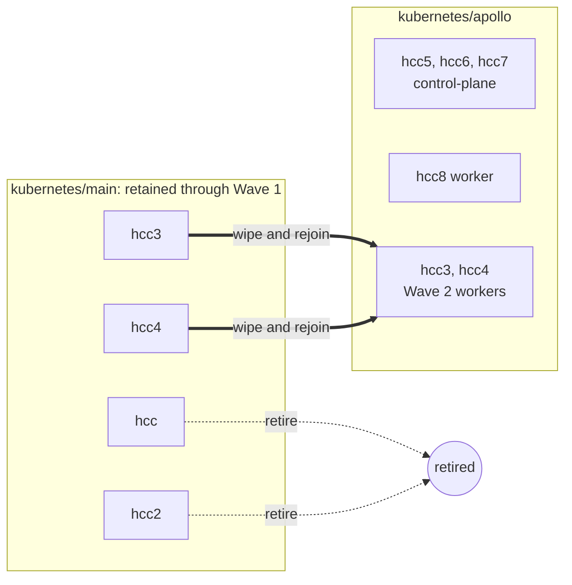
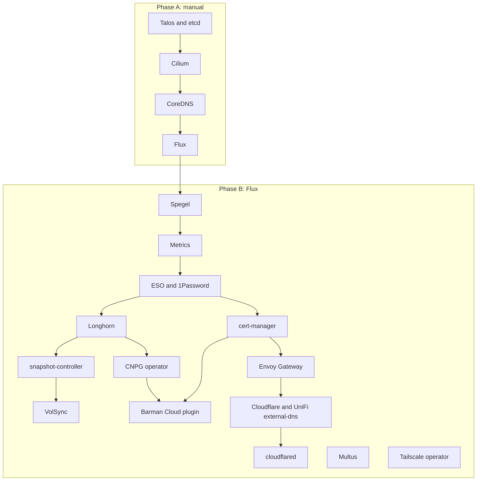

# Talos migration

# Overview

The cluster moves from ansible-managed k3s to Talos on `kubernetes/apollo`, starting with three new NUC11 control-plane nodes, adding hcc8 when a switch port is available, and adding the wiped hcc3 and hcc4 in Wave 2; the unsupported Odroid HC2 nodes hcc and hcc2 retire, while hcc-tablet1 has already left the live cluster. Apps are rebuilt and cut over one at a time from verified backups, while `kubernetes/main` remains intact for rollback until the old cluster shuts down in Wave 2.

# Functionality

Each hosted app gets a short maintenance window at its own cutover point. Home Assistant, Mealie, Paperless, and the apps backed by the shared Postgres cluster go fully offline while their final backup and restore or import runs; Node-RED is rebuilt empty after Home Assistant. A data source is never writable during transfer.

Ingress hostnames and Tailscale names do not change. The old cluster releases each name before the new cluster claims it. Afterward, Flux remains the normal operating path; routine work does not use SSH or hand-applied manifests.

At the end of Wave 1, every app runs on Apollo and the four-node k3s cluster remains intact for rollback. At the end of Wave 2, Apollo has three control-plane nodes and three workers, `kubernetes/main` is gone, and the ansible and k3s tooling can be removed.

# Design

## Migration principles

- Rebuild manifests under `kubernetes/apollo` instead of moving directories. Review each app and its `app-template` chart for compatible upgrades while copying it; take upgrades that can be verified without obscuring migration failures.
- For workloads without an app-specific Helm chart, prefer a compatible image from [`home-operations/containers`](https://github.com/home-operations/containers) and pin it by digest. Use an upstream image next, and retain an image from `ghcr.io/evanmoelter` only when neither provides the required behavior.
- Prepare each cutover as a two-PR Graphite stack: the old-cluster disable on the bottom and the Apollo rebuild on top. Both pass review and CI before the maintenance window.
- Disable old copies without deleting their manifests, PVCs, databases, or secrets. Nothing leaves `kubernetes/main` until Wave 2.
- Allow only one serving copy and one backup writer per app. The clusters never share active IPs, DNS records, tailnet names, restic write paths, or Barman server names.
- Prefer short downtime to importing from a writable source. Every cutover stops the app before its final backup.
- Use current stable Talos and Kubernetes releases. VolSync and CNPG migration do not require matching Kubernetes versions.
- Name clusters from Greek mythology in alphabetical order. Names are neither changed nor reused, so this cluster remains Apollo.

The old cluster stays at `kubernetes/main`. Renaming a live Flux root adds risk and spends a permanent name on a cluster with weeks left to live.

## Node topology

| Node | Today | After migration | Wave |
|---|---|---|---|
| hcc | k3s controller and Longhorn storage node | retired | 2 |
| hcc2 | k3s controller and Longhorn storage node | retired | 2 |
| hcc-tablet1 | stale ansible entry; absent from live cluster | confirm decommissioned; remove entry | n/a |
| hcc5, hcc6, hcc7 | new NUC11s | Talos control-plane | 1 |
| hcc8 | new NUC11; awaiting a switch port | Talos worker | when a port is available |
| hcc3, hcc4 | k3s controllers; multus `enp1s0` hosts | wiped; Talos workers | 2 |



## Storage

| Node | Disks | Longhorn |
|---|---|---|
| hcc5, hcc6 | 256GB NVMe, 1TB WD10SPSX HDD | NVMe only |
| hcc7 | 256GB NVMe, 256GB SATA SSD | both |
| hcc8 | 256GB NVMe | NVMe |
| hcc3, hcc4 | existing drives, about 360Gi schedulable each | both after Wave 2 |

All flash disks use one untagged Longhorn pool. SATA SSD and NVMe latency is close enough after Longhorn's engine hop and synchronous replica writes. The HDDs stay out because Longhorn does not account for disk speed and could place a database replica on roughly 150-IOPS storage. Current workloads use about 12GB and do not need the capacity.

Reduce `paperless-library` from 100Gi to 50Gi when recreating it. It holds about 3.4GB and can expand later, cutting Wave 1 reservation from roughly 363Gi to 265Gi.

Talos storage requirements:

- Cap EPHEMERAL at install time and provision a `longhorn` user volume on NVMe. Otherwise EPHEMERAL fills the disk and correction requires reinstalling the node.
- Mount it at `/var/mnt/longhorn` and set Longhorn's `defaultDataPath` there; Talos cannot use `/storage01`.
- Give hcc7 a second user volume at `/var/mnt/longhorn-sata`.
- Add kubelet mounts with `rshared` propagation and the `iscsi-tools` and `util-linux-tools` extensions.

Keep `defaultReplicaCount: 3`. Apollo initially uses hcc5 through hcc7 because no switch port is available for hcc8.
App migrations can proceed on these three nodes; a node outage temporarily leaves two replicas until it returns.
Add hcc8 when a port becomes available to gain reboot slack. Two replicas remain available per app through a
separate StorageClass when offsite restore is acceptable. Upgrade or reset one node at a time and wait for
Longhorn rebuilds. [docs/storage.md](../docs/storage.md) records Longhorn configuration and hcc8 registration.

The planned four-node fleet provides about 790Gi after the EPHEMERAL cap, above the 265Gi reservation.
Until hcc8 joins, verify actual schedulable capacity on the three control-plane nodes before each app migration.
A three-replica volume needs a sufficiently large eligible disk on each of three distinct nodes; hcc7's two
disks do not combine into one replica's capacity. After the fleet expands, hcc8 need not hold every volume.

## Cluster structure and tooling

Apollo uses `bootstrap/`, `flux/`, `apps/`, and `components/`, its own Flux source and root Kustomization, and independent node, pod, service, VIP, and load-balancer addressing on a dedicated HCC VLAN.

While both trees exist:

- Make the root `Taskfile.yaml` Kubernetes directory a per-cluster variable.
- Add Apollo to `flux-diff.yaml` and `kubeconform.yaml` when the tree is created.
- Re-encrypt `cluster-secrets.sops.yaml` with the existing age key.
- Change only the tree serving an app. Disabled copies in `kubernetes/main` stay frozen.

Use Kubernetes 1.32 as the removed-API baseline, not the stale 1.29 system-upgrade pin. The old `system-upgrade/k3s` Kustomization is live, and its Plan is pinned below the running version, so verify that it is inert rather than a pending downgrade. Generate Apollo against current stable releases; `.private/bootstrap-121456` is a structural reference only.

Use `topf` for machine configuration. Hand-author `topf.yaml` and strategic-merge patches under `all/`, `control-plane/`, `worker/`, and `node/<host>/`; merge order runs from broad to specific and lexically within a directory. `topf` supports `$patch: delete` and templated `.yaml.tpl` patches, but not JSON patches. Create `.taskfiles/Talos/Taskfile.yaml` to call `topf apply`, `upgrade`, `render`, and `reset`. Keep the repo's Task and YAML conventions instead of adopting upstream's Just and TOML tooling.

`topf upgrade` handles Talos OS upgrades. Kubernetes upgrades use `talosctl upgrade-k8s` directly because `topf` does not wrap them. Talos cannot use system-upgrade-controller: its privileged upgrade pod expects a writable host filesystem and a shell.

### Shared components

Apollo replaces `kubernetes/main/templates/` with `kubernetes/apollo/components/`, holding Kustomize `Component` resources rather than plain bases. A component attaches through the consuming Flux `Kustomization`'s `spec.components` and can patch what it composes with, so shared configuration is written once instead of retyped per app.

Know what a component can reach, because it is narrower than it looks. A component composes into the build of `spec.path`. It can add resources there and patch them, including `HelmRelease.spec.dependsOn`, which is how an app's release comes to wait on the CNPG operator release. It cannot touch the `ks.yaml` that references it: that file is rendered by `cluster-apps`, a different build. `dependsOn` and `healthCheckExprs` on the owning Kustomization stay written out by hand, or arrive from a root patch selected by label.

Three components cover the migration:

| Component | Replaces | Provides |
|---|---|---|
| `volsync` | `templates/volsync` | Bootstrap `ReplicationDestination`, hydrating claim, and `ReplicationSource` |
| `postgres` | a hand-written `cluster.yaml` per app | CNPG `Cluster`, its `ObjectStore`, `ScheduledBackup`, and a `HelmRelease.dependsOn` on the CNPG operator release |
| `namespace` | a `namespace.yaml` per namespace | The `Namespace`, annotated `kustomize.toolkit.fluxcd.io/prune: disabled` |

A database-backed app gets two Kustomizations, following "One Flux Kustomization per lifecycle" in AGENTS.md. The satellite renders the component and waits; the app depends on it:

```yaml
# ks-cluster.yaml
spec:
  components:
    - ../../../../components/postgres
  path: ./kubernetes/apollo/apps/default/mealie/cluster
  wait: true
  healthCheckExprs:
    - apiVersion: postgresql.cnpg.io/v1
      kind: Cluster
      current: status.conditions.filter(e, e.type == 'Ready').all(e, e.status == 'True')
      failed: status.conditions.filter(e, e.type == 'Ready').all(e, e.status == 'False')
  postBuild:
    substitute:
      APP: *app
---
# ks.yaml
spec:
  dependsOn:
    - name: mealie-cluster
```

Rendering the cluster and the app together would not work. Health checks gate a Kustomization's own readiness; they do not order resources within one. A single Kustomization applies the CNPG `Cluster` and the `HelmRelease` in the same pass, so the app would start against a database still restoring.

The `postgres` component defaults to `bootstrap.recovery`, not `initdb`. This inverts the trap recorded under "Data migration methods": copying a manifest forward and forgetting to switch it produces an empty but healthy database, and nothing reports a problem. With recovery as the default, a net-new database is the case that must be declared, and a forgotten switch fails loudly with no target backup found rather than quietly succeeding. Declare it with a label that the root Kustomization turns into a plain `initdb`:

```yaml
metadata:
  name: &app teslamate
  labels:
    components.postgres/cnpg: init
```

Drop the label once the app's first backup lands, so a later rebuild recovers instead of reinitializing.

Two details are easy to lose:

- `cnpg.io/skipEmptyWalArchiveCheck: enabled` goes on the `Cluster`, so the component carries it. Recovery into a cluster whose destination archive is non-empty is refused by default, which is exactly the case when a rebuilt cluster reuses its own server name. Safe here, because the recovered cluster inherits the source's system identifier and writes new WAL on a new timeline.
- `healthCheckExprs` goes on a Kustomization, so the component cannot carry it. It belongs in `ks-cluster.yaml` above, together with `wait: true`; expressions alone define how to judge a custom resource and do not select anything to wait for.

### Root Kustomization defaults

Apollo's `cluster-apps` Kustomization patches defaults into every child `Kustomization` and every `HelmRelease` it renders, so roughly twenty rebuilt apps do not each repeat them. `kubernetes/main` already does this for `decryption` and `postBuild.substituteFrom`. Apollo extends it to HelmRelease install, upgrade, and rollback remediation, `crds: CreateReplace`, and `deletionPolicy: WaitForTermination`.

The trap is that the parent wins. Flux applies `spec.patches` to the rendered output of `spec.path`, so a defaulted field overrides whatever the app wrote in its own file. An app cannot opt out by setting the field locally: the value it writes is replaced, and only the rendered diff shows it happened. Three rules keep that manageable.

- Default only what is universal, where an app disagreeing is a smell rather than a requirement. Remediation policy, CRD handling, and deletion policy qualify. Resource requests, replica counts, and timeouts do not.
- Give any default with a legitimate exception a `labelSelector` escape hatch on the patch target, the way the `postgres` component's `init` label works. The opt-out is then declared in the app's own `ks.yaml` and greppable across the tree. The repo already uses this idiom in `kubernetes/main/flux/apps.yaml`: `substitution.flux.home.arpa/disabled notin (true)`.
- Read defaults through the rendered diff. CI renders the effective manifest, so a default that surprises an app surfaces in the PR that adds the app rather than at reconcile time.

Add a default once two apps need it. A default introduced for one app is a patch in the wrong place.

### Talos and Cilium invariants

Keep KubePrism enabled while writing the `all/` patches. Configure Cilium with `k8sServiceHost: 127.0.0.1`, `k8sServicePort: 7445`, and `kubeProxyReplacement: true` so it can reach the API through KubePrism before its own datapath is ready. Set `cni.exclusive: false` for Multus and `gatewayAPI.enabled: false` so Cilium does not compete with Envoy Gateway.

Talos uses `/etc/cri/conf.d/hosts` instead of k3s's embedded containerd and CNI paths, which is the one Helm value Spegel needs overridden on Talos. `plans/done/05a-spegel.md` records what shipped.

Spegel needs containerd to keep unpacked layers, so `all/70-cri.yaml` writes `discard_unpacked_layers = false` into `/etc/cri/conf.d/20-customization.part`. It has to be on the node before Spegel starts, which is why it lands with the machine config rather than with Spegel itself. Reference repos also set `enable_unprivileged_ports` and `enable_unprivileged_icmp` here; containerd 2.0 changed both defaults to true, so on Talos 1.13.9 they are redundant and Apollo leaves them out.

Talos 1.13.9 has no `FilesystemTrimConfig` or `FilesystemScrubConfig`; both are newer documents, and `talosctl validate` rejects them. Add periodic trim and scrub when Apollo moves to a release that registers them.

Carry over upstream's QUIC socket-buffer and ARP cache tuning. Preserve its bootstrap order, with Spegel between CoreDNS and cert-manager, but leave CoreDNS Talos-managed. Revisit that choice only if custom configuration requires it, as described in `plans/05b-coredns-helm.md`. Verify whether the target release still needs kubelet-csr-approver; current upstream no longer lists it.

## Foundational bootstrap

Phase A is installed by hand. Phase B is reconciled by Flux with `wait: true`, one service at a time.



| Component | Decision and migration work |
|---|---|
| Ingress | Replace ingress-nginx with internal and external Envoy Gateways. Rewrite internal and external Ingresses as `HTTPRoute`s. Raw `LoadBalancer` services stay unchanged. Complete `plans/04-envoy-gateway.md` for Apollo before Wave 1. |
| CoreDNS | Keep Talos-managed. Use the UniFi answer and Gateway LAN IP for in-cluster names rather than adding a CoreDNS rewrite. |
| Spegel and metrics | Add Spegel and kube-prometheus-stack early. Add Thanos later only if long retention, object-storage-backed metrics, or cross-cluster queries become requirements. |
| Secrets | Add ESO and 1Password Connect for new app secrets. Keep SOPS and age for Talos and bootstrap secrets. |
| Storage backup | Install snapshot-controller and `longhorn-snapclass` before VolSync. Decide separately whether Longhorn needs a cluster-level S3 target. |
| CNPG | Install the operator and the Barman Cloud plugin; CNPG deprecated the in-tree `barmanObjectStore` in 1.26. The plugin needs cert-manager and must sit in the operator's namespace, so it lands after both. Split the old shared cluster into per-app clusters during migration; `plans/11-cnpg-database-split.md` holds the detailed comparison and the plugin configuration. |
| Tailscale | Keep its Ingress objects. Give Apollo's operator a distinct hostname and OAuth client. |
| cloudflared | Create a new tunnel, credentials, and `external-apollo.${SECRET_DOMAIN}` alias. |
| DNS | Replace pihole and k8s-gateway with a second external-dns instance using the UniFi webhook. |
| Flux webhook | Create a distinct receiver hostname and token, plus a second GitHub webhook. |
| Node management | Replace kube-vip with Talos's native VIP. Remove ansible, SSH, and system-upgrade-controller in Wave 2. |
| Longhorn taints | Drop the Odroid-specific `dedicated=storage` taint and matching toleration. |
| Other | Keep Dragonfly, cert-manager, Authentik, Multus, Cilium, reloader, and metrics-server. Do not carry OpenEBS scaffold cruft forward. |

Bootstrap metrics are deployed and their active scrape targets were verified healthy on 2026-09-09;
[docs/monitoring.md](../docs/monitoring.md) records the configuration and follow-up work. ESO and 1Password
Connect provide secrets from the dedicated `hcc-apollo` vault, using SOPS for bootstrap credentials.
[docs/secrets.md](../docs/secrets.md) records the setup and app integration. Cert-manager's controller,
issuers, and production wildcard certificate are defined under Apollo; [docs/certificates.md](../docs/certificates.md)
records credential setup and issuance checks. Envoy Gateway and echo-server provide the ingress foundation;
[docs/gateway.md](../docs/gateway.md) records its configuration and successful LAN verification.
Cloudflare and UniFi external-dns and Apollo's locally managed tunnel are defined for split-horizon testing;
[docs/dns.md](../docs/dns.md) records ownership, Terraform and credential setup, and pending deployment checks.
External-path testing, forwarded-header trust, and echo's return to internal-only access remain on the ingress
path. Longhorn is defined on the parallel storage path;
[docs/storage.md](../docs/storage.md) records disk assignments and deployment verification.
Snapshot-controller, its separately reconciled `longhorn-snapclass`, and the VolSync controller are defined
after Longhorn; [docs/storage.md](../docs/storage.md) records configuration and pending snapshot/backup/restore
verification. The reusable VolSync component and per-app repository credentials remain to be added before
the first PVC-backed app rebuild.
Reloader and opt-ins for DNS, cloudflared, and 1Password Connect are defined;
[docs/secrets.md](../docs/secrets.md#configuration-reloads) records the app pattern and pending reload verification.
