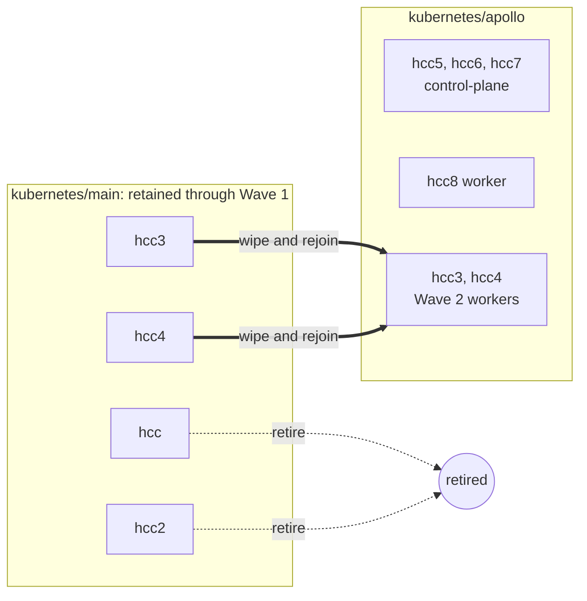
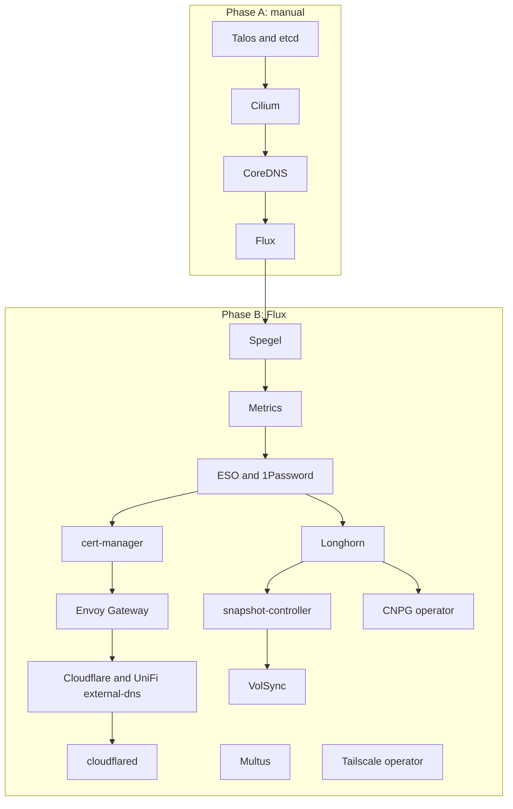

# Talos migration

# Overview

The cluster moves from ansible-managed k3s to Talos on `kubernetes/apollo`, using four new NUC11s in Wave 1 and adding the wiped hcc3 and hcc4 in Wave 2; the unsupported Odroid HC2 nodes hcc and hcc2 retire, while hcc-tablet1 has already left the live cluster. Apps are rebuilt and cut over one at a time from verified backups, while `kubernetes/main` remains intact for rollback until the old cluster shuts down in Wave 2.

# Functionality

Each hosted app gets a short maintenance window at its own cutover point. Home Assistant, Mealie, Node-RED, Paperless, and the apps backed by the shared Postgres cluster go fully offline while their final backup and restore or import runs. The source is never writable during transfer.

Ingress hostnames and Tailscale names do not change. The old cluster releases each name before the new cluster claims it. Afterward, Flux remains the normal operating path; routine work does not use SSH or hand-applied manifests.

At the end of Wave 1, every app runs on Apollo and the four-node k3s cluster remains intact for rollback. At the end of Wave 2, Apollo has three control-plane nodes and three workers, `kubernetes/main` is gone, and the ansible and k3s tooling can be removed.

# Design

## Migration principles

- Rebuild manifests under `kubernetes/apollo` instead of moving directories. Review each app while copying it.
- Disable old copies without deleting their manifests, PVCs, databases, or secrets. Nothing leaves `kubernetes/main` until Wave 2.
- Allow only one serving copy and one backup writer per app. The clusters never share active IPs, DNS records, tailnet names, restic write paths, or Barman server names.
- Prefer short downtime to importing from a writable source. Every cutover stops the app before its final backup.
- Use current stable Talos and Kubernetes releases. VolSync and CNPG migration do not require matching Kubernetes versions.
- Name clusters from Greek mythology in alphabetical order. Names are neither changed nor reused, so this cluster remains Apollo.

The old cluster stays at `kubernetes/main`. Renaming a live Flux root adds risk and spends a permanent name on a cluster with weeks left to live.

## Node topology

| Node | Today | After migration | Wave |
|---|---|---|---|
| hcc | k3s controller and Longhorn storage node | retired | 2 |
| hcc2 | k3s controller and Longhorn storage node | retired | 2 |
| hcc-tablet1 | stale ansible entry; absent from live cluster | confirm decommissioned; remove entry | n/a |
| hcc5, hcc6, hcc7 | new NUC11s | Talos control-plane | 1 |
| hcc8 | new NUC11 | Talos worker | 1 |
| hcc3, hcc4 | k3s controllers; multus `enp1s0` hosts | wiped; Talos workers | 2 |

## Storage

| Node | Disks | Longhorn |
|---|---|---|
| hcc5, hcc6 | 256GB NVMe, 1TB WD10SPSX HDD | NVMe only |
| hcc7 | 256GB NVMe, 256GB SATA SSD | both |
| hcc8 | 256GB NVMe | NVMe |
| hcc3, hcc4 | existing drives, about 360Gi schedulable each | both after Wave 2 |

All flash disks use one untagged Longhorn pool. SATA SSD and NVMe latency is close enough after Longhorn's engine hop and synchronous replica writes. The HDDs stay out because Longhorn does not account for disk speed and could place a database replica on roughly 150-IOPS storage. Current workloads use about 12GB and do not need the capacity.

Reduce `paperless-library` from 100Gi to 25Gi when recreating it. It holds about 3.4GB and can expand later, cutting Wave 1 reservation from roughly 363Gi to 215Gi.

Talos storage requirements:

- Cap EPHEMERAL at install time and provision a `longhorn` user volume on NVMe. Otherwise EPHEMERAL fills the disk and correction requires reinstalling the node.
- Mount it at `/var/mnt/longhorn` and set Longhorn's `defaultDataPath` there; Talos cannot use `/storage01`.
- Give hcc7 a second user volume at `/var/mnt/longhorn-sata`.
- Add kubelet mounts with `rshared` propagation and the `iscsi-tools` and `util-linux-tools` extensions.

Keep `defaultReplicaCount: 3`. Four Wave 1 nodes leave one node of reboot slack. Two replicas remain available per app through a separate StorageClass when offsite restore is acceptable. Upgrade or reset one node at a time and wait for Longhorn rebuilds.

Wave 1 provides about 790Gi after the EPHEMERAL cap, well above the 215Gi reservation. In the final fleet, hcc8's single 256GB NVMe sets the per-volume ceiling because three replicas need space on three nodes. Current data is nowhere near it; replace that NVMe if the limit becomes binding.

## Cluster structure and tooling

Apollo uses `bootstrap/`, `flux/`, `apps/`, and `templates/`, its own Flux source and root Kustomization, and independent node, pod, service, VIP, and load-balancer addressing on a dedicated HCC VLAN. Copy `templates/volsync` to the same relative location.

While both trees exist:

- Make the root `Taskfile.yaml` Kubernetes directory a per-cluster variable.
- Add Apollo to `flux-diff.yaml` and `kubeconform.yaml` when the tree is created.
- Re-encrypt `cluster-secrets.sops.yaml` with the existing age key.
- Change only the tree serving an app. Disabled copies in `kubernetes/main` stay frozen.

Use Kubernetes 1.32 as the removed-API baseline, not the stale 1.29 system-upgrade pin. Generate Apollo against current stable releases; `.private/bootstrap-121456` is a structural reference only.

Use `topf` for machine configuration. Hand-author `topf.yaml` and strategic-merge patches under `all/`, `control-plane/`, `worker/`, and `node/<host>/`; merge order runs from broad to specific and lexically within a directory. `topf` supports `$patch: delete` and templated `.yaml.tpl` patches, but not JSON patches. Adapt `.taskfiles/Talos/Taskfile.yaml` to call `topf apply`, `upgrade`, `render`, and `reset`. Keep the repo's Task and YAML conventions instead of adopting upstream's Just and TOML tooling.

Carry over upstream's QUIC socket-buffer and ARP cache tuning. Preserve its bootstrap order, with Spegel between CoreDNS and cert-manager, but leave CoreDNS Talos-managed. Verify whether the target release still needs kubelet-csr-approver; current upstream no longer lists it.

## Foundational bootstrap

Phase A is installed by hand. Phase B is reconciled by Flux with `wait: true`, one service at a time.

| Component | Decision and migration work |
|---|---|
| Ingress | Replace ingress-nginx with internal and external Envoy Gateways. Rewrite internal and external Ingresses as `HTTPRoute`s. Raw `LoadBalancer` services stay unchanged. |
| CoreDNS | Keep Talos-managed unless custom configuration becomes necessary. |
| Spegel and metrics | Add both early. Choose kube-prometheus-stack or VictoriaMetrics before bootstrap. |
| Secrets | Add ESO and 1Password Connect for new app secrets. Keep SOPS and age for Talos and bootstrap secrets. |
| Storage backup | Install snapshot-controller and `longhorn-snapclass` before VolSync. Decide separately whether Longhorn needs a cluster-level S3 target. |
| CNPG | Install only the operator. Split the old shared cluster into per-app clusters during migration. |
| Tailscale | Keep its Ingress objects. Give Apollo's operator a distinct hostname and OAuth client. |
| cloudflared | Create a new tunnel, credentials, and `external-apollo.${SECRET_DOMAIN}` alias. |
| DNS | Replace pihole and k8s-gateway with a second external-dns instance using the UniFi webhook. |
| Flux webhook | Create a distinct receiver hostname and token, plus a second GitHub webhook. |
| Node management | Replace kube-vip with Talos's native VIP. Remove ansible, SSH, and system-upgrade-controller in Wave 2. |
| Longhorn taints | Drop the Odroid-specific `dedicated=storage` taint and matching toleration. |
| Other | Keep Dragonfly, cert-manager, Authentik, Multus, Cilium, reloader, and metrics-server. Do not carry OpenEBS scaffold cruft forward. |

## Networking and external state

### HCC VLAN

- Allow the trusted network to reach the HCC VLAN.
- Isolate the HCC and IoT VLANs in both directions by default.
- Temporarily allow Apollo to reach `192.168.6.21:5432` for the authentik, Paperless, and TeslaMate imports. Remove the rule after all three migrate.
- Allow Apollo to reach only the UCG Fiber Integration API needed by external-dns.
- Give Home Assistant one intentional IoT path through multus. Set the VLAN tag in `bootstrap_talos.vlan` and the NAD, and trunk it to the selected node.

A separate Longhorn replication VLAN and BGP load-balancer announcements remain out of scope.

### DNS and ingress

Apollo gets its own Cloudflare tunnel. Reusing the old tunnel would distribute traffic across both clusters. Publish `external-apollo.${SECRET_DOMAIN}` with a `DNSEndpoint`, use it as cloudflared's `originServerName`, and target external routes at it. The existing wildcard certificate covers the alias.

Internal records move to the UCG Fiber through the [UniFi external-dns webhook](https://github.com/kashalls/external-dns-unifi-webhook). It requires ExternalDNS 0.21.0 or newer, UniFi OS 5.x or newer, Network 10.3.58 or newer, and an API key from Settings > Control Plane > Integrations. It supports ownership TXT records but not wildcards. Pihole and k8s-gateway do not move; ad blocking is separate.

| Instance | Watches | Produces |
|---|---|---|
| external-dns, Cloudflare | external Gateway | proxied CNAME to `external-apollo.${SECRET_DOMAIN}` |
| external-dns, UniFi | both Gateways initially | A record to the parent Gateway address |

Test both routing shapes on echo-server before any stateful app moves:

| | Split-horizon, try first | Dual-route fallback |
|---|---|---|
| Routes per dual-exposed host | one on external Gateway | one per Gateway |
| UniFi scope | both Gateways | internal Gateway only |
| LAN path | external Gateway LAN IP | internal Gateway LAN IP |
| Policy | shared listener | separate listeners |

Use dual-route if split-horizon causes proxy-header, certificate, SNI, or policy trouble. Both keep one canonical hostname, as OIDC requires. Split-horizon needs a LAN load-balancer IP on the external Gateway. Tailscale remains a separate Ingress either way.

Set Apollo's Cloudflare external-dns to `txtOwnerId: apollo` and `policy: upsert-only` before its first reconciliation. This prevents either cluster from deleting the other's records. Leave the old instance unchanged so removing an old Ingress releases its name. Return Apollo to `policy: sync` in Wave 2. Give UniFi its own owner ID.

Use cert-manager's staging issuer during repeated bootstrap attempts and avoid simultaneous wildcard renewals across clusters.

### Backup paths and identities

Apollo reads old backups but writes new ones:

| Resource | Apollo handling |
|---|---|
| VolSync | Hydrate from `s3://tf-hcc-volsync/<app>`; write to `s3://tf-hcc-volsync/apollo/<app>` |
| CNPG | Recover from the existing server name; write as `<app>-pg-apollo-v1` |
| Cloudflare | Use owner `apollo`, a new tunnel alias, and upsert-only in Wave 1 |
| Tailscale | Use a distinct operator identity; release and reclaim each app hostname |
| Flux webhook | Use a distinct receiver hostname and token |

Suspend each old `ReplicationSource` after its final sync. Two writers or pruners against one restic repository can damage the rollback copy.

## App migration

### Standard cutover

For each app:

1. Commit the old workload at zero replicas. Remove its external and Tailscale Ingresses so DNS and tailnet names are released. Keep the app directory, PVC, secrets, database, and internal Ingress.
2. Confirm the workload is stopped. Trigger and verify the final VolSync sync and, where applicable, an on-demand CNPG `Backup`. Suspend the old `ReplicationSource` afterward.
3. Author the reviewed app under `kubernetes/apollo`. Restore its PVC or database using the method below and point ongoing backups at Apollo-specific paths.
4. Verify the unnamed app through a port-forward and logs. Check the restored data, not only pod health.
5. Add the final route and any Tailscale Ingress. Confirm DNS, TLS, authentication, and application behavior before moving on.

Do not use a temporary `.new` hostname. It adds routes, certificates, and cleanup for downtime reduction that this migration does not need.

### Data migration methods

| Apps | Data | Method |
|---|---|---|
| Node-RED | PVC | VolSync bootstrap `ReplicationDestination` from the existing restic path |
| Home Assistant | config PVC plus `home-assistant-pg` | VolSync plus Barman recovery from R2 |
| Mealie | data PVC plus `mealie-pg` | VolSync plus Barman recovery from R2 |
| Paperless | library PVC plus database in shared `cnpg-cluster` | VolSync plus logical CNPG import |
| authentik | database in shared `cnpg-cluster` | logical CNPG import |
| TeslaMate | database in shared `cnpg-cluster` | logical CNPG import; update Grafana with it |

VolSync-backed PVCs use the shared template. Its claim references a one-time `${APP}-bootstrap` `ReplicationDestination`, allowing the CSI populator to hydrate the PVC when created.

`mealie-pg` and `home-assistant-pg` already hold one app each on PostgreSQL 18.1. Change copied manifests from `bootstrap.initdb` to `bootstrap.recovery`; leaving `initdb` creates an empty but healthy database. Both back up weekly, so take an on-demand backup after disabling the app. Confirm Home Assistant recorder history after restore.

authentik, Paperless, and TeslaMate still share `cnpg-cluster` on PostgreSQL 16.2. Create one cluster per app in that app's namespace and use CNPG `bootstrap.initdb.import` with the microservice `pg_dump` method. Connect to `192.168.6.21`, not its internal DNS name, and stop the source app first. Physical Barman recovery cannot select one database from a shared instance.

Logical import permits a PostgreSQL major-version change, but check each app's supported range immediately before cutover. Upgrade the old app first if required, and verify TeslaMate's `cube` and `earthdistance` extensions. A lagging app may remain on PostgreSQL 16. Update Grafana's TeslaMate datasource to `teslamate-pg` at the same time.

### App review and order

| App | Required review |
|---|---|
| Home Assistant | Assign an IoT VLAN address; pin it to the node with the trunked IoT NIC; reserve a USB port for the future Thread antenna; parameterize trusted proxy CIDRs; recover the database instead of using initdb |
| Paperless | Assign its SFTP load-balancer IP from Apollo's pool; request 25Gi for the library PVC |
| Mealie | Restore LAN reachability using the chosen Gateway pattern; consider adding its missing Tailscale Ingress; recover the database instead of using initdb |
| Authentik | Apply the Gateway pattern proven on echo-server; keep the same internal and external hostname |
| External apps | Replace the old tunnel target with `external-apollo.${SECRET_DOMAIN}` |
| All apps | Convert internal and external Ingresses to `HTTPRoute`; retain Tailscale Ingresses |
| TeslaMate | Confirm `teslamate_db_2024-03-18.sql` in `teslamate-backup-pvc` is no longer needed |

Home Assistant cannot move in Wave 1 until a Wave 1 node has a trunked IoT VLAN port. If that hardware is not ready, defer only Home Assistant until hcc3 or hcc4 joins in Wave 2. Keep `postgres-lb` until every logical import finishes; then decide whether external database access remains useful.

Migrate in this order:

1. authentik, because Mealie and Paperless depend on it.
2. Node-RED, to prove VolSync hydration and name transfer without a database.
3. Mealie, to prove the smaller hybrid and Barman recovery.
4. Paperless, after both migration mechanisms have been exercised.
5. TeslaMate and Grafana together.
6. Home Assistant last, or in Wave 2 if its network hardware is not ready.

## Execution waves

### Wave 1

1. Create the HCC VLAN and Apollo repo tree. Build the four new nodes with hcc5 through hcc7 as control-plane and hcc8 as worker.
2. Bootstrap Talos, etcd, Cilium, Talos-managed CoreDNS, and Flux.
3. Reconcile Phase B in dependency order. Use echo-server to test the external, LAN, certificate, and tailnet paths and settle the Gateway pattern.
4. Rebuild stateful apps one at a time using the standard cutover and app order above.

Do not remove a node from the old cluster during Wave 1. All four nodes are embedded-etcd controllers, so removing both Odroids without contracting membership loses quorum. Two remaining nodes also cannot satisfy Longhorn's three-replica policy. Keeping the cluster whole preserves the rollback environment when it matters.

Wave 1 ends with all migrated apps on Apollo and their disabled copies intact on the four-node old cluster. No hardware has been freed. Confirm hcc-tablet1 is decommissioned; remove its stale entry during Wave 2 cleanup.

### Wave 2

1. Confirm every app is healthy on Apollo and no rollback is pending. This is the point of no return.
2. Shut down the old cluster as a unit. Power off hcc and hcc2 for disposal.
3. Wipe hcc3 and hcc4, install Talos, and join them as workers.
4. Wipe the two 1TB SSDs from the Odroids and install them in hcc5 and hcc6 in place of the unused HDDs. Work one node at a time and wait for Longhorn rebuilds.
5. Recheck the multus interface name, driver, VLAN tag, and cabling. Migrate Home Assistant now if deferred.
6. Return Apollo's Cloudflare external-dns to `policy: sync`.
7. Delete `kubernetes/main`, `ansible/`, system-upgrade-controller, its k3s Plan, and taskfiles used only by ansible or k3s.
8. Revoke the old Cloudflare tunnel credentials and Tailscale OAuth client. Wipe every retired or repurposed disk.

# Security

- Talos removes SSH. Node administration uses the mTLS-authenticated Talos API.
- The HCC VLAN blocks direct access from IoT devices. Only Home Assistant receives a deliberate IoT interface, and Apollo receives only the management and temporary database access described above.
- Exactly one cluster writes each restic repository, Barman server name, DNS ownership set, and database WAL stream.
- The old cluster remains in scope for access control until Wave 2 because it still holds current app data and secrets.
- Back up `age.key` outside this machine. It is required to decrypt existing secrets and seed Apollo.
- Wipe hcc, hcc2, hcc-tablet1, hcc3, and hcc4 disks before disposal or repurposing. Revoke old tunnel and OAuth credentials after teardown.

## Backup gate

Longhorn has no cluster-level backup target. App-level VolSync and CNPG backups are the only recovery path, so Wave 1 does not start until all checks pass.

- [ ] Confirm `age.key` has a durable external backup.
- [ ] Verify recent R2 snapshots for the Home Assistant, Mealie, Node-RED, and Paperless PVCs.
- [ ] Verify recent R2 backups for `cnpg-cluster`, `mealie-pg`, and `home-assistant-pg`.
- [ ] Test restoration of `mealie-pg` and `home-assistant-pg`; these weekly backups are their migration path and have not yet been exercised.
- [ ] Confirm Dragonfly is intentionally cache-only and safe to lose.

# Pre-migration checklist

Network and hardware:

- [ ] Create the HCC VLAN, addressing, and firewall rules described above.
- [ ] Verify the UCG Fiber and ExternalDNS versions required by the UniFi webhook; generate its API key and allow Apollo to reach the Integration API.
- [ ] Open the temporary path to `192.168.6.21:5432`.
- [ ] Choose Home Assistant's Wave 1 trunked node or defer it to Wave 2; assign the IoT VLAN ID in Talos and the NAD.

Cluster bootstrap:

- [ ] Generate the Talos schematic with `iscsi-tools` and `util-linux-tools` against current releases.
- [ ] Author `topf.yaml` and scoped patches; adapt the Talos Taskfile.
- [ ] Make the root Kubernetes directory task variable cluster-specific and add Apollo to Flux diff and kubeconform validation.
- [ ] Verify whether kubelet-csr-approver is required.
- [ ] Cap EPHEMERAL, mount Longhorn user volumes with `rshared`, set the data path, and keep both HDDs out of Longhorn.

Platform:

- [ ] Create the Cloudflare tunnel, alias, credentials, and staging certificate path.
- [ ] Configure Cloudflare external-dns with owner `apollo`, upsert-only policy, and external-Gateway scope. Give UniFi its own owner and initial both-Gateway scope.
- [ ] Prove UniFi record creation, both Gateways, the Flux webhook, and the distinct Tailscale identity.
- [ ] Test both routing shapes on echo-server; record the choice before Phase C.
- [ ] Deploy Phase B in dependency order, including ESO, metrics, Spegel, snapshot-controller, `longhorn-snapclass`, and the VolSync template.
- [ ] Configure Apollo-specific restic and Barman write paths before any new backup runs.
- [ ] Confirm hcc-tablet1 is decommissioned.

Per app:

- [ ] Follow the standard cutover, including a verified final backup and suspension of the old `ReplicationSource`.
- [ ] Use Barman recovery for Mealie and Home Assistant, with a fresh on-demand backup; verify recorder history after Home Assistant restores.
- [ ] Put every CNPG cluster in its app namespace and check the supported PostgreSQL major and required extensions before import.
- [ ] Apply the app review table, including Home Assistant network settings and Paperless sizing.
- [ ] Verify external OIDC login to Mealie after Authentik moves.

Wave 2:

- [ ] Confirm no rollback is pending, then shut down the old cluster as a unit.
- [ ] Add hcc3 and hcc4, transplant the wiped SSDs, and wait for each Longhorn rebuild.
- [ ] Remove the temporary database firewall rule and return external-dns to sync policy.
- [ ] Confirm nothing uses old DNS or pihole, then delete the old repo tree and tooling.
- [ ] Revoke old credentials and wipe old disks.

# Rollback

Rollback remains available until Wave 2 because the old manifests, PVCs, and databases stay intact.

For one app, first remove its Apollo route so the name is released, then revert the old disable commit. Restore the old database service reference for authentik, Paperless, or TeslaMate and delete the partial new per-app cluster. For Mealie or Home Assistant, delete the partial recovered cluster; the old per-app database was never modified. Any writes made on Apollo after cutover are lost, so verify each migration promptly.

Before Wave 2, cluster-wide rollback means leaving all four old nodes untouched. Once hcc3 and hcc4 are wiped, the retained data copies are gone and rollback is no longer available.

# Open questions

- Which node carries Home Assistant's IoT NIC in Wave 1, and do hcc3 or hcc4 inherit it after Wave 2?
- Keep `external-apollo.${SECRET_DOMAIN}` permanently, as recommended, or rename it to `external.${SECRET_DOMAIN}` after teardown and update every route?
- Does the echo-server test choose split-horizon or dual-route?
- Should in-cluster `sso.${SECRET_DOMAIN}` lookups use a CoreDNS rewrite instead of the external Gateway's LAN IP? That would require taking CoreDNS under explicit management.
- Should ad blocking return through UniFi or a non-primary pihole?
- Future work: consider a dedicated Longhorn replication VLAN after the migration stabilizes.
